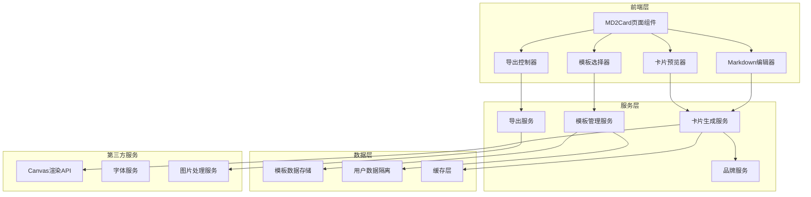
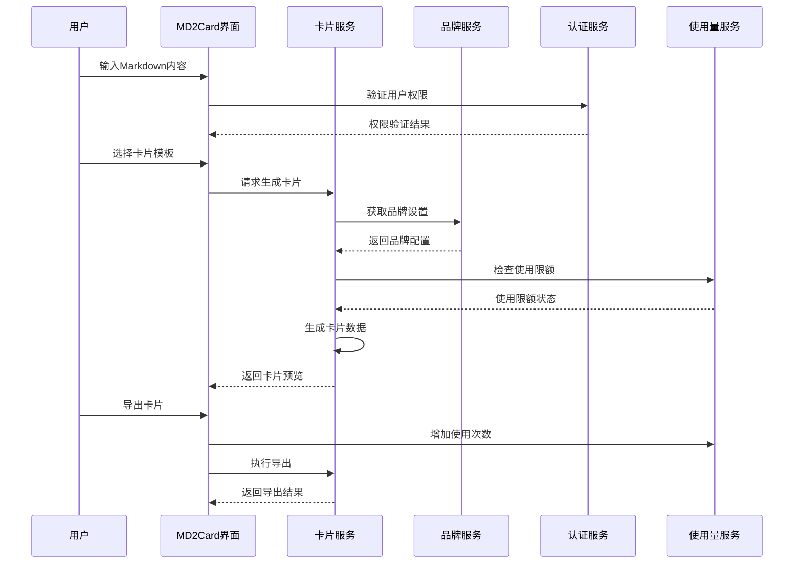
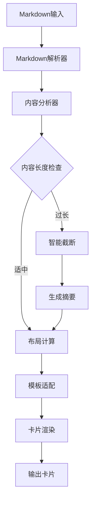
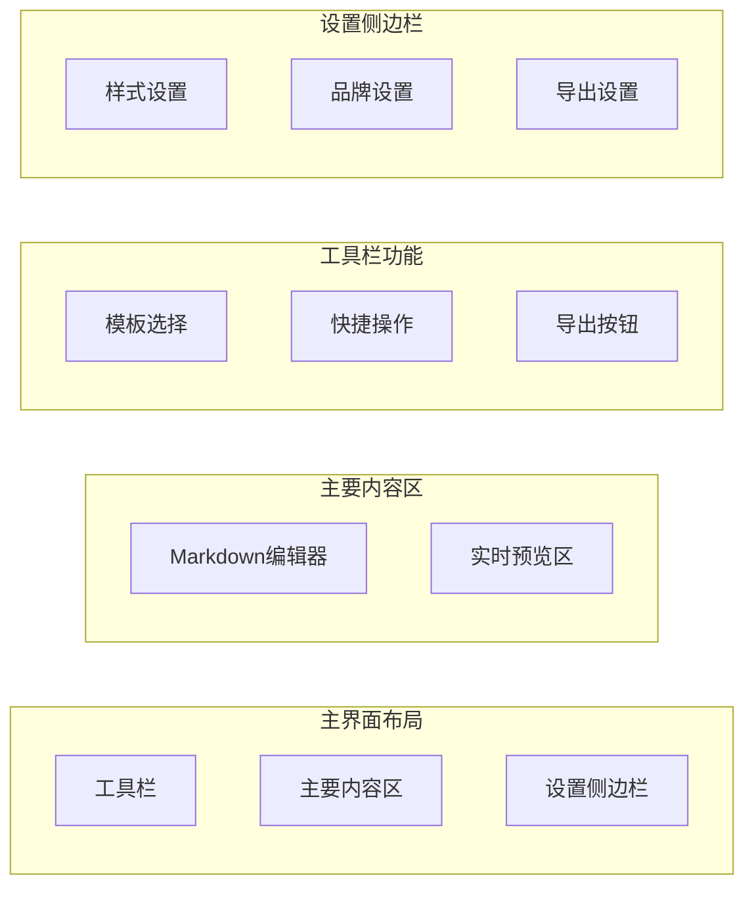
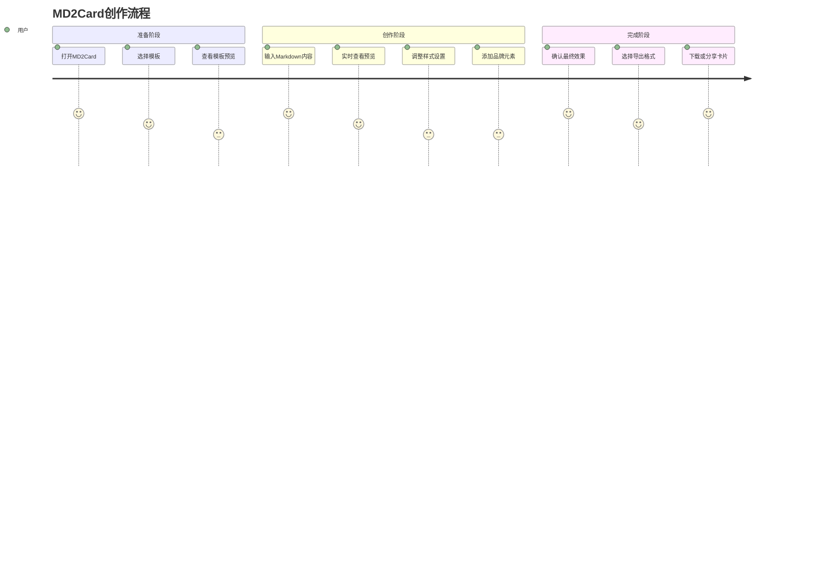
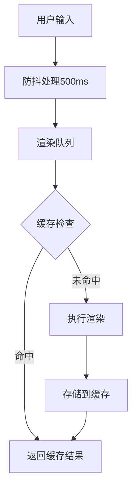

# MD2Card功能设计文档

## 1. 概述

### 1.1 功能定义
MD2Card是文派创意魔方中的一个新功能模块，专门用于将Markdown格式的文档转换为精美的卡片样式展示。不同于现有的MD2WeChat功能（专注于微信公众号排版），MD2Card专注于生成适合社交媒体分享、演示文稿、知识卡片等场景的视觉化卡片内容。

### 1.2 核心价值
- **视觉化展示**：将文字内容转换为图形化卡片，提升内容的视觉吸引力
- **多场景适配**：支持不同尺寸和风格的卡片，适应各种社交平台和使用场景
- **品牌一致性**：集成品牌元素，确保输出内容与品牌形象保持一致
- **高效创作**：通过模板化设计，快速生成专业级别的视觉内容

### 1.3 目标用户群体
- 内容创作者：需要制作知识卡片、教程卡片的创作者
- 社交媒体运营：需要创建吸引眼球的社交媒体内容
- 企业用户：需要制作产品介绍、公司信息等宣传卡片
- 教育工作者：制作教学卡片、知识点总结

## 2. 技术架构

### 2.1 系统架构图



### 2.2 核心组件设计

#### 2.2.1 MD2CardPage组件
主页面组件，负责整体布局和状态管理。

```typescript
interface MD2CardPageProps {
  // 页面级别属性
}

interface MD2CardState {
  markdownContent: string;
  selectedTemplate: CardTemplate;
  cardConfig: CardConfiguration;
  previewData: CardPreviewData;
  isGenerating: boolean;
  exportSettings: ExportSettings;
}
```

#### 2.2.2 CardTemplate数据模型

```typescript
interface CardTemplate {
  id: string;
  name: string;
  displayName: string;
  description: string;
  category: 'knowledge' | 'social' | 'business' | 'education';
  dimensions: {
    width: number;
    height: number;
    aspectRatio: string;
  };
  layout: LayoutConfiguration;
  defaultStyle: StyleConfiguration;
  previewImage: string;
  isCustomizable: boolean;
  isFree: boolean;
}
```

#### 2.2.3 卡片生成配置

```typescript
interface CardConfiguration {
  template: CardTemplate;
  branding: BrandingSettings;
  typography: TypographySettings;
  colors: ColorScheme;
  layout: LayoutSettings;
  effects: VisualEffects;
}

interface BrandingSettings {
  enableBrandLogo: boolean;
  logoPosition: 'top-left' | 'top-right' | 'bottom-left' | 'bottom-right';
  brandColors: string[];
  watermark?: string;
}
```

### 2.3 集成点设计

#### 2.3.1 创意工作室集成
在现有的CreativeStudioPage中添加新的标签页：

```typescript
// 在CreativeStudioPage.tsx中添加
<TabsTrigger value="md2card" className="unified-tab-trigger">
  <FileText className="tab-icon" />
  <span className="tab-text-mobile">卡片</span>
  <span className="tab-text-desktop">MD2Card卡片生成</span>
</TabsTrigger>

<TabsContent value="md2card" className="mt-6">
  <React.Suspense fallback={<LoadingSpinner />}>
    <MD2CardPage />
  </React.Suspense>
</TabsContent>
```

#### 2.3.2 与现有服务的协作



## 3. 功能特性设计

### 3.1 核心功能矩阵

| 功能模块 | 基础版 | 高级版 | 企业版 |
|---------|--------|--------|--------|
| 基础模板 | ✅ 5个 | ✅ 20个 | ✅ 50个 |
| 自定义模板 | ❌ | ✅ | ✅ |
| 品牌元素集成 | ❌ | ✅ | ✅ |
| 高分辨率导出 | ❌ | ✅ | ✅ |
| 批量生成 | ❌ | ❌ | ✅ |
| API接口 | ❌ | ❌ | ✅ |

### 3.2 模板类型设计

#### 3.2.1 知识卡片模板
- **简约学习卡**：突出知识点，适合教育内容
- **信息图表卡**：支持数据可视化展示
- **步骤指南卡**：流程化展示操作步骤

#### 3.2.2 社交媒体模板
- **Instagram Stories**：9:16竖屏比例
- **微博图文卡**：3:4比例，适合微博发布
- **朋友圈分享卡**：1:1正方形格式

#### 3.2.3 商务模板
- **产品介绍卡**：企业产品展示
- **团队名片卡**：个人或团队介绍
- **活动宣传卡**：活动信息发布

### 3.3 Markdown解析策略

#### 3.3.1 支持的Markdown元素

```typescript
interface SupportedMarkdownElements {
  headers: {
    h1: 'title',     // 转换为卡片标题
    h2: 'subtitle',  // 转换为副标题
    h3: 'section'    // 转换为段落标题
  };
  text: {
    bold: 'emphasis',      // 重点强调样式
    italic: 'secondary',   // 次要文本样式
    code: 'highlight'      // 高亮显示
  };
  lists: {
    unordered: 'bullet-points',  // 项目符号
    ordered: 'numbered-steps'    // 步骤编号
  };
  media: {
    images: 'visual-content',    // 图片内容
    links: 'reference-links'     // 外部链接
  };
}
```

#### 3.3.2 智能内容适配



## 4. 用户界面设计

### 4.1 页面布局架构



### 4.2 响应式设计规范

#### 4.2.1 桌面端布局（>=1024px）
- 三列布局：编辑器(40%) + 预览区(40%) + 设置面板(20%)
- 工具栏固定在顶部
- 侧边栏可折叠

#### 4.2.2 平板端布局（768px-1023px）
- 两列布局：编辑器和预览区上下分布
- 设置面板以抽屉形式展现
- 工具栏保持固定

#### 4.2.3 移动端布局（<768px）
- 单列布局，通过标签页切换编辑和预览
- 工具栏简化为关键操作
- 设置通过底部弹窗展示

### 4.3 交互流程设计

#### 4.3.1 标准创作流程



#### 4.3.2 高级自定义流程
1. **模板自定义**：修改布局、字体、颜色方案
2. **品牌集成**：添加Logo、品牌色彩、水印
3. **批量生成**：上传多个Markdown文件，批量转换

## 5. 数据流设计

### 5.1 状态管理架构

```typescript
interface MD2CardStore {
  // 编辑器状态
  editor: {
    content: string;
    cursorPosition: number;
    isDirty: boolean;
  };
  
  // 模板状态
  templates: {
    available: CardTemplate[];
    selected: CardTemplate | null;
    favorites: string[];
    custom: CardTemplate[];
  };
  
  // 卡片配置状态
  cardConfig: CardConfiguration;
  
  // 预览状态
  preview: {
    isLoading: boolean;
    imageData: string | null;
    error: string | null;
  };
  
  // 导出状态
  export: {
    isExporting: boolean;
    format: 'png' | 'jpg' | 'svg' | 'pdf';
    quality: 'low' | 'medium' | 'high';
    progress: number;
  };
}
```

### 5.2 数据持久化策略

#### 5.2.1 本地存储设计
```typescript
interface LocalStorageSchema {
  'md2card_drafts': Draft[];           // 草稿保存
  'md2card_templates': CustomTemplate[]; // 自定义模板
  'md2card_settings': UserSettings;    // 用户设置
  'md2card_history': GenerationHistory[]; // 生成历史
}
```

#### 5.2.2 缓存策略
- **模板缓存**：预加载常用模板，减少网络请求
- **图片缓存**：缓存生成的卡片图片，避免重复渲染
- **设置缓存**：保存用户偏好设置，提升体验

### 5.3 性能优化机制

#### 5.3.1 渲染优化


#### 5.3.2 资源加载优化
- **懒加载**：模板图片和字体按需加载
- **预加载**：预加载用户常用的模板和资源
- **压缩**：图片和资源文件压缩，减少带宽占用

## 6. 集成与扩展

### 6.1 与现有功能的协作

#### 6.1.1 品牌资料库集成
- 自动获取用户的品牌设置
- 应用品牌色彩方案到卡片模板
- 集成品牌Logo和水印元素

#### 6.1.2 创意魔方数据共享
- 复用创意魔方生成的内容作为卡片素材
- 支持从其他模块导入Markdown内容
- 统一的历史记录和收藏夹系统

### 6.2 API接口设计

#### 6.2.1 核心API端点

```typescript
// 卡片生成API
POST /api/md2card/generate
{
  markdown: string;
  templateId: string;
  configuration: CardConfiguration;
}

// 模板管理API
GET /api/md2card/templates
POST /api/md2card/templates/custom
PUT /api/md2card/templates/{id}
DELETE /api/md2card/templates/{id}

// 导出API
POST /api/md2card/export
{
  cardData: CardData;
  format: ExportFormat;
  options: ExportOptions;
}
```

#### 6.2.2 Webhook集成
支持第三方系统通过Webhook接收卡片生成完成的通知。

```typescript
interface WebhookPayload {
  event: 'card_generated' | 'export_completed';
  userId: string;
  cardId: string;
  timestamp: string;
  data: {
    templateId: string;
    downloadUrl: string;
    metadata: CardMetadata;
  };
}
```

### 6.3 插件化架构

#### 6.3.1 模板插件系统
```typescript
interface TemplatePlugin {
  id: string;
  name: string;
  version: string;
  templates: CardTemplate[];
  install(): Promise<void>;
  uninstall(): Promise<void>;
}
```

#### 6.3.2 导出插件系统
支持第三方开发者扩展导出格式和平台集成。

```typescript
interface ExportPlugin {
  id: string;
  name: string;
  supportedFormats: string[];
  export(cardData: CardData, options: ExportOptions): Promise<ExportResult>;
}
```

## 7. 测试策略

### 7.1 单元测试覆盖

#### 7.1.1 核心模块测试
```typescript
describe('MD2Card核心功能', () => {
  describe('Markdown解析器', () => {
    test('应该正确解析标题', () => {});
    test('应该处理列表元素', () => {});
    test('应该转换链接和图片', () => {});
  });
  
  describe('卡片生成器', () => {
    test('应该根据模板生成卡片', () => {});
    test('应该应用品牌设置', () => {});
    test('应该处理内容溢出', () => {});
  });
  
  describe('导出功能', () => {
    test('应该生成正确格式的图片', () => {});
    test('应该保持图片质量', () => {});
    test('应该处理导出错误', () => {});
  });
});
```

#### 7.1.2 集成测试
- **权限集成测试**：验证与认证系统的正确集成
- **数据流测试**：验证从输入到输出的完整数据流
- **性能测试**：验证在各种负载下的系统表现

### 7.2 用户体验测试

#### 7.2.1 A/B测试计划
- **模板选择界面**：测试不同的模板展示方式
- **编辑器布局**：测试编辑器和预览区的布局比例
- **导出流程**：测试不同的导出选项排列

#### 7.2.2 可用性测试场景
1. **新用户首次使用**：从登录到生成第一张卡片
2. **高频用户工作流**：快速生成和导出卡片
3. **移动端使用体验**：在手机上完成卡片创作

## 8. 部署与运维

### 8.1 技术要求

#### 8.1.1 前端要求
- React 18.3.1+
- TypeScript 5.7.2+
- Canvas API支持
- 现代浏览器兼容性（Chrome 90+, Firefox 88+, Safari 14+）

#### 8.1.2 后端要求
- Node.js 20.16.0+
- 图片处理能力（Sharp或类似库）
- 充足的内存和CPU资源用于渲染

#### 8.1.3 第三方依赖
- 字体服务（Google Fonts或自托管）
- 图片存储服务（用于模板和导出文件）
- CDN服务（加速资源加载）

### 8.2 监控和日志

#### 8.2.1 关键指标监控
```typescript
interface MD2CardMetrics {
  // 使用量指标
  dailyGenerations: number;
  templateUsageDistribution: Record<string, number>;
  exportFormatDistribution: Record<string, number>;
  
  // 性能指标
  averageGenerationTime: number;
  errorRate: number;
  cacheHitRate: number;
  
  // 用户行为指标
  userRetentionRate: number;
  averageSessionDuration: number;
  featureAdoptionRate: Record<string, number>;
}
```

#### 8.2.2 错误处理和恢复
- **自动重试机制**：对于临时性错误自动重试
- **优雅降级**：当高级功能不可用时提供基础功能
- **用户反馈通道**：收集用户遇到的问题和建议