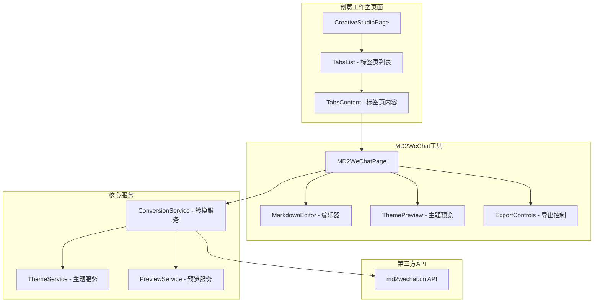
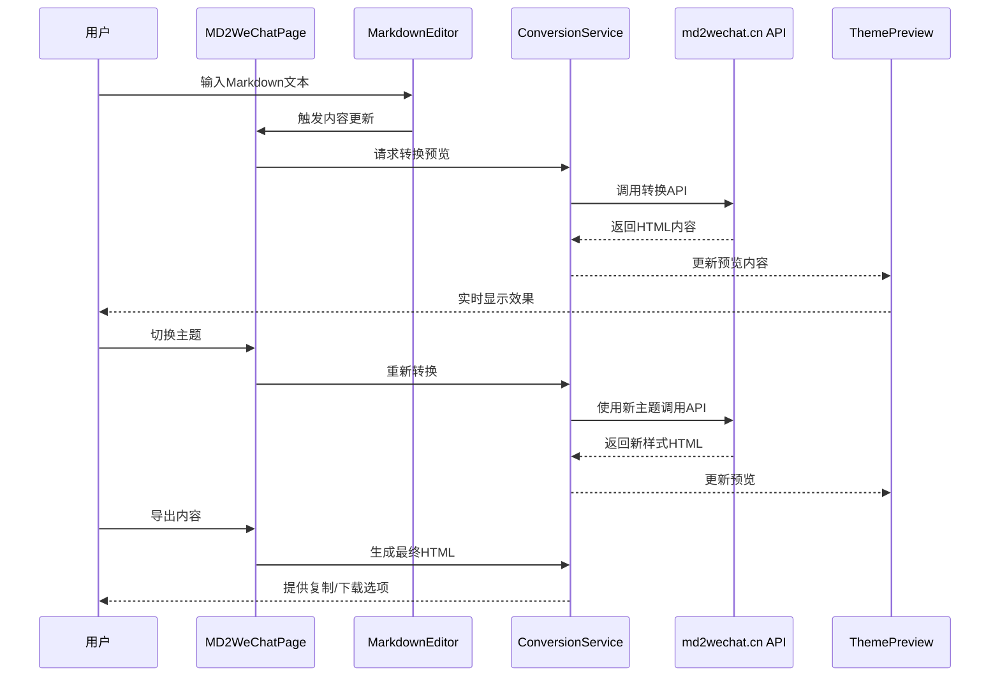
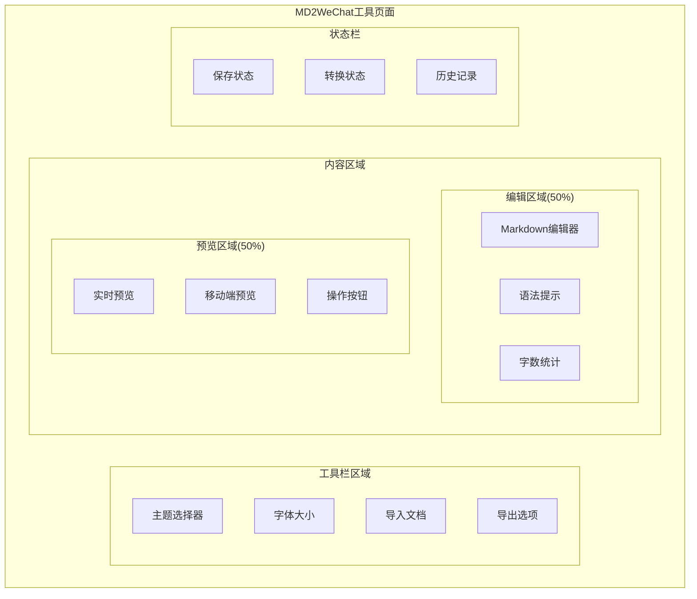
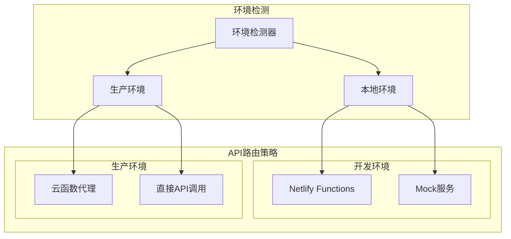

# Markdown转微信公众号排版工具设计文档

## 1. 概述

### 功能定位
在创意魔方板块下增加一个Markdown转微信公众号排版工具，为内容创作者提供一键将Markdown文档转换为适合微信公众号发布的样式化HTML内容的功能。

### 核心价值
- **提升创作效率**: 让用户专注于内容创作，自动完成排版美化
- **统一品牌视觉**: 提供多种预设主题，保持品牌一致性
- **优化阅读体验**: 专门针对微信公众号阅读场景优化
- **完整创作闭环**: 与现有创意工具形成完整的内容创作工作流

## 2. 技术架构

### 2.1 组件集成架构



### 2.2 数据流设计



## 3. 功能模块设计

### 3.1 核心功能模块

#### Markdown编辑器模块
- **实时编辑**: 支持Markdown语法高亮和实时预览
- **智能提示**: 提供Markdown语法提示和快捷插入
- **文档导入**: 支持.md文件拖拽上传和粘贴导入
- **历史记录**: 自动保存编辑历史，支持撤销重做

#### 主题系统模块
- **预设主题**: 集成多种微信公众号风格主题
- **主题预览**: 实时切换主题效果
- **自定义配置**: 支持字体大小、行间距等细节调整
- **主题管理**: 收藏常用主题，快速切换

#### 转换引擎模块
- **API集成**: 集成md2wechat.cn转换服务
- **批量转换**: 支持多文档批量处理
- **格式适配**: 自动适配微信公众号格式要求
- **错误处理**: 完善的转换失败处理机制

#### 预览导出模块
- **实时预览**: 所见即所得的效果预览
- **多端适配**: 支持手机端预览效果
- **导出选项**: HTML代码复制、文件下载
- **分享功能**: 快速分享到其他创作工具

### 3.2 支持的主题样式

| 主题名称 | 主题标识 | 风格特点 | 适用场景 |
|---------|---------|---------|---------|
| 默认温暖风 | default | 温馨舒适，适合日常内容 | 生活分享、情感文章 |
| 字节范 | bytedance | 简洁现代，科技感强 | 科技资讯、产品介绍 |
| 苹果风 | apple | 极简优雅，设计感突出 | 设计分享、品牌文章 |
| 运动风 | sports | 活力动感，适合健身运动 | 健身指导、运动心得 |
| 中国风 | chinese | 古典雅致，传统文化 | 文化传承、历史故事 |
| 赛博朋克 | cyber | 未来科幻，个性十足 | 前沿科技、创新理念 |

## 4. 用户界面设计

### 4.1 布局结构



### 4.2 响应式设计

- **桌面端**: 左右分栏布局，编辑器与预览并排显示
- **平板端**: 可切换的标签页布局，编辑和预览分别占用全屏
- **手机端**: 垂直堆叠布局，编辑在上，预览在下

### 4.3 交互设计

#### 主要交互流程
1. **内容输入**: 用户在左侧编辑器输入Markdown内容
2. **实时预览**: 右侧自动显示转换后的微信公众号样式效果
3. **主题切换**: 通过顶部主题选择器切换样式
4. **参数调整**: 通过工具栏调整字体大小、行间距等参数
5. **导出操作**: 点击导出按钮复制HTML代码或下载文件

#### 快捷操作
- **Ctrl+S**: 保存当前文档
- **Ctrl+Z/Y**: 撤销/重做编辑
- **Ctrl+Enter**: 快速转换预览
- **Ctrl+C**: 复制预览HTML代码

## 5. 数据模型设计

### 5.1 文档数据模型

```typescript
interface MarkdownDocument {
  id: string;
  title: string;
  content: string;
  theme: string;
  fontSize: 'small' | 'medium' | 'large';
  createdAt: Date;
  updatedAt: Date;
  wordCount: number;
  estimatedReadTime: number;
}
```

### 5.2 主题配置模型

```typescript
interface ThemeConfig {
  id: string;
  name: string;
  displayName: string;
  description: string;
  previewImage: string;
  isDefault: boolean;
  isFavorite: boolean;
  customSettings?: {
    fontSize?: string;
    lineHeight?: string;
    marginTop?: string;
    marginBottom?: string;
  };
}
```

### 5.3 转换历史模型

```typescript
interface ConversionHistory {
  id: string;
  documentId: string;
  originalContent: string;
  convertedContent: string;
  theme: string;
  settings: Record<string, any>;
  timestamp: Date;
  success: boolean;
  errorMessage?: string;
}
```

## 6. API集成设计

### 6.1 转换服务接口

```typescript
interface ConversionService {
  // 转换Markdown为HTML
  convertToHTML(request: ConversionRequest): Promise<ConversionResponse>;
  
  // 获取支持的主题列表
  getAvailableThemes(): Promise<ThemeConfig[]>;
  
  // 验证API密钥
  validateApiKey(apiKey: string): Promise<boolean>;
  
  // 获取用户转换配额
  getQuotaStatus(): Promise<QuotaStatus>;
}

interface ConversionRequest {
  markdown: string;
  theme: string;
  fontSize: 'small' | 'medium' | 'large';
  customSettings?: Record<string, any>;
}

interface ConversionResponse {
  success: boolean;
  html: string;
  preview: string;
  error?: string;
  quotaUsed: number;
  quotaRemaining: number;
}
```

### 6.2 环境适配策略



## 7. 性能优化策略

### 7.1 转换性能优化

- **防抖处理**: 编辑器输入防抖，减少不必要的API调用
- **缓存机制**: 相同内容和主题的转换结果缓存
- **分片转换**: 长文档分片处理，提升响应速度
- **后台预转换**: 主题切换时后台预转换常用主题

### 7.2 用户体验优化

- **加载状态**: 转换过程中显示进度指示器
- **错误恢复**: 转换失败时提供重试机制
- **离线支持**: 基础Markdown预览支持离线使用
- **快捷操作**: 常用功能提供键盘快捷键

## 8. 安全性设计

### 8.1 数据安全

- **内容加密**: 用户文档内容本地加密存储
- **API密钥管理**: 安全存储和传输API密钥
- **数据隔离**: 用户数据完全隔离，不会泄露给其他用户
- **传输安全**: 所有API调用使用HTTPS加密传输

### 8.2 访问控制

- **权限验证**: 集成现有的用户权限系统
- **配额限制**: 根据用户等级限制转换次数
- **防刷机制**: 防止恶意大量调用API接口
- **内容审核**: 集成内容安全检查机制

## 9. 集成方案

### 9.1 创意工作室集成

#### 标签页集成
在现有的创意工作室页面中新增"排版工具"标签页：

```typescript
// 在 CreativeStudioPage.tsx 中添加新标签页
<TabsTrigger value="md2wechat" className="unified-tab-trigger">
  <FileText className="tab-icon" />
  <span className="tab-text-mobile">排版</span>
  <span className="tab-text-desktop">Markdown排版工具</span>
</TabsTrigger>

<TabsContent value="md2wechat" className="mt-6">
  <React.Suspense fallback={<LoadingSpinner />}>
    <MD2WeChatPage />
  </React.Suspense>
</TabsContent>
```

#### 导航结构调整
```mermaid
graph TB
    subgraph "创意工作室标签页"
        MC[营销日历]
        CC[九宫格创意魔方]
        WT[微信朋友圈文案模板]
        EP[Emoji图库]
        MT[Markdown排版工具] %% 新增
    end
    
    subgraph "工作流集成"
        CC --> MT
        WT --> MT
        MT --> EP
    end
```

### 9.2 现有功能协同

#### 与创意魔方协同
- 创意魔方生成的内容可直接导入到排版工具
- 排版工具处理后的内容可回流到创意魔方历史

#### 与朋友圈文案协同  
- 朋友圈模板生成的长文案可导入排版工具美化
- 排版后的内容可适配回朋友圈格式

#### 与品牌资料库协同
- 读取品牌色彩和字体偏好应用到排版主题
- 品牌Logo和元素集成到排版模板

## 10. 开发计划

### 10.1 开发阶段

#### 第一阶段：基础功能 (2周)
- Markdown编辑器组件开发
- 基础主题系统实现
- API集成和转换服务
- 基础预览功能

#### 第二阶段：高级功能 (2周)  
- 多主题支持和切换
- 文档导入导出功能
- 历史记录和缓存机制
- 响应式界面优化

#### 第三阶段：集成优化 (1周)
- 创意工作室集成
- 与现有功能协同
- 性能优化和错误处理
- 用户体验优化

### 10.2 技术实现重点

#### 组件开发
```typescript
// MD2WeChatPage 主组件
export default function MD2WeChatPage() {
  const [markdownContent, setMarkdownContent] = useState('');
  const [selectedTheme, setSelectedTheme] = useState('default');
  const [previewHtml, setPreviewHtml] = useState('');
  const [isConverting, setIsConverting] = useState(false);
  
  // 防抖转换
  const debouncedConvert = useDebouncedCallback(
    async (content: string, theme: string) => {
      await convertMarkdownToHTML(content, theme);
    },
    500
  );
  
  return (
    <div className="md2wechat-container">
      <MD2WeChatToolbar />
      <div className="md2wechat-content">
        <MarkdownEditor />
        <ThemePreview />
      </div>
      <StatusBar />
    </div>
  );
}
```

#### API服务集成
```typescript
// 转换服务实现
export class MD2WeChatService {
  async convertToHTML(request: ConversionRequest): Promise<ConversionResponse> {
    try {
      const response = await apiClient.post('/api/md2wechat/convert', {
        markdown: request.markdown,
        theme: request.theme,
        fontSize: request.fontSize
      });
      
      return {
        success: true,
        html: response.data.html,
        preview: response.data.preview,
        quotaUsed: response.data.quotaUsed,
        quotaRemaining: response.data.quotaRemaining
      };
    } catch (error) {
      return {
        success: false,
        html: '',
        preview: '',
        error: error.message
      };
    }
  }
}
```

## 11. 测试策略

### 11.1 单元测试
- Markdown解析器测试
- 主题切换逻辑测试  
- API调用和错误处理测试
- 本地存储和缓存测试

### 11.2 集成测试
- 完整转换流程测试
- 多主题兼容性测试
- 大文档性能测试
- API配额和限流测试

### 11.3 用户体验测试
- 不同设备尺寸适配测试
- 网络异常情况处理测试
- 用户操作流程测试
- 可访问性(A11y)测试