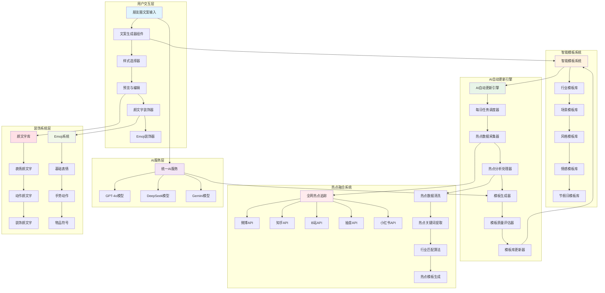
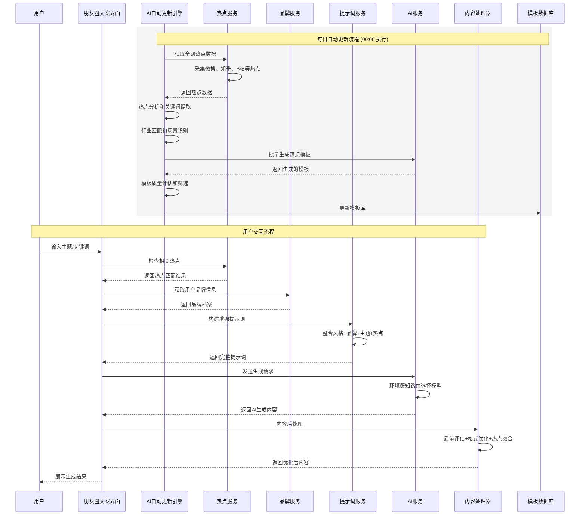
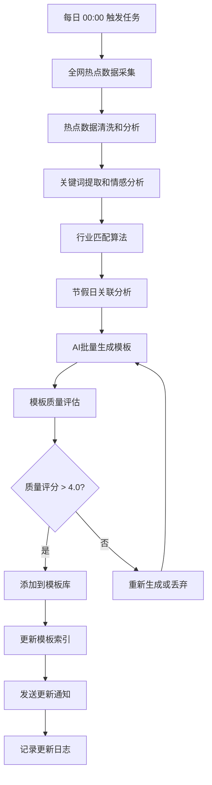
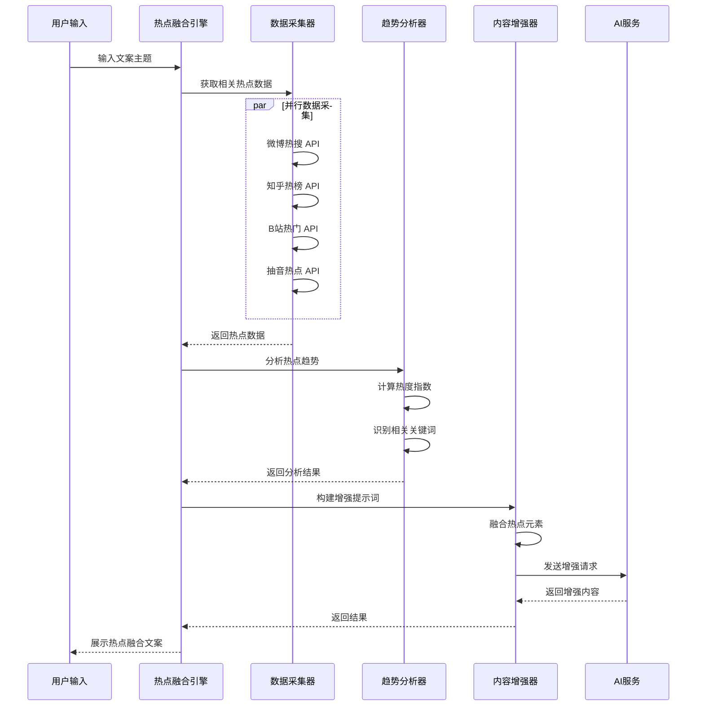
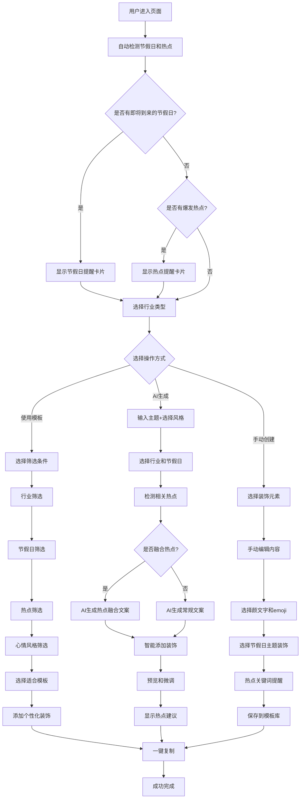

# 朋友圈文案生成功能设计文档

## 1. 功能概述

### 1.1 背景与目标

朋友圈文案生成功能是文派智能内容创作平台的核心AI应用之一，旨在帮助用户快速生成高质量、个性化的朋友圈内容。该功能基于先进的AI模型和品牌化提示词系统，为用户提供多样化、情感丰富的朋友圈文案创作体验。

**核心目标：**
- 提供智能化的朋友圈文案生成服务
- 支持多种文案风格和情感表达
- 丰富的模板库，涵盖多个行业场景
- 集成颜文字(Emoticon)和Emoji装饰系统
- 智能行业适配和个性化推荐
- 集成品牌资料库实现个性化创作
- 提供一键复制和多平台适配能力
- 确保内容质量和用户体验

### 1.2 技术栈

- **前端框架：** React 18.3.1 + TypeScript 5.7.2
- **构建工具：** Vite 7.0.5
- **AI服务：** OpenAI GPT-4o、DeepSeek Chat、Google Gemini Pro
- **状态管理：** Zustand
- **UI框架：** Tailwind CSS + shadcn/ui + Radix UI
- **后端服务：** Netlify Functions
- **提示词系统：** 模块化提示词管理
- **品牌集成：** 智能品牌资料库

## 2. 功能架构

### 2.1 整体架构图



### 2.2 数据流程图



## 3. 核心功能模块

### 3.1 朋友圈文案生成器 (MomentsTextGenerator)

**功能职责：**
- 提供直观的朋友圈文案创作界面
- 支持AI智能生成和手动创作模式
- 提供文案模板库和收藏管理

**核心接口：**

| 方法名 | 功能描述 | 参数 |
|--------|----------|------|
| `generateAIText()` | AI生成文案 | `aiPrompt, aiStyle, aiLength` |
| `copyToClipboard()` | 复制文案 | `content` |
| `toggleFavorite()` | 切换收藏 | `templateId` |
| `filterTemplates()` | 过滤模板 | `query, category, mood` |

**数据结构：**

```typescript
interface TextTemplate {
  id: string;
  title: string;           // 文案标题
  content: string;         // 文案内容
  category: string;        // 分类
  tags: string[];          // 标签
  mood: 'happy' | 'romantic' | 'motivational' | 'casual' | 'thoughtful' | 'funny';
  isFavorite: boolean;     // 是否收藏
  useCount: number;        // 使用次数
}
```

### 3.2 智能模板系统 (IntelligentTemplateSystem)

**功能特色：**
- 多行业智能模板管理
- 支持分类、标签、场合、行业多维度过滤
- 集成颜文字和Emoji装饰系统
- 智能推荐和个性化适配
- 模板热度和效果统计

**行业模板分类：**

| 行业类别 | 模板子类 | 装饰特色 | 示例场景 |
|----------|----------|----------|---------|
| 餐饮行业 | 新品推广、店铺活动、美食分享 | 🍕🍰🥘 + (๑´ڡ`๑) | 新品上市、节日促销 |
| 美妆时尚 | 产品种草、搭配分享、护肤心得 | 💄💅✨ + (｡♥‿♥｡) | 化妆教程、穿搭推荐 |
| 健身运动 | 训练打卡、减脂分享、健康生活 | 💪🏃‍♀️🔥 + ᕦ(ò_óˇ)ᕤ | 健身记录、减重成果 |
| 教育培训 | 课程推广、学习分享、知识科普 | 📚🎓💡 + (◕‿◕) | 课程招生、学习心得 |
| 电商零售 | 产品推广、促销活动、客户服务 | 🛍️💰🎁 + (≧∇≦)ﾉ | 商品推荐、优惠活动 |
| 旅游出行 | 景点推荐、游记分享、攻略指南 | ✈️🏖️🗺️ + ٩(◕‿◕)۶ | 旅游路线、酒店推荐 |
| 房产家居 | 楼盘推广、装修分享、生活方式 | 🏠🔑🛋️ + (ﾉ◕ヮ◕)ﾉ | 新房推荐、装修案例 |
| 汽车行业 | 新车发布、保养知识、驾驶分享 | 🚗⛽🔧 + ╰( ͡° ͜ʖ ͡° )つ | 试驾体验、保养提醒 |
| 母婴亲子 | 育儿心得、产品推荐、成长记录 | 👶🍼🧸 + (๑>◡<๑) | 育儿经验、产品种草 |
| 金融服务 | 理财知识、产品介绍、市场分析 | 💰📈💳 + (￣▽￣)ノ | 投资建议、理财规划 |

**节假日专题模板：**

| 节假日类型 | 核心主题 | 装饰组合 | 适用行业 |
|----------|----------|----------|----------|
| 春节新年 | 新年祝福、年货推荐、团圆主题 | 🧧🎊🐉🏮 + ヽ(°〇°)ﾉ | 餐饮、零售、旅游 |
| 情人节 | 浪漫表白、礼品推荐、甜蜜分享 | 💕🌹💎🍫 + (♡˙︶˙♡) | 美妆、餐饮、零售 |
| 妇女节 | 女性关怀、美丽主题、自我犒赏 | 🌸💐👸✨ + (｡♥‿♥｡) | 美妆、时尚、健康 |
| 清明节 | 踏青郊游、缅怀追思、春日美好 | 🌱🌸🕊️⛰️ + (◡ ‿ ◡) | 旅游、文化、教育 |
| 劳动节 | 致敬劳动、假期出游、特惠活动 | 🔧⚒️🎪🎢 + ᕦ(ò_óˇ)ᕤ | 旅游、零售、服务 |
| 儿童节 | 童趣回忆、亲子活动、儿童关爱 | 🎈🎪🧸🎨 + (๑>◡<๑) | 母婴、教育、娱乐 |
| 端午节 | 传统文化、粽子美食、龙舟竞渡 | 🐉🥟🚣‍♂️🎋 + ٩(◕‿◕)۶ | 餐饮、文化、传统 |
| 中秋节 | 团圆思念、月饼分享、赏月情怀 | 🌕🥮🏮🦴 + (´∀｀)♡ | 餐饮、家居、传统 |
| 国庆节 | 爱国情怀、出游计划、庆祝活动 | 🇨🇳🎆🎪🗺️ + (≧▽≦) | 旅游、文化、零售 |
| 万圣节 | 奇趣装扮、惊喜活动、创意主题 | 🎃👻🦇🕷️ + (⊙_⊙) | 娱乐、时尚、餐饮 |
| 双十一 | 购物狂欢、超值优惠、抢购热潮 | 🛒💰🎯⚡ + (≧∇≦)ﾉ | 电商、零售、数码 |
| 圣诞节 | 温馨祝福、礼品交换、节日氛围 | 🎄🎅🎁❄️ + ♪(´▽｀) | 餐饮、零售、娱乐 |

**场景模板库：**
- 日常分享：晨光微醉 ☀️ (◡ ‿ ◡)、周末慢时光 🌸 ♪(´▽｀)
- 节日祝福：新年愿景 🎊 ヽ(°〇°)ﾉ、情人节甜蜜 💕 (♡˙︶˙♡)
- 传统节日：中秋团圆 🌕 (´∀｀)♡、端午習俗 🐉 ٩(◕‿◕)۶
- 国际节日：妇女节美丽 🌸 (｡♥‿♥｡)、儿童节欢乐 🎈 (๑>◡<๑)
- 购物节日：双十一狂欢 🛒 (≧∇≦)ﾉ、年中大促 💰 ٩(◕‿◕)۶
- 心情表达：月光下的思绪 🌙 (´･ω･`)、春天的约定 🌱 (≧▽≦)
- 工作感悟：职场成长 📊 ᕦ(ò_óˇ)ᕤ、团队协作 🤝 ٩(◕‿◕)۶
- 生活记录：美食探店 🍜 (´∀｀)♡、运动打卡 🏃‍♀️ ᕦ(ò_óˇ)ᕤ

### 3.4 AI自动更新引擎 (AutoUpdateEngine)

**核心功能：**
- 每日定时任务调度，自动更新模板库
- 全网热点实时采集和分析处理
- 智能生成热点相关模板内容
- 模板质量评估和智能筛选

**每日更新流程：**



**热点数据源配置：**

| 平台名称 | API接口 | 更新频率 | 数据类型 |
|----------|----------|----------|----------|
| 微博热搜 | `/api/weibo/trending` | 15分钟 | 实时热点、话题热度 |
| 知乎热榜 | `/api/zhihu/hot` | 30分钟 | 知识问答、话题讨论 |
| B站热门 | `/api/bilibili/trending` | 20分钟 | 视频热点、UP主动态 |
| 抽音热榜 | `/api/douyin/hot` | 30分钟 | 短视频、音乐热点 |
| 小红书热门 | `/api/xiaohongshu/trending` | 1小时 | 生活方式、美妆时尚 |
| 今日头条 | `/api/toutiao/hot` | 30分钟 | 新闻资讯、社会热点 |

**模板生成策略：**

```typescript
interface HotTopicTemplate {
  id: string;
  hotTopic: string;          // 热点话题
  platform: string;          // 来源平台
  industry: string;          // 适用行业
  content: string;           // 模板内容
  keywords: string[];        // 关键词
  sentiment: 'positive' | 'neutral' | 'negative';
  heatIndex: number;         // 热度指数
  decorations: {
    emojis: string[];
    emoticons: string[];
  };
  qualityScore: number;      // 质量评分 (1-5)
  generatedAt: Date;
  expiryDate: Date;          // 过期时间
}

class AutoTemplateGenerator {
  // 热点模板生成
  async generateHotTopicTemplates(hotTopics: HotTopic[]): Promise<HotTopicTemplate[]> {
    const templates = [];
    
    for (const topic of hotTopics) {
      const industries = this.matchIndustries(topic.keywords);
      
      for (const industry of industries) {
        const prompt = this.buildHotTopicPrompt(topic, industry);
        const content = await this.aiService.generate(prompt);
        const quality = await this.evaluateQuality(content, topic);
        
        if (quality >= 4.0) {
          templates.push({
            id: generateId(),
            hotTopic: topic.title,
            platform: topic.platform,
            industry: industry,
            content: content,
            keywords: topic.keywords,
            sentiment: topic.sentiment,
            heatIndex: topic.heatIndex,
            decorations: this.generateDecorations(topic, industry),
            qualityScore: quality,
            generatedAt: new Date(),
            expiryDate: this.calculateExpiryDate(topic.heatIndex)
          });
        }
      }
    }
    
    return templates;
  }
  
  // 行业匹配算法
  private matchIndustries(keywords: string[]): string[] {
    const industryKeywords = {
      '餐饮': ['美食', '餐厅', '菜品', '料理', '吃播'],
      '美妆': ['化妆品', '护肤', '美容', '彩妆', '香水'],
      '时尚': ['服装', '穿搭', '时尚', '潮流', '配饰'],
      '科技': ['手机', '电脑', 'AI', '科技', '互联网'],
      '汽车': ['汽车', '新能源', '驾驶', '车展']
    };
    
    const matchedIndustries = [];
    for (const [industry, words] of Object.entries(industryKeywords)) {
      if (keywords.some(keyword => 
        words.some(word => keyword.includes(word))
      )) {
        matchedIndustries.push(industry);
      }
    }
    
    return matchedIndustries.length > 0 ? matchedIndustries : ['通用'];
  }
  
  // 质量评估算法
  private async evaluateQuality(content: string, topic: HotTopic): Promise<number> {
    const criteria = {
      relevance: this.calculateRelevance(content, topic.keywords),
      creativity: this.calculateCreativity(content),
      readability: this.calculateReadability(content),
      engagement: this.calculateEngagement(content),
      brandSafety: this.checkBrandSafety(content)
    };
    
    return (criteria.relevance * 0.3 + 
            criteria.creativity * 0.25 + 
            criteria.readability * 0.2 + 
            criteria.engagement * 0.15 + 
            criteria.brandSafety * 0.1);
  }
}
```

**AI模型集成：**
- OpenAI GPT-4o：高质量文本生成
- DeepSeek Chat：中文优化AI
- Google Gemini Pro：多模态AI

**智能装饰系统：**

| 装饰类型 | 元素库 | 使用场景 | 示例 |
|----------|--------|----------|---------|
| 基础表情 | 😀😍😎🤔😢😡 | 情感表达 | 今天心情超级好 😊 |
| 手势动作 | 👍👌✌️🤝👏💪 | 互动鼓励 | 给你点赞 👍 加油 💪 |
| 物品符号 | 🎁🌸🔥⭐💎🎯 | 内容装饰 | 新品上市 🔥 限时优惠 ⭐ |
| 颜文字-开心 | (◕‿◕) ٩(◕‿◕)۶ (≧∇≦)ﾉ | 快乐分享 | 周末愉快 (◕‿◕) |
| 颜文字-可爱 | (｡♥‿♥｡) (๑´ڡ`๑) (◡ ‿ ◡) | 温馨表达 | 小确幸时刻 (｡♥‿♥｡) |
| 颜文字-惊讶 | (⊙_⊙) (°o°) ヽ(°〇°)ﾉ | 强调重点 | 居然是这样 (⊙_⊙) |
| 颜文字-努力 | ᕦ(ò_óˇ)ᕤ (ง •̀_•́)ง | 励志打气 | 继续加油 ᕦ(ò_óˇ)ᕤ |
| 颜文字-思考 | (´･ω･`) (￣ω￣) | 深度表达 | 人生感悟 (´･ω･`) |

**风格模板升级：**

| 风格类型 | 描述 | 装饰特色 | 行业适配 |
|----------|------|----------|----------|
| `casual` | 轻松随性 | 😊😎 + (◕‿◕) | 日常生活、朋友聚会 |
| `romantic` | 浪漫温馨 | 💕🌹 + (｡♥‿♥｡) | 情感表达、婚庆服务 |
| `motivational` | 励志正能量 | 💪🔥 + ᕦ(ò_óˇ)ᕤ | 健身、教育、职场 |
| `funny` | 幽默搞笑 | 😂🤣 + (≧∇≦)ﾉ | 娱乐、餐饮、社交 |
| `thoughtful` | 深度思考 | 🤔💭 + (´･ω･`) | 知识分享、文化艺术 |
| `professional` | 专业商务 | 📊💼 + (￣▽￣)ノ | 金融、咨询、B2B |
| `trendy` | 时尚潮流 | ✨💎 + (ﾉ◕ヮ◕)ﾉ | 美妆、时尚、设计 |
| `warm` | 温暖治愈 | 🌸☀️ + ♪(´▽｀) | 母婴、医疗、公益 |

**生成策略升级：**

```typescript
const generatePrompt = (topic: string, style: string, length: string, industry?: string, holiday?: string) => {
  // 获取行业专属装饰
  const industryDecorations = getIndustryDecorations(industry);
  const styleEmoticons = getStyleEmoticons(style);
  const holidayTheme = getHolidayTheme(holiday);
  
  return `请为我生成一条朋友圈文案，要求：
1. 主题：${topic}
2. 风格：${style}
3. 长度：${length}
4. 行业：${industry || '通用'}
5. 节假日：${holiday ? `结合${holiday}节日氛围` : '无特定节日'}
6. 装饰要求：
   - 包含适当的emoji表情: ${industryDecorations.emojis}
   - 使用颜文字装饰: ${styleEmoticons}
   - 节日主题装饰: ${holidayTheme?.decorations || '无'}
   - 整体风格符合${industry}行业特色
7. 内容要求：
   - 适合微信朋友圈发布
   - 原创有创意，符合现代年轻人表达习惯
   - 内容积极正面，具有传播价值
   ${holiday ? `- 突出${holiday}节日氛围和相关元素` : ''}`;
};

// 增强型模板生成器
const generateEnhancedTemplate = {
  // 行业适配生成
  byIndustry: (industry: string, scenario: string) => {
    const templates = INDUSTRY_TEMPLATES[industry];
    return templates.filter(t => t.scenarios.includes(scenario));
  },
  
  // 节假日主题生成
  byHoliday: (holiday: string, industry?: string) => {
    const holidayTemplates = HOLIDAY_TEMPLATES[holiday];
    if (industry) {
      return holidayTemplates.filter(t => t.industries.includes(industry));
    }
    return holidayTemplates;
  },
  
  // 智能节假日识别
  detectHoliday: (currentDate: Date) => {
    const month = currentDate.getMonth() + 1;
    const day = currentDate.getDate();
    return HOLIDAY_DETECTOR.getHolidayByDate(month, day);
  },
  
  // 情感增强生成
  withEmotions: (baseText: string, mood: string) => {
    const emoticons = MOOD_EMOTICONS[mood];
    const emojis = MOOD_EMOJIS[mood];
    return decorateText(baseText, emoticons, emojis);
  },
  
  // 智能装饰推荐
  smartDecoration: (content: string, context: TemplateContext) => {
    const decorationSuggestions = analyzeContent(content);
    return applyBestDecorations(content, decorationSuggestions, context);
  }
};

// 节假日检测器
const HOLIDAY_DETECTOR = {
  holidays: {
    '1-1': '元旦',
    '2-14': '情人节',
    '3-8': '妇女节',
    '4-4': '清明节', // 近似日期
    '5-1': '劳动节',
    '6-1': '儿童节',
    '10-1': '国庆节',
    '10-31': '万圣节',
    '11-11': '双十一',
    '12-25': '圣诞节'
  },
  
  getHolidayByDate: (month: number, day: number) => {
    const key = `${month}-${day}`;
    return HOLIDAY_DETECTOR.holidays[key] || null;
  },
  
  getUpcomingHolidays: (daysAhead: number = 7) => {
    const upcoming = [];
    const today = new Date();
    for (let i = 0; i <= daysAhead; i++) {
      const checkDate = new Date(today);
      checkDate.setDate(today.getDate() + i);
      const holiday = HOLIDAY_DETECTOR.getHolidayByDate(
        checkDate.getMonth() + 1, 
        checkDate.getDate()
      );
      if (holiday) {
        upcoming.push({ date: checkDate, holiday });
      }
    }
    return upcoming;
  }
};
```### 3.5 实时热点融合系统 (RealTimeHotspotFusion)

**核心功能：**
- 实时监控全网热点变化和趋势
- 智能识别爆发性热点和突发事件
- 实时融合热点到用户文案生成
- 提供热点趋势预测和建议

**实时热点融合流程：**



**热点识别算法：**

```typescript
class HotspotDetector {
  // 爆发性热点检测
  detectTrendingTopics(data: PlatformData[]): TrendingTopic[] {
    const trendingTopics = [];
    
    for (const platformData of data) {
      const topics = this.analyzePlatformTrends(platformData);
      
      for (const topic of topics) {
        const trendScore = this.calculateTrendScore(topic);
        
        if (trendScore > 0.7) { // 热度阈值
          trendingTopics.push({
            ...topic,
            trendScore,
            platform: platformData.platform,
            detectedAt: new Date(),
            predictedPeak: this.predictPeakTime(topic),
            suggestedActions: this.generateActionSuggestions(topic)
          });
        }
      }
    }
    
    return this.rankByUrgency(trendingTopics);
  }
  
  // 热度计算算法
  private calculateTrendScore(topic: TopicData): number {
    const factors = {
      searchVolume: topic.searchCount / 100000,        // 搜索量权重: 30%
      growthRate: topic.hourlyGrowth,                  // 增长率权重: 25%
      engagement: topic.interactions / topic.views,    // 互动率权重: 20%
      mediaAttention: topic.mediaCount / 100,          // 媒体关注权重: 15%
      recency: this.calculateRecencyScore(topic.time), // 时效性权重: 10%
    };
    
    return Math.min(1, 
      factors.searchVolume * 0.3 +
      factors.growthRate * 0.25 +
      factors.engagement * 0.2 +
      factors.mediaAttention * 0.15 +
      factors.recency * 0.1
    );
  }
  
  // 关键词提取和匹配
  extractRelevantKeywords(userInput: string, hotTopics: TrendingTopic[]): MatchResult[] {
    const userKeywords = this.extractKeywords(userInput);
    const matches = [];
    
    for (const topic of hotTopics) {
      const relevanceScore = this.calculateRelevance(userKeywords, topic.keywords);
      
      if (relevanceScore > 0.3) {
        matches.push({
          topic,
          relevanceScore,
          matchedKeywords: this.findMatchedKeywords(userKeywords, topic.keywords),
          suggestionText: this.generateSuggestion(topic, relevanceScore)
        });
      }
    }
    
    return matches.sort((a, b) => b.relevanceScore - a.relevanceScore);
  }
}

// 实时热点推荐组件
class HotspotRecommendation {
  // 实时热点推荐
  getInstantRecommendations(context: UserContext): HotspotSuggestion[] {
    const currentHotspots = this.hotspotDetector.getCurrentTrending();
    const userProfile = this.getUserProfile(context.userId);
    
    return currentHotspots
      .filter(spot => this.isRelevantToUser(spot, userProfile))
      .map(spot => ({
        hotspot: spot,
        urgency: this.calculateUrgency(spot),
        suggestedContent: this.generateContentSuggestion(spot, context),
        expectedEngagement: this.predictEngagement(spot, userProfile),
        optimalTiming: this.calculateOptimalTiming(spot)
      }))
      .sort((a, b) => b.urgency - a.urgency)
      .slice(0, 5); // 只返回前5个最相关的
  }
  
  // 热点预测算法
  predictHotspotEvolution(topic: TrendingTopic): HotspotPrediction {
    const historicalData = this.getHistoricalData(topic.keywords);
    const seasonalFactors = this.getSeasonalFactors(topic.category);
    
    return {
      peakTime: this.predictPeakTime(topic, historicalData),
      duration: this.predictDuration(topic, seasonalFactors),
      relatedTopics: this.findRelatedTopics(topic),
      actionWindow: this.calculateActionWindow(topic),
      confidenceScore: this.calculateConfidence(topic, historicalData)
    };
  }
}
```

**热点数据结构：**

```typescript
interface TrendingTopic {
  id: string;
  title: string;
  keywords: string[];
  platform: string;
  category: string;
  trendScore: number;        // 0-1 热度评分
  searchVolume: number;
  growthRate: number;        // 小时增长率
  sentiment: 'positive' | 'neutral' | 'negative';
  demographics: {
    ageGroups: string[];
    regions: string[];
    interests: string[];
  };
  timeline: {
    startTime: Date;
    peakTime?: Date;
    endTime?: Date;
  };
  relatedTopics: string[];
  suggestedIndustries: string[];
}

interface HotspotSuggestion {
  hotspot: TrendingTopic;
  urgency: number;           // 0-1 紧急度
  suggestedContent: string;
  expectedEngagement: number;
  optimalTiming: Date;
  actionTips: string[];
}
```

### 4.1 颜文字系统 (EmoticonSystem)

**功能特色：**
- 按情感分类的颜文字库
- 智能情感识别和匹配
- 个性化的颜文字推荐

**情感分类详细：**

| 情感类型 | 代表符号 | 强度层次 | 使用场景 |
|----------|----------|----------|----------|
| 开心快乐 | (◕‿◕) | 轻度 | 日常分享 |
| | ٩(◕‿◕)۶ | 中度 | 好消息分享 |
| | (≧∇≦)ﾉ | 高度 | 特别兴奋 |
| 可爱温馨 | (◡ ‿ ◡) | 轻度 | 温馨日常 |
| | (｡♥‿♥｡) | 中度 | 情感表达 |
| | (๑´ڡ`๑) | 高度 | 超级喜欢 |
| 努力加油 | ᕦ(ò_óˇ)ᕤ | 轻度 | 工作状态 |
| | (ง •̀_•́)ง | 中度 | 励志打气 |
| | ٩(•̤̀ᵕ•̤́)و | 高度 | 充满动力 |

### 4.2 行业适配系统

**核心行业覆盖：**
- 餐饮业：新品推广、店铺活动、美食分享 🍕🍰 + (´∀｀)♡
- 美妆业：产品种草、搭配分享、护肤心得 💄💅 + (♡♡♡)
- 健身业：训练打卡、减脂分享、健康生活 💪🔥 + ᕦ(ò_óˇ)ᕤ
- 教育业：课程推广、学习分享、知识科普 📚💡 + (◕‿◕)
- 电商业：产品推广、促销活动、客户服务 🛍️💰 + (≧∇≦)

**节假日智能推荐：**
- 实时节假日检测：自动识别当前日期对应的节假日
- 提前提醒功能：7天内即将到来的节假日提醒
- 节假日主题匹配：根据节假日类型推荐相关模板
- 行业与节假日结合：不同行业在特定节假日的专属模板
- 节假日装饰库：12个主要节假日的专属装饰元素

### 4.3 智能装饰算法

```typescript
class SmartDecorationEngine {
  // 内容分析和情感识别
  analyzeContent(text: string): ContentAnalysis {
    return {
      sentiment: detectSentiment(text),
      topics: extractTopics(text),
      industry: detectIndustry(text)
    };
  }
  
  // 智能推荐装饰
  recommendDecorations(analysis: ContentAnalysis): DecorationSuggestion {
    const emojis = this.selectEmojis(analysis.topics);
    const emoticons = this.selectEmoticons(analysis.sentiment);
    return { emojis, emoticons };
  }
}
```

## 5. 用户体验与界面设计

### 5.1 现代化界面布局设计

**设计理念：**
- 采用Material Design 3.0和Apple Human Interface Guidelines融合设计
- 支持浅色/深色主题自适应切换
- 遵循无障碍设计标准(WCAG 2.1 AA级)
- 移动优先的响应式设计策略

**主界面布局架构：**

```mermaid
graph TB
    subgroup "顶部导航栏 (64px)"
        A1[Logo & 品牌标识] 
        A2[搜索栏 + 快捷筛选]
        A3[用户头像 + 设置]
    end
    
    subgroup "智能推荐卡片区 (120px)"
        B1[热点提醒卡片]
        B2[节假日推荐卡片] 
        B3[AI生成快捷入口]
    end
    
    subgroup "主要内容区域"
        C1[侧边筛选面板 (280px)]
        C2[模板展示网格 (flex-1)]
        C3[装饰工具面板 (320px)]
    end
    
    subgroup "底部操作栏 (72px)"
        D1[快速生成按钮]
        D2[我的收藏]
        D3[最近使用]
    end
    
    style A1 fill:#e3f2fd
    style B1 fill:#fff3e0
    style C2 fill:#f3e5f5
    style D1 fill:#e8f5e8
```

**详细界面组件设计：**

### 5.2 顶部导航栏优化

```typescript
interface TopNavigationProps {
  searchQuery: string;
  onSearchChange: (query: string) => void;
  user: UserProfile;
  theme: 'light' | 'dark';
  onThemeToggle: () => void;
}

const TopNavigation: React.FC<TopNavigationProps> = ({
  searchQuery,
  onSearchChange,
  user,
  theme,
  onThemeToggle
}) => {
  return (
    <header className="
      sticky top-0 z-50 bg-white/80 dark:bg-gray-900/80 
      backdrop-blur-lg border-b border-gray-200 dark:border-gray-700
      transition-all duration-300 ease-in-out
    ">
      <div className="max-w-7xl mx-auto px-4 sm:px-6 lg:px-8">
        <div className="flex items-center justify-between h-16">
          {/* Logo区域 */}
          <div className="flex items-center space-x-4">
            <Logo className="h-8 w-auto" />
            <div className="hidden sm:block">
              <Badge variant="secondary" className="text-xs">
                朋友圈文案生成器
              </Badge>
            </div>
          </div>
          
          {/* 搜索区域 */}
          <div className="flex-1 max-w-lg mx-8">
            <SearchInput
              value={searchQuery}
              onChange={onSearchChange}
              placeholder="搜索模板、关键词或热点话题..."
              className="w-full"
              showSuggestions
              hotTopics={getHotTopicSuggestions()}
            />
          </div>
          
          {/* 用户操作区域 */}
          <div className="flex items-center space-x-3">
            <ThemeToggle theme={theme} onToggle={onThemeToggle} />
            <NotificationBell />
            <UserMenu user={user} />
          </div>
        </div>
      </div>
    </header>
  );
};
```

### 5.3 智能推荐卡片区设计

**热点推荐卡片：**
```typescript
const HotspotRecommendationCard: React.FC = () => {
  const [hotspots] = useHotspots();
  const [isExpanded, setIsExpanded] = useState(false);
  
  return (
    <Card className="
      group relative overflow-hidden bg-gradient-to-r 
      from-orange-50 to-red-50 dark:from-orange-900/20 dark:to-red-900/20
      border-orange-200 dark:border-orange-700
      hover:shadow-lg transition-all duration-300
    ">
      {/* 热度指示器 */}
      <div className="absolute top-2 right-2">
        <Badge className="bg-red-500 text-white animate-pulse">
          🔥 热点
        </Badge>
      </div>
      
      <CardContent className="p-4">
        <div className="flex items-start justify-between">
          <div className="flex-1">
            <h3 className="font-semibold text-gray-900 dark:text-white mb-2">
              实时热点推荐
            </h3>
            <div className="space-y-2">
              {hotspots.slice(0, isExpanded ? 5 : 2).map(hotspot => (
                <HotspotItem 
                  key={hotspot.id} 
                  hotspot={hotspot}
                  onSelect={() => handleHotspotSelect(hotspot)}
                />
              ))}
            </div>
          </div>
          
          <Button
            variant="ghost"
            size="sm"
            onClick={() => setIsExpanded(!isExpanded)}
            className="ml-2"
          >
            {isExpanded ? <ChevronUp /> : <ChevronDown />}
          </Button>
        </div>
        
        {/* 快速操作按钮 */}
        <div className="mt-4 flex space-x-2">
          <Button size="sm" variant="outline">
            <Zap className="w-4 h-4 mr-1" />
            一键蹭热点
          </Button>
          <Button size="sm" variant="ghost">
            查看更多
          </Button>
        </div>
      </CardContent>
    </Card>
  );
};
```

### 5.4 侧边筛选面板优化

```typescript
const FilterSidebar: React.FC = () => {
  const [filters, setFilters] = useFilters();
  const [isCollapsed, setIsCollapsed] = useState(false);
  
  return (
    <aside className={`
      transition-all duration-300 ease-in-out bg-white dark:bg-gray-900
      border-r border-gray-200 dark:border-gray-700
      ${isCollapsed ? 'w-16' : 'w-80'}
    `}>
      {/* 收起/展开按钮 */}
      <div className="flex items-center justify-between p-4 border-b">
        {!isCollapsed && (
          <h2 className="font-semibold text-gray-900 dark:text-white">
            筛选条件
          </h2>
        )}
        <Button
          variant="ghost"
          size="sm"
          onClick={() => setIsCollapsed(!isCollapsed)}
        >
          {isCollapsed ? <ChevronRight /> : <ChevronLeft />}
        </Button>
      </div>
      
      {!isCollapsed && (
        <div className="p-4 space-y-6 max-h-[calc(100vh-200px)] overflow-y-auto">
          {/* 行业筛选 */}
          <FilterSection
            title="行业类型"
            icon={<Building className="w-4 h-4" />}
          >
            <IndustryFilter 
              selected={filters.industry}
              onChange={(industry) => setFilters({...filters, industry})}
            />
          </FilterSection>
          
          {/* 节假日筛选 */}
          <FilterSection
            title="节假日主题"
            icon={<Calendar className="w-4 h-4" />}
          >
            <HolidayFilter
              selected={filters.holiday}
              onChange={(holiday) => setFilters({...filters, holiday})}
            />
          </FilterSection>
          
          {/* 热点筛选 */}
          <FilterSection
            title="热点话题"
            icon={<TrendingUp className="w-4 h-4" />}
          >
            <HotTopicFilter
              selected={filters.hotTopic}
              onChange={(hotTopic) => setFilters({...filters, hotTopic})}
            />
          </FilterSection>
          
          {/* 风格筛选 */}
          <FilterSection
            title="文案风格"
            icon={<Palette className="w-4 h-4" />}
          >
            <StyleFilter
              selected={filters.style}
              onChange={(style) => setFilters({...filters, style})}
            />
          </FilterSection>
          
          {/* 清除筛选按钮 */}
          <Button
            variant="outline"
            className="w-full"
            onClick={() => setFilters({})}
          >
            <X className="w-4 h-4 mr-2" />
            清除所有筛选
          </Button>
        </div>
      )}
    </aside>
  );
};
```

### 5.5 模板卡片网格优化

```typescript
interface TemplateCardProps {
  template: TextTemplate;
  onPreview: (template: TextTemplate) => void;
  onCopy: (template: TextTemplate) => void;
  onFavorite: (template: TextTemplate) => void;
}

const TemplateCard: React.FC<TemplateCardProps> = ({
  template,
  onPreview,
  onCopy,
  onFavorite
}) => {
  const [isHovered, setIsHovered] = useState(false);
  const [isCopied, setIsCopied] = useState(false);
  
  const handleCopy = async () => {
    await onCopy(template);
    setIsCopied(true);
    setTimeout(() => setIsCopied(false), 2000);
  };
  
  return (
    <Card 
      className="
        group relative transition-all duration-300 ease-in-out
        hover:shadow-xl hover:-translate-y-1
        bg-white dark:bg-gray-800
        border border-gray-200 dark:border-gray-700
        hover:border-blue-300 dark:hover:border-blue-600
      "
      onMouseEnter={() => setIsHovered(true)}
      onMouseLeave={() => setIsHovered(false)}
    >
      {/* 模板标签 */}
      <div className="absolute top-3 left-3 flex space-x-1">
        {template.industry && (
          <Badge variant="secondary" className="text-xs">
            {template.industry}
          </Badge>
        )}
        {template.holiday && (
          <Badge className="text-xs bg-red-100 text-red-800">
            {template.holiday}
          </Badge>
        )}
        {template.isHot && (
          <Badge className="text-xs bg-orange-100 text-orange-800">
            🔥 热点
          </Badge>
        )}
      </div>
      
      {/* 收藏按钮 */}
      <Button
        variant="ghost"
        size="sm"
        className="
          absolute top-3 right-3 opacity-0 group-hover:opacity-100
          transition-opacity duration-200
        "
        onClick={() => onFavorite(template)}
      >
        <Heart 
          className={`w-4 h-4 ${
            template.isFavorite 
              ? 'fill-red-500 text-red-500' 
              : 'text-gray-400'
          }`} 
        />
      </Button>
      
      <CardContent className="p-6">
        {/* 模板内容预览 */}
        <div className="mb-4">
          <h3 className="font-medium text-gray-900 dark:text-white mb-2 line-clamp-1">
            {template.title}
          </h3>
          <p className="text-sm text-gray-600 dark:text-gray-300 line-clamp-3 leading-relaxed">
            {template.content}
          </p>
        </div>
        
        {/* 装饰预览 */}
        <div className="flex items-center space-x-2 mb-4">
          <div className="flex space-x-1">
            {template.decorations?.emojis?.slice(0, 3).map((emoji, index) => (
              <span key={index} className="text-sm">{emoji}</span>
            ))}
          </div>
          <div className="flex space-x-1">
            {template.decorations?.emoticons?.slice(0, 2).map((emoticon, index) => (
              <span key={index} className="text-xs text-gray-500">{emoticon}</span>
            ))}
          </div>
        </div>
        
        {/* 模板统计信息 */}
        <div className="flex items-center justify-between text-xs text-gray-500 mb-4">
          <span>使用 {template.useCount} 次</span>
          <div className="flex items-center space-x-2">
            <Star className="w-3 h-3" />
            <span>{template.qualityScore?.toFixed(1) || '5.0'}</span>
          </div>
        </div>
        
        {/* 操作按钮 */}
        <div className="
          flex space-x-2 opacity-0 group-hover:opacity-100
          transition-opacity duration-200
        ">
          <Button
            size="sm"
            variant="outline"
            className="flex-1"
            onClick={() => onPreview(template)}
          >
            <Eye className="w-4 h-4 mr-1" />
            预览
          </Button>
          <Button
            size="sm"
            className="flex-1"
            onClick={handleCopy}
            disabled={isCopied}
          >
            {isCopied ? (
              <>
                <Check className="w-4 h-4 mr-1" />
                已复制
              </>
            ) : (
              <>
                <Copy className="w-4 h-4 mr-1" />
                复制
              </>
            )}
          </Button>
        </div>
      </CardContent>
    </Card>
  );
};
```

### 5.6 装饰工具面板设计

```typescript
const DecorationPanel: React.FC = () => {
  const [activeTab, setActiveTab] = useState<'emoji' | 'emoticon' | 'style'>('emoji');
  const [selectedDecorations, setSelectedDecorations] = useState<string[]>([]);
  
  return (
    <aside className="
      w-80 bg-white dark:bg-gray-900 border-l border-gray-200 dark:border-gray-700
      flex flex-col h-full
    ">
      {/* 面板标题 */}
      <div className="p-4 border-b border-gray-200 dark:border-gray-700">
        <h2 className="font-semibold text-gray-900 dark:text-white">
          装饰工具
        </h2>
        <p className="text-sm text-gray-500 mt-1">
          为您的文案添加生动装饰
        </p>
      </div>
      
      {/* 标签页导航 */}
      <div className="flex border-b border-gray-200 dark:border-gray-700">
        {[
          { id: 'emoji', label: 'Emoji', icon: '😊' },
          { id: 'emoticon', label: '颜文字', icon: '(◕‿◕)' },
          { id: 'style', label: '风格', icon: '🎨' }
        ].map(tab => (
          <button
            key={tab.id}
            className={`
              flex-1 py-3 px-4 text-sm font-medium transition-colors
              ${activeTab === tab.id
                ? 'text-blue-600 border-b-2 border-blue-600 bg-blue-50 dark:bg-blue-900/20'
                : 'text-gray-500 hover:text-gray-700 dark:hover:text-gray-300'
              }
            `}
            onClick={() => setActiveTab(tab.id as any)}
          >
            <span className="mr-2">{tab.icon}</span>
            {tab.label}
          </button>
        ))}
      </div>
      
      {/* 装饰内容区域 */}
      <div className="flex-1 overflow-y-auto p-4">
        {activeTab === 'emoji' && (
          <EmojiSelector
            onSelect={(emoji) => setSelectedDecorations([...selectedDecorations, emoji])}
            categories={['faces', 'nature', 'food', 'activity', 'travel', 'objects']}
          />
        )}
        
        {activeTab === 'emoticon' && (
          <EmoticonSelector
            onSelect={(emoticon) => setSelectedDecorations([...selectedDecorations, emoticon])}
            emotions={['happy', 'cute', 'surprised', 'thinking', 'determined']}
          />
        )}
        
        {activeTab === 'style' && (
          <StyleSelector
            onSelect={(style) => console.log('Style selected:', style)}
            styles={['casual', 'romantic', 'motivational', 'funny', 'professional']}
          />
        )}
      </div>
      
      {/* 已选装饰预览 */}
      {selectedDecorations.length > 0 && (
        <div className="p-4 border-t border-gray-200 dark:border-gray-700">
          <h3 className="text-sm font-medium text-gray-900 dark:text-white mb-2">
            已选装饰
          </h3>
          <div className="flex flex-wrap gap-2 mb-3">
            {selectedDecorations.map((decoration, index) => (
              <Badge
                key={index}
                variant="secondary"
                className="cursor-pointer hover:bg-red-100"
                onClick={() => setSelectedDecorations(
                  selectedDecorations.filter((_, i) => i !== index)
                )}
              >
                {decoration}
                <X className="w-3 h-3 ml-1" />
              </Badge>
            ))}
          </div>
          <Button
            size="sm"
            className="w-full"
            onClick={() => console.log('Apply decorations')}
          >
            应用装饰
          </Button>
        </div>
      )}
    </aside>
  );
};
```

### 5.2 交互流程优化



### 5.3 响应式设计

| 屏幕尺寸 | 布局方式 | 网格列数 | 特殊处理 |
|----------|----------|----------|----------|
| 手机 (<768px) | 垂直堆叠 | 1列 | 简化操作按钮，装饰工具折叠 |
| 平板 (768-1024px) | 混合布局 | 2列 | 侧边栏可折叠，装饰面板缩小 |
| 桌面 (>1024px) | 完整布局 | 3列 | 全功能展示，装饰工具完整 |

## 6. 技术实现与部署

### 6.1 核心数据结构

```typescript
// 组件状态接口
interface MomentsState {
  templates: TextTemplate[];
  filteredTemplates: TextTemplate[];
  searchQuery: string;
  selectedCategory: string;
  selectedMood: string;
  selectedIndustry: string;
  selectedHoliday: string;
  showFavoritesOnly: boolean;
  isGenerating: boolean;
  upcomingHolidays: UpcomingHoliday[];
}

// AI生成状态
interface AIGenerationState {
  aiPrompt: string;
  aiStyle: 'casual' | 'romantic' | 'motivational' | 'funny' | 'thoughtful' | 'professional' | 'trendy' | 'warm';
  aiLength: 'short' | 'medium' | 'long';
  aiIndustry?: string;
  aiHoliday?: string;
}

// 节假日模板结构
interface HolidayTemplate {
  id: string;
  holiday: string;           // 节假日名称
  title: string;            // 模板标题
  content: string;          // 模板内容
  industries: string[];     // 适用行业
  decorations: {
    emojis: string[];       // 专属 emoji
    emoticons: string[];    // 专属颜文字
    colors: string[];       // 主题色彩
  };
  tags: string[];          // 标签
  popularity: number;      // 热度评分
  createdAt: Date;
  updatedAt: Date;
}

// 即将到来的节假日
interface UpcomingHoliday {
  date: Date;
  holiday: string;
  daysUntil: number;
  relevantTemplates: HolidayTemplate[];
}

// 热点数据结构
interface TrendingTopic {
  id: string;
  title: string;
  keywords: string[];
  platform: string;
  category: string;
  trendScore: number;        // 0-1 热度评分
  searchVolume: number;
  growthRate: number;        // 小时增长率
  sentiment: 'positive' | 'neutral' | 'negative';
  detectedAt: Date;
  predictedPeak?: Date;
  relatedTopics: string[];
  suggestedIndustries: string[];
}

// AI自动更新任务配置
interface AutoUpdateConfig {
  enabled: boolean;
  schedule: string;          // cron 表达式
  platforms: string[];       // 需要采集的平台
  qualityThreshold: number;  // 模板质量阈值
  maxTemplatesPerDay: number; // 每日最大生成数量
  retentionDays: number;     // 模板保存天数
}

// 定时任务管理器
class ScheduledTaskManager {
  private config: AutoUpdateConfig;
  
  constructor() {
    this.config = {
      enabled: true,
      schedule: '0 0 * * *',  // 每日 00:00 执行
      platforms: ['weibo', 'zhihu', 'bilibili', 'douyin', 'xiaohongshu'],
      qualityThreshold: 4.0,
      maxTemplatesPerDay: 100,
      retentionDays: 30
    };
  }
  
  // 启动定时任务
  startScheduledTasks() {
    if (!this.config.enabled) return;
    
    // 每日更新任务
    this.scheduleTask(this.config.schedule, this.dailyUpdateTask.bind(this));
    
    // 每小时热点检测
    this.scheduleTask('0 * * * *', this.hourlyHotspotCheck.bind(this));
    
    // 每周模板清理
    this.scheduleTask('0 2 * * 0', this.weeklyCleanup.bind(this));
  }
  
  // 每日更新任务
  private async dailyUpdateTask() {
    try {
      console.log('开始每日模板更新任务...');
      
      const hotTopics = await this.collectHotTopics();
      const newTemplates = await this.generateTemplates(hotTopics);
      const qualifiedTemplates = this.filterQualityTemplates(newTemplates);
      
      await this.updateTemplateDatabase(qualifiedTemplates);
      await this.sendUpdateNotification(qualifiedTemplates.length);
      
      console.log(`模板更新完成，新增 ${qualifiedTemplates.length} 个模板`);
    } catch (error) {
      console.error('每日更新任务失败:', error);
    }
  }
  
  // 每小时热点检测
  private async hourlyHotspotCheck() {
    const emergencyHotspots = await this.detectEmergencyHotspots();
    if (emergencyHotspots.length > 0) {
      await this.generateEmergencyTemplates(emergencyHotspots);
    }
  }
}
```

### 6.2 性能优化策略

**存储与缓存策略：**
- 模板数据：localStorage存储用户创建的模板
- 节假日模板：专门的节假日模板库，支持定期更新
- 收藏状态：localStorage记录用户收藏
- 使用统计：localStorage记录使用次数
- 搜索历史：sessionStorage存储搜索记录
- 装饰偏好：用户颜文字和Emoji使用习惯
- 节假日检测缓存：缓存节假日检测结果，减少重复计算
- 智能推荐缓存：基于用户行为的模板推荐结果

**优化措施：**
- 虚拟滚动：大量模板时使用虚拟滚动
- 防抖搜索：搜索输入防抖处理
- 延迟加载：模板内容按需加载
- 缓存机制：AI生成结果缓存
- 装饰预加载：常用颜文字和emoji组合预加载
- 行业模板分组加载：按需加载行业特定模板

### 6.3 部署与维护

**环境配置：**
```bash
# 开发服务器
npm run dev  # Vite (localhost:5175)
npx netlify dev --port 8888  # Netlify Functions

# 环境变量
VITE_OPENAI_API_KEY=your_openai_key
VITE_DEEPSEEK_API_KEY=your_deepseek_key
VITE_GEMINI_API_KEY=your_gemini_key
```

**功能扩展计划：**
- 近期：AI自动每日更新系统、实时热点融合、节假日模板智能推荐、品牌资料库集成
- 中期：热点趋势预测算法、爆发性热点快速响应、智能内容优化、跨平台热点数据融合
- 远期：个性化热点推荐引擎、自定义模板生成器、全球化热点适配、AI内容创新实验室