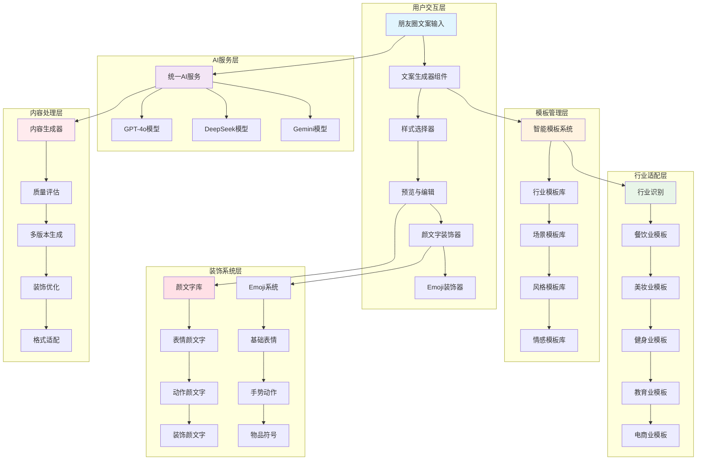
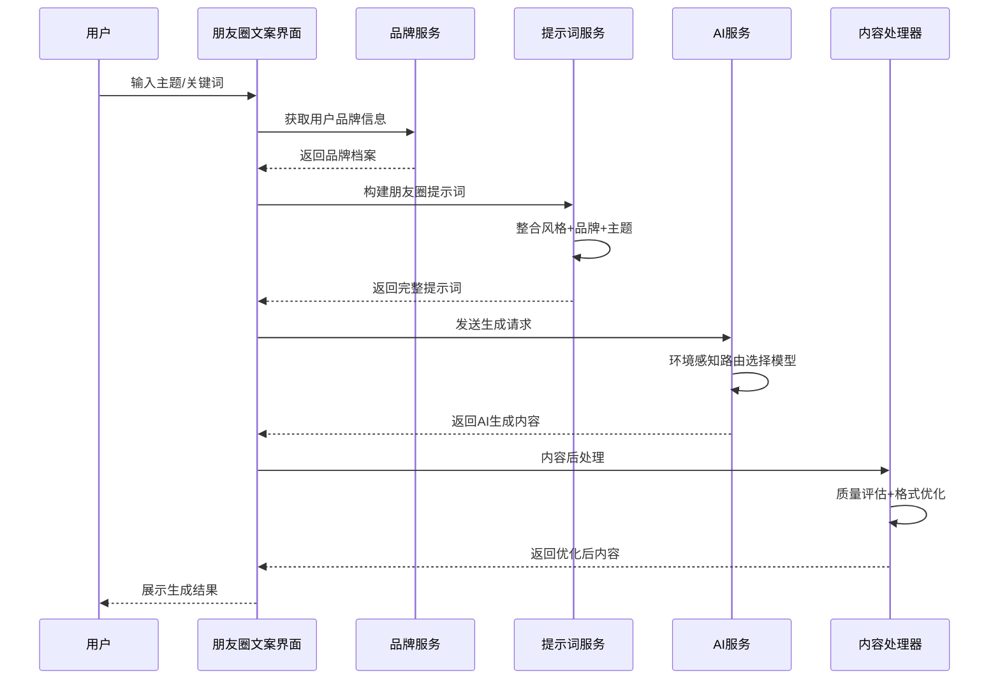
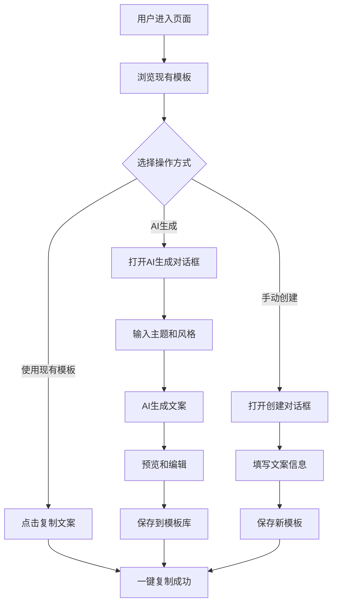

# 朋友圈文案生成功能设计文档

## 1. 功能概述

### 1.1 背景与目标

朋友圈文案生成功能是文派智能内容创作平台的核心AI应用之一，旨在帮助用户快速生成高质量、个性化的朋友圈内容。该功能基于先进的AI模型和品牌化提示词系统，为用户提供多样化、情感丰富的朋友圈文案创作体验。

**核心目标：**
- 提供智能化的朋友圈文案生成服务
- 支持多种文案风格和情感表达
- 丰富的模板库，涵盖多个行业场景
- 集成颜文字(Emoticon)和Emoji装饰系统
- 智能行业适配和个性化推荐
- 集成品牌资料库实现个性化创作
- 提供一键复制和多平台适配能力
- 确保内容质量和用户体验

### 1.2 技术栈

- **前端框架：** React 18.3.1 + TypeScript 5.7.2
- **构建工具：** Vite 7.0.5
- **AI服务：** OpenAI GPT-4o、DeepSeek Chat、Google Gemini Pro
- **状态管理：** Zustand
- **UI框架：** Tailwind CSS + shadcn/ui + Radix UI
- **后端服务：** Netlify Functions
- **提示词系统：** 模块化提示词管理
- **品牌集成：** 智能品牌资料库

## 2. 功能架构

### 2.1 整体架构图



### 2.2 数据流程图



## 3. 核心功能模块

### 3.1 朋友圈文案生成器 (MomentsTextGenerator)

**功能职责：**
- 提供直观的朋友圈文案创作界面
- 支持AI智能生成和手动创作模式
- 提供文案模板库和收藏管理

**核心接口：**

| 方法名 | 功能描述 | 参数 |
|--------|----------|------|
| `generateAIText()` | AI生成文案 | `aiPrompt, aiStyle, aiLength` |
| `copyToClipboard()` | 复制文案 | `content` |
| `toggleFavorite()` | 切换收藏 | `templateId` |
| `filterTemplates()` | 过滤模板 | `query, category, mood` |

**数据结构：**

```typescript
interface TextTemplate {
  id: string;
  title: string;           // 文案标题
  content: string;         // 文案内容
  category: string;        // 分类
  tags: string[];          // 标签
  mood: 'happy' | 'romantic' | 'motivational' | 'casual' | 'thoughtful' | 'funny';
  isFavorite: boolean;     // 是否收藏
  useCount: number;        // 使用次数
}
```

### 3.2 智能模板系统 (IntelligentTemplateSystem)

**功能特色：**
- 多行业智能模板管理
- 支持分类、标签、场合、行业多维度过滤
- 集成颜文字和Emoji装饰系统
- 智能推荐和个性化适配
- 模板热度和效果统计

**行业模板分类：**

| 行业类别 | 模板子类 | 装饰特色 | 示例场景 |
|----------|----------|----------|---------|
| 餐饮行业 | 新品推广、店铺活动、美食分享 | 🍕🍰🥘 + (๑´ڡ`๑) | 新品上市、节日促销 |
| 美妆时尚 | 产品种草、搭配分享、护肤心得 | 💄💅✨ + (｡♥‿♥｡) | 化妆教程、穿搭推荐 |
| 健身运动 | 训练打卡、减脂分享、健康生活 | 💪🏃‍♀️🔥 + ᕦ(ò_óˇ)ᕤ | 健身记录、减重成果 |
| 教育培训 | 课程推广、学习分享、知识科普 | 📚🎓💡 + (◕‿◕) | 课程招生、学习心得 |
| 电商零售 | 产品推广、促销活动、客户服务 | 🛍️💰🎁 + (≧∇≦)ﾉ | 商品推荐、优惠活动 |
| 旅游出行 | 景点推荐、游记分享、攻略指南 | ✈️🏖️🗺️ + ٩(◕‿◕)۶ | 旅游路线、酒店推荐 |
| 房产家居 | 楼盘推广、装修分享、生活方式 | 🏠🔑🛋️ + (ﾉ◕ヮ◕)ﾉ | 新房推荐、装修案例 |
| 汽车行业 | 新车发布、保养知识、驾驶分享 | 🚗⛽🔧 + ╰( ͡° ͜ʖ ͡° )つ | 试驾体验、保养提醒 |
| 母婴亲子 | 育儿心得、产品推荐、成长记录 | 👶🍼🧸 + (๑>◡<๑) | 育儿经验、产品种草 |
| 金融服务 | 理财知识、产品介绍、市场分析 | 💰📈💳 + (￣▽￣)ノ | 投资建议、理财规划 |

**场景模板库：**
- 日常分享：晨光微醉 ☀️ (◡ ‿ ◡)、周末慢时光 🌸 ♪(´▽｀)
- 节日祝福：新年愿景 🎊 ヽ(°〇°)ﾉ、情人节甜蜜 💕 (♡˙︶˙♡)
- 心情表达：月光下的思绪 🌙 (´･ω･`)、春天的约定 🌱 (≧▽≦)
- 工作感悟：职场成长 📊 ᕦ(ò_óˇ)ᕤ、团队协作 🤝 ٩(◕‿◕)۶
- 生活记录：美食探店 🍜 (´∀｀)♡、运动打卡 🏃‍♀️ ᕦ(ò_óˇ)ᕤ

### 3.3 AI智能生成服务

**AI模型集成：**
- OpenAI GPT-4o：高质量文本生成
- DeepSeek Chat：中文优化AI
- Google Gemini Pro：多模态AI

**智能装饰系统：**

| 装饰类型 | 元素库 | 使用场景 | 示例 |
|----------|--------|----------|---------|
| 基础表情 | 😀😍😎🤔😢😡 | 情感表达 | 今天心情超级好 😊 |
| 手势动作 | 👍👌✌️🤝👏💪 | 互动鼓励 | 给你点赞 👍 加油 💪 |
| 物品符号 | 🎁🌸🔥⭐💎🎯 | 内容装饰 | 新品上市 🔥 限时优惠 ⭐ |
| 颜文字-开心 | (◕‿◕) ٩(◕‿◕)۶ (≧∇≦)ﾉ | 快乐分享 | 周末愉快 (◕‿◕) |
| 颜文字-可爱 | (｡♥‿♥｡) (๑´ڡ`๑) (◡ ‿ ◡) | 温馨表达 | 小确幸时刻 (｡♥‿♥｡) |
| 颜文字-惊讶 | (⊙_⊙) (°o°) ヽ(°〇°)ﾉ | 强调重点 | 居然是这样 (⊙_⊙) |
| 颜文字-努力 | ᕦ(ò_óˇ)ᕤ (ง •̀_•́)ง | 励志打气 | 继续加油 ᕦ(ò_óˇ)ᕤ |
| 颜文字-思考 | (´･ω･`) (￣ω￣) | 深度表达 | 人生感悟 (´･ω･`) |

**风格模板升级：**

| 风格类型 | 描述 | 装饰特色 | 行业适配 |
|----------|------|----------|----------|
| `casual` | 轻松随性 | 😊😎 + (◕‿◕) | 日常生活、朋友聚会 |
| `romantic` | 浪漫温馨 | 💕🌹 + (｡♥‿♥｡) | 情感表达、婚庆服务 |
| `motivational` | 励志正能量 | 💪🔥 + ᕦ(ò_óˇ)ᕤ | 健身、教育、职场 |
| `funny` | 幽默搞笑 | 😂🤣 + (≧∇≦)ﾉ | 娱乐、餐饮、社交 |
| `thoughtful` | 深度思考 | 🤔💭 + (´･ω･`) | 知识分享、文化艺术 |
| `professional` | 专业商务 | 📊💼 + (￣▽￣)ノ | 金融、咨询、B2B |
| `trendy` | 时尚潮流 | ✨💎 + (ﾉ◕ヮ◕)ﾉ | 美妆、时尚、设计 |
| `warm` | 温暖治愈 | 🌸☀️ + ♪(´▽｀) | 母婴、医疗、公益 |

**生成策略升级：**

```typescript
const generatePrompt = (topic: string, style: string, length: string, industry?: string) => {
  // 获取行业专属装饰
  const industryDecorations = getIndustryDecorations(industry);
  const styleEmoticons = getStyleEmoticons(style);
  
  return `请为我生成一条朋友圈文案，要求：
1. 主题：${topic}
2. 风格：${style}
3. 长度：${length}
4. 行业：${industry || '通用'}
5. 装饰要求：
   - 包含适当的emoji表情: ${industryDecorations.emojis}
   - 使用颜文字装饰: ${styleEmoticons}
   - 整体风格符合${industry}行业特色
6. 内容要求：
   - 适合微信朋友圈发布
   - 原创有创意，符合现代年轻人表达习惯
   - 内容积极正面，具有传播价值`;
};

// 增强型模板生成器
const generateEnhancedTemplate = {
  // 行业适配生成
  byIndustry: (industry: string, scenario: string) => {
    const templates = INDUSTRY_TEMPLATES[industry];
    return templates.filter(t => t.scenarios.includes(scenario));
  },
  
  // 情感增强生成
  withEmotions: (baseText: string, mood: string) => {
    const emoticons = MOOD_EMOTICONS[mood];
    const emojis = MOOD_EMOJIS[mood];
    return decorateText(baseText, emoticons, emojis);
  },
  
  // 智能装饰推荐
  smartDecoration: (content: string, context: TemplateContext) => {
    const decorationSuggestions = analyzeContent(content);
    return applyBestDecorations(content, decorationSuggestions, context);
  }
};
```## 4. 装饰系统与行业适配

### 4.1 颜文字系统 (EmoticonSystem)

**功能特色：**
- 按情感分类的颜文字库
- 智能情感识别和匹配
- 个性化的颜文字推荐

**情感分类详细：**

| 情感类型 | 代表符号 | 强度层次 | 使用场景 |
|----------|----------|----------|----------|
| 开心快乐 | (◕‿◕) | 轻度 | 日常分享 |
| | ٩(◕‿◕)۶ | 中度 | 好消息分享 |
| | (≧∇≦)ﾉ | 高度 | 特别兴奋 |
| 可爱温馨 | (◡ ‿ ◡) | 轻度 | 温馨日常 |
| | (｡♥‿♥｡) | 中度 | 情感表达 |
| | (๑´ڡ`๑) | 高度 | 超级喜欢 |
| 努力加油 | ᕦ(ò_óˇ)ᕤ | 轻度 | 工作状态 |
| | (ง •̀_•́)ง | 中度 | 励志打气 |
| | ٩(•̤̀ᵕ•̤́)و | 高度 | 充满动力 |

### 4.2 行业适配系统

**核心行业覆盖：**
- 餐饮业：新品推广、店铺活动、美食分享 🍕🍰 + (´∀｀)♡
- 美妆业：产品种草、搭配分享、护肤心得 💄💅 + (♡♡♡)
- 健身业：训练打卡、减脂分享、健康生活 💪🔥 + ᕦ(ò_óˇ)ᕤ
- 教育业：课程推广、学习分享、知识科普 📚💡 + (◕‿◕)
- 电商业：产品推广、促销活动、客户服务 🛍️💰 + (≧∇≦)

### 4.3 智能装饰算法

```typescript
class SmartDecorationEngine {
  // 内容分析和情感识别
  analyzeContent(text: string): ContentAnalysis {
    return {
      sentiment: detectSentiment(text),
      topics: extractTopics(text),
      industry: detectIndustry(text)
    };
  }
  
  // 智能推荐装饰
  recommendDecorations(analysis: ContentAnalysis): DecorationSuggestion {
    const emojis = this.selectEmojis(analysis.topics);
    const emoticons = this.selectEmoticons(analysis.sentiment);
    return { emojis, emoticons };
  }
}
```

## 5. 用户体验设计

**主要区域划分：**
- 头部操作区：搜索、筛选、AI生成按钮
- 侧边筛选栏：分类、心情、标签过滤
- 主内容区：文案模板网格展示
- 预览弹窗：文案详情和编辑

### 4.2 交互流程



### 4.3 响应式设计

| 屏幕尺寸 | 布局方式 | 网格列数 | 特殊处理 |
|----------|----------|----------|----------|
| 手机 (<768px) | 垂直堆叠 | 1列 | 简化操作按钮 |
| 平板 (768-1024px) | 混合布局 | 2列 | 侧边栏可折叠 |
| 桌面 (>1024px) | 完整布局 | 3列 | 全功能展示 |

## 5. 技术实现细节

### 5.1 状态管理

```typescript
// 组件状态接口
interface MomentsState {
  templates: TextTemplate[];
  filteredTemplates: TextTemplate[];
  searchQuery: string;
  selectedCategory: string;
  selectedMood: string;
  showFavoritesOnly: boolean;
  isGenerating: boolean;
}

// AI生成状态
interface AIGenerationState {
  aiPrompt: string;
  aiStyle: 'casual' | 'romantic' | 'motivational' | 'funny' | 'thoughtful';
  aiLength: 'short' | 'medium' | 'long';
}
```

### 5.2 数据持久化

**本地存储策略：**
- 模板数据：localStorage存储用户创建的模板
- 收藏状态：localStorage记录用户收藏
- 使用统计：localStorage记录使用次数
- 搜索历史：sessionStorage存储搜索记录

### 5.3 性能优化

**优化措施：**
- 虚拟滚动：大量模板时使用虚拟滚动
- 防抖搜索：搜索输入防抖处理
- 延迟加载：模板内容按需加载
- 缓存机制：AI生成结果缓存

## 6. 部署与维护

### 6.1 开发环境配置

**启动命令：**
```bash
# 启动开发服务器
npm run dev  # Vite开发服务器 (localhost:5175)
npx netlify dev --port 8888  # Netlify Functions
```

**环境变量：**
```bash
VITE_OPENAI_API_KEY=your_openai_key
VITE_DEEPSEEK_API_KEY=your_deepseek_key
VITE_GEMINI_API_KEY=your_gemini_key
```

### 6.2 功能扩展规划

**近期计划：**
- 品牌资料库集成：结合用户品牌信息生成个性化文案
- 多平台适配：支持小红书、微博等平台的文案格式
- 协作功能：团队共享文案模板库
- 数据分析：文案使用效果统计

**长期规划：**
- 智能推荐：基于用户行为推荐文案模板
- 语音输入：支持语音转文案功能
- 图片识别：从图片生成配套文案
- API开放：提供第三方集成接口