# 用户认证系统设计文档

## 1. 系统概述

### 1.1 背景与目标

用户认证系统是文派智能内容创作平台的核心安全组件，负责用户身份验证、权限管理和安全访问控制。系统采用现代化的 OAuth 2.0 + PKCE 认证流程，集成企业级身份提供商 Authing，为平台提供安全、可靠、用户友好的认证体验。

**核心目标：**
- 提供安全可靠的用户身份验证
- 实现细粒度的权限控制和访问管理
- 支持多种认证方式和社交登录
- 确保用户数据安全和隐私保护
- 提供良好的用户认证体验

### 1.2 技术栈

- **前端框架：** React 18.3.1 + TypeScript 5.7.2
- **构建工具：** Vite 7.0.5
- **认证框架：** Authing Guard SDK v5.1.0
- **认证协议：** OAuth 2.0 + PKCE (Proof Key for Code Exchange)
- **身份提供商：** Authing (App ID: 68a68a29d0c3341ae7a3df23)
- **状态管理：** React Context + Zustand
- **UI框架：** Tailwind CSS + shadcn/ui + Radix UI
- **后端服务：** Netlify Functions
- **开发服务器：** localhost:5175 (Vite) + localhost:8888 (Netlify)
- **安全传输：** HTTPS + TLS 1.3

## 2. 系统架构

### 2.1 整体架构图

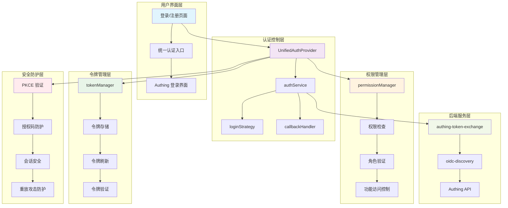

### 2.2 核心组件架构

#### 2.2.1 认证流程控制

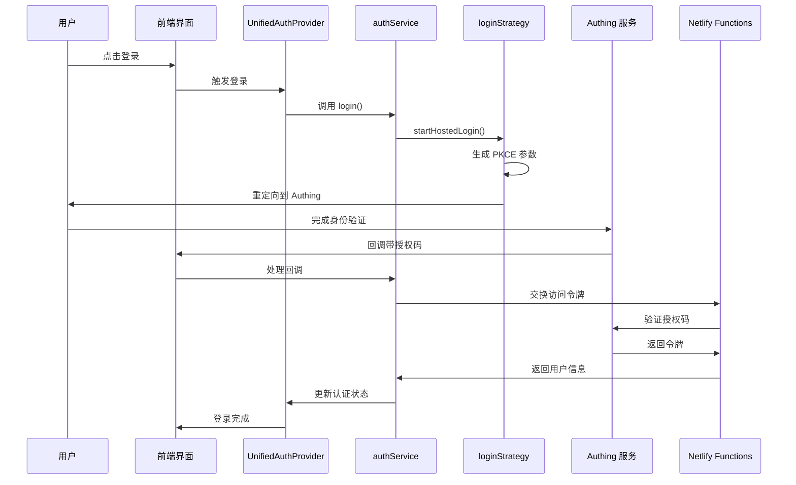

## 3. 核心功能模块

### 3.1 统一认证提供者 (UnifiedAuthProvider)

**功能职责：**
- 作为全局认证状态管理中心
- 提供统一的认证 API 接口
- 管理认证生命周期
- 处理认证状态变化通知

**核心接口：**

| 方法名 | 功能描述 | 参数 | 返回值 |
|--------|----------|------|--------|
| `login()` | 启动登录流程 | - | `Promise<void>` |
| `register()` | 启动注册流程 | - | `Promise<void>` |
| `logout()` | 用户登出 | - | `Promise<void>` |
| `getCurrentUser()` | 获取当前用户 | - | `AuthUser \| null` |
| `refreshToken()` | 刷新访问令牌 | - | `Promise<boolean>` |

**状态管理：**

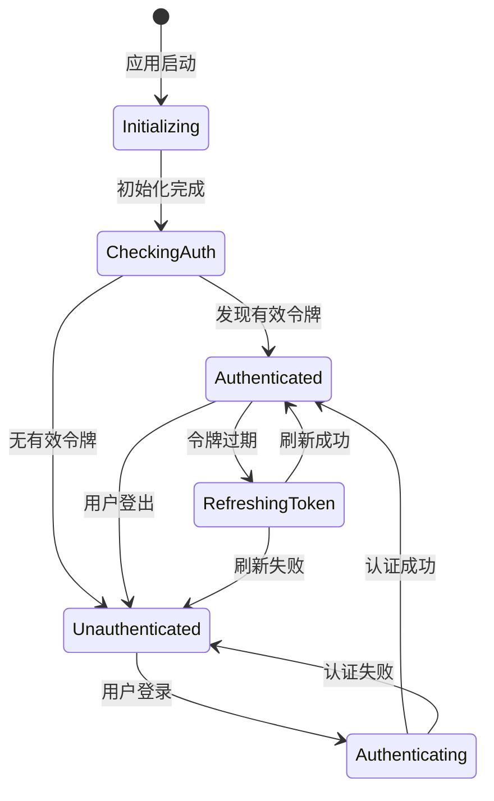

### 3.2 认证服务 (authService)

**功能职责：**
- 封装 Authing SDK 交互逻辑
- 处理认证流程的核心业务逻辑
- 标准化用户数据格式
- 管理认证配置

**关键方法：**

| 方法名 | 功能 | 实现要点 |
|--------|------|----------|
| `initialize()` | 初始化认证服务 | 配置 Authing 客户端，清理过期令牌 |
| `normalizeAuthUser()` | 标准化用户数据 | 统一用户信息格式，处理空值 |
| `handleAuthError()` | 认证错误处理 | 分类错误类型，提供友好提示 |
| `validateToken()` | 令牌有效性验证 | 检查令牌格式和过期时间 |

### 3.3 登录策略 (loginStrategy)

**功能职责：**
- 实现 OAuth 2.0 + PKCE 登录流程
- 生成安全的认证参数
- 构建 Authing 授权 URL
- 避免 Authing Guard SDK 的已知问题

**PKCE 实现：**

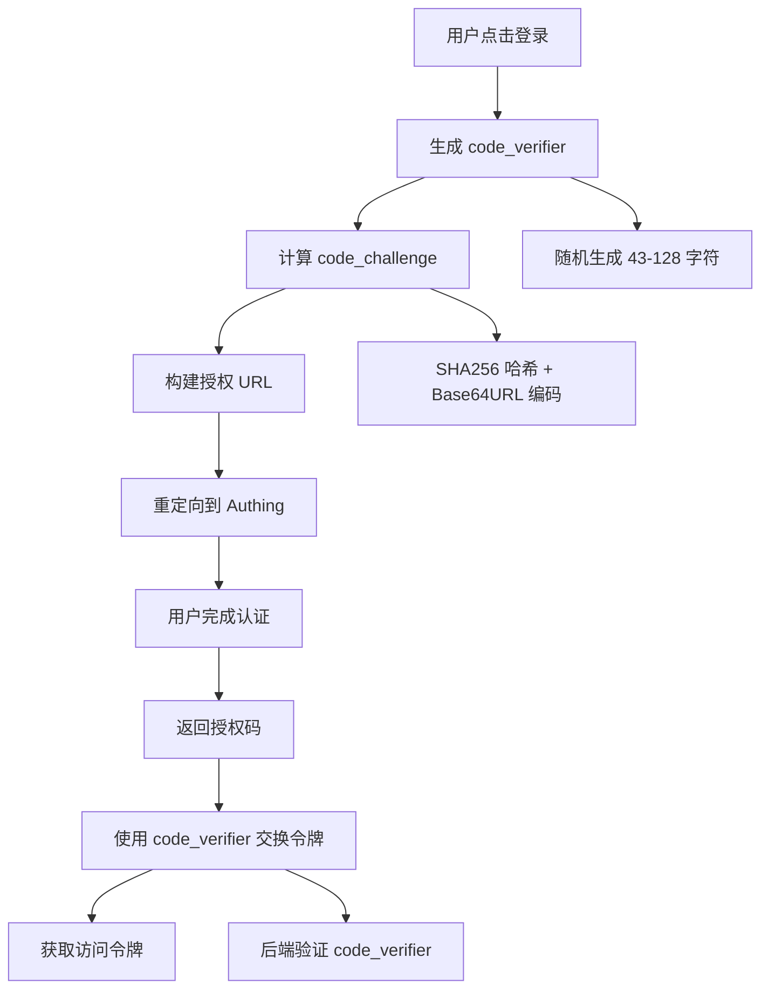

### 3.4 权限管理 (permissionManager)

**权限层次结构：**

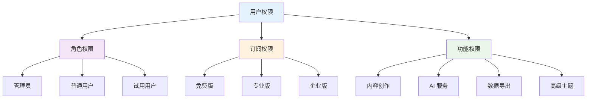

**权限检查方法：**

| 方法名 | 检查类型 | 用法示例 |
|--------|----------|----------|
| `hasPermission(permission)` | 具体权限 | `hasPermission('content.create')` |
| `hasRole(role)` | 用户角色 | `hasRole('admin')` |
| `canUseFeature(feature)` | 功能访问 | `canUseFeature('ai-service')` |
| `checkSubscriptionTier(tier)` | 订阅等级 | `checkSubscriptionTier('premium')` |

### 3.5 令牌管理 (tokenManager)

**功能架构：**

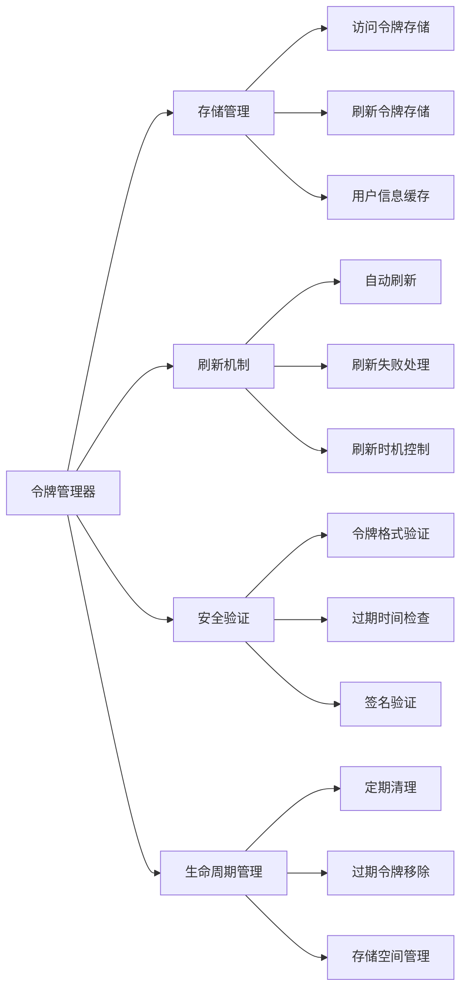

**令牌生命周期：**

| 阶段 | 描述 | 持续时间 | 处理逻辑 |
|------|------|----------|----------|
| 获取 | 首次登录获取令牌 | - | 存储访问令牌和刷新令牌 |
| 使用 | API 请求携带令牌 | 1 小时 | 自动添加 Authorization 头 |
| 刷新 | 令牌即将过期时刷新 | 提前 5 分钟 | 使用刷新令牌获取新的访问令牌 |
| 清理 | 登出或令牌无效 | - | 清除所有本地存储的认证信息 |

## 4. 安全机制

### 4.1 PKCE 安全增强

**PKCE 流程图：**

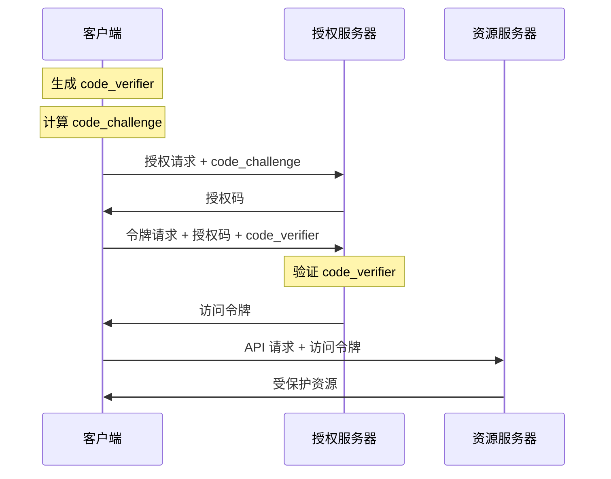

**PKCE 参数：**

| 参数 | 描述 | 生成方式 | 安全要求 |
|------|------|----------|----------|
| `code_verifier` | 密码验证器 | 随机字符串 (43-128 字符) | 客户端保密 |
| `code_challenge` | 密码挑战 | SHA256(code_verifier) | 公开传输 |
| `code_challenge_method` | 挑战方法 | "S256" | 固定值 |

### 4.2 授权码防护

**防护机制：**

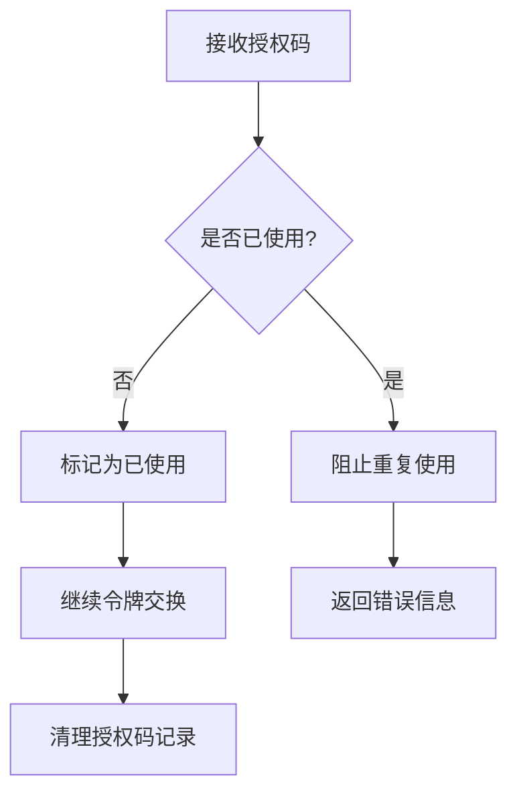

**防护规则：**

| 防护类型 | 检查条件 | 处理方式 | 清理策略 |
|----------|----------|----------|----------|
| 重复使用检查 | 授权码已存在记录 | 阻止交换，显示错误 | 10 分钟后清理 |
| 时间窗口限制 | 授权码超过有效期 | 自动清理，重新登录 | 立即清理 |
| 跨页面同步 | 多标签页同时使用 | 同步状态，防止冲突 | 实时同步 |

**回调URL配置：**
- 开发环境：`http://localhost:5175/callback`
- 生产环境：`https://www.wenpai.xyz/callback`
- 认证地址：`https://rzcswqs4sq0f.authing.cn/68a68a29d0c3341ae7a3df23`

### 4.3 会话安全

**安全特性：**

```mermaid
mind:
    会话安全
        令牌安全
            JWT 签名验证
            令牌过期控制
            刷新令牌轮转
        传输安全
            HTTPS 强制
            CSRF 防护
            XSS 防护
        存储安全
            安全存储策略
            敏感数据加密
            定期清理
        访问控制
            路由守卫
            权限验证
            会话超时
```

## 5. 路由守卫与权限控制

### 5.1 路由守卫架构

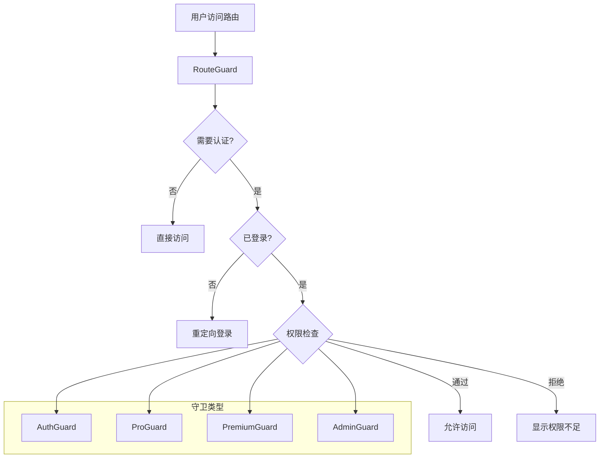

### 5.2 守卫组件设计

| 守卫类型 | 检查条件 | 失败处理 | 使用场景 |
|----------|----------|----------|----------|
| `AuthGuard` | 用户已登录 | 重定向到首页 | 需要登录的页面 |
| `ProGuard` | 专业版或更高 | 显示升级提示 | 专业版功能 |
| `PremiumGuard` | 企业版权限 | 显示权限不足 | 企业版功能 |
| `AdminGuard` | 管理员角色 | 返回 403 页面 | 管理后台 |

### 5.3 权限控制矩阵

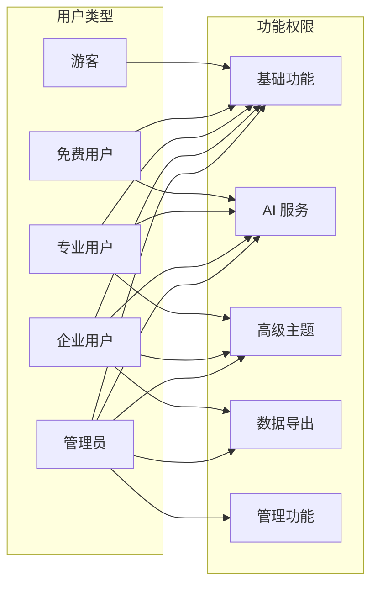

## 6. 错误处理与用户体验

### 6.1 错误分类与处理

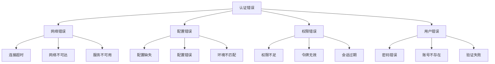

### 6.2 用户体验优化

**加载状态管理：**

| 状态 | 显示内容 | 持续时间 | 用户操作 |
|------|----------|----------|----------|
| 初始化中 | Loading 动画 | 1-3 秒 | 禁用所有操作 |
| 登录中 | 登录按钮 Loading | 2-5 秒 | 可取消登录 |
| 令牌刷新中 | 静默刷新 | 0.5-1 秒 | 透明处理 |
| 权限检查中 | 权限验证中 | 0.2-0.5 秒 | 静默处理 |

**错误提示设计：**

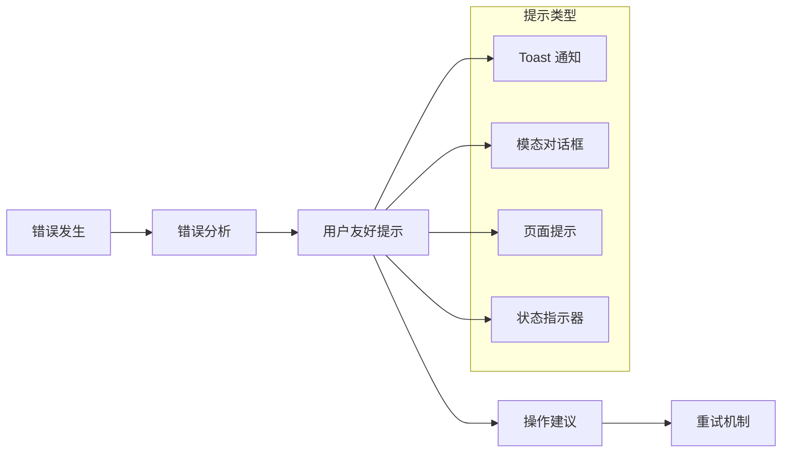

## 7. 监控与日志

### 7.1 认证事件监控

**监控指标：**

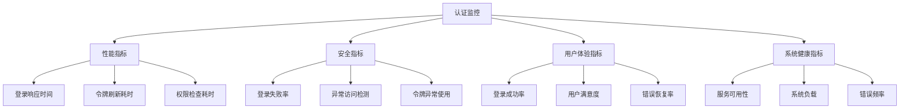

### 7.2 日志记录策略

| 日志级别 | 记录内容 | 存储期限 | 用途 |
|----------|----------|----------|------|
| ERROR | 认证失败、系统错误 | 30 天 | 问题排查 |
| WARN | 权限不足、配置警告 | 14 天 | 监控预警 |
| INFO | 登录成功、权限变更 | 7 天 | 业务统计 |
| DEBUG | 详细调试信息 | 1 天 | 开发调试 |

## 8. 性能优化与配置

### 8.1 环境配置

| 环境 | 开发服务器 | 回调URL | 特性 |
|------|------------|---------|------|
| 开发 | localhost:5175 (Vite)<br>localhost:8888 (Netlify) | `http://localhost:5175/callback` | 热重载、详细日志 |
| 生产 | Netlify CDN | `https://www.wenpai.xyz/callback` | 缓存优化、压缩 |

### 8.2 缓存策略

| 缓存类型 | 存储位置 | 生命周期 | 用途 |
|----------|----------|----------|------|
| 访问令牌 | localStorage | 1小时 | API认证 |
| 用户信息 | 内存缓存 | 会话期间 | 快速访问 |
| 权限数据 | localStorage | 登录期间 | 权限检查 |

### 8.3 安全防护

- **重试防护：** 30秒冷却，最多3次重试
- **授权码防护：** localStorage记录，10分钟清理
- **URL规范化：** 自动检测多重URL并规范化

## 9. 部署与运维

### 9.1 部署配置

**构建命令：**
```bash
# 开发环境
npm run dev  # 启动 Vite 开发服务器 (localhost:5175)
npx netlify dev --port 8888  # 启动 Netlify Functions

# 生产部署
npm run build
npm run deploy:netlify
```

**环境变量：**
```bash
VITE_AUTHING_APP_ID=68a68a29d0c3341ae7a3df23
VITE_AUTHING_HOST=https://rzcswqs4sq0f.authing.cn
VITE_REDIRECT_URI=http://localhost:5175/callback  # 开发环境
```

### 9.2 监控要点

| 监控项 | 阈值 | 处理方式 |
|--------|------|----------|
| 登录失败率 | >10% | 检查配置 |
| 令牌刷新失败 | >20% | 检查网络 |
| 响应时间 | >3秒 | 性能优化 |

### 9.3 故障排查

**常见问题：**
1. **回调URL不匹配** - 检查环境配置是否正确
2. **授权码重复使用** - 清理localStorage缓存
3. **权限检查异常** - 验证用户订阅状态
4. **令牌刷新失败** - 检查网络连接和配置