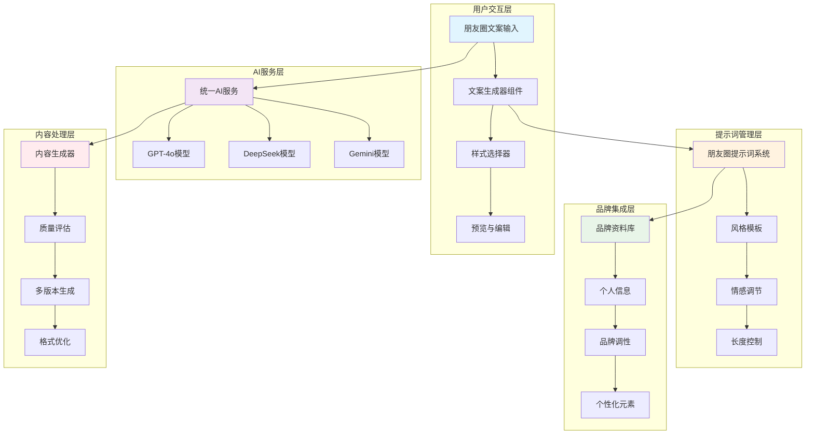
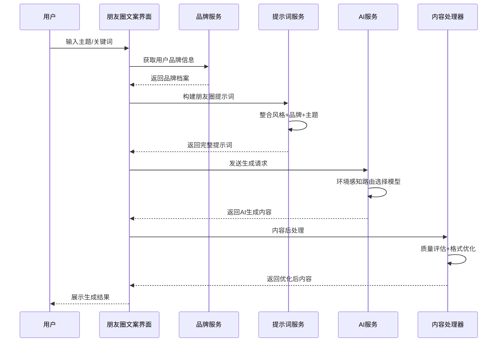
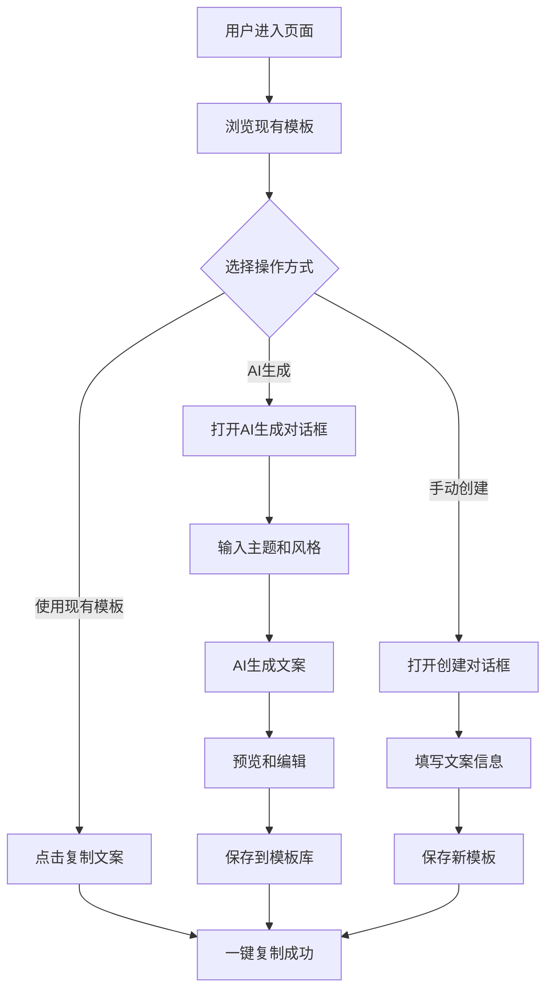

# 朋友圈文案生成功能设计文档

## 1. 功能概述

### 1.1 背景与目标

朋友圈文案生成功能是文派智能内容创作平台的核心AI应用之一，旨在帮助用户快速生成高质量、个性化的朋友圈内容。该功能基于先进的AI模型和品牌化提示词系统，为用户提供多样化、情感丰富的朋友圈文案创作体验。

**核心目标：**
- 提供智能化的朋友圈文案生成服务
- 支持多种文案风格和情感表达
- 集成品牌资料库实现个性化创作
- 提供一键复制和多平台适配能力
- 确保内容质量和用户体验

### 1.2 技术栈

- **前端框架：** React 18.3.1 + TypeScript 5.7.2
- **构建工具：** Vite 7.0.5
- **AI服务：** OpenAI GPT-4o、DeepSeek Chat、Google Gemini Pro
- **状态管理：** Zustand
- **UI框架：** Tailwind CSS + shadcn/ui + Radix UI
- **后端服务：** Netlify Functions
- **提示词系统：** 模块化提示词管理
- **品牌集成：** 智能品牌资料库

## 2. 功能架构

### 2.1 整体架构图



### 2.2 数据流程图



## 3. 核心功能模块

### 3.1 朋友圈文案生成器 (MomentsTextGenerator)

**功能职责：**
- 提供直观的朋友圈文案创作界面
- 支持AI智能生成和手动创作模式
- 提供文案模板库和收藏管理

**核心接口：**

| 方法名 | 功能描述 | 参数 |
|--------|----------|------|
| `generateAIText()` | AI生成文案 | `aiPrompt, aiStyle, aiLength` |
| `copyToClipboard()` | 复制文案 | `content` |
| `toggleFavorite()` | 切换收藏 | `templateId` |
| `filterTemplates()` | 过滤模板 | `query, category, mood` |

**数据结构：**

```typescript
interface TextTemplate {
  id: string;
  title: string;           // 文案标题
  content: string;         // 文案内容
  category: string;        // 分类
  tags: string[];          // 标签
  mood: 'happy' | 'romantic' | 'motivational' | 'casual' | 'thoughtful' | 'funny';
  isFavorite: boolean;     // 是否收藏
  useCount: number;        // 使用次数
}
```

### 3.2 微信朋友圈模板页 (WechatTemplatePage)

**功能特色：**
- 专门的微信朋友圈文案模板管理
- 支持分类、标签、场合多维度过滤
- 集成Emoji装饰和字数统计
- 权限保护的高级功能

**分类体系：**
- 日常分享：晨光微醉、周末慢时光
- 节日祝福：新年愿景、情人节甜蜜
- 心情表达：月光下的思绪、春天的约定
- 美食分享、旅行记录、工作感悟等

### 3.3 AI文案生成服务

**AI模型集成：**
- OpenAI GPT-4o：高质量文本生成
- DeepSeek Chat：中文优化AI
- Google Gemini Pro：多模态AI

**风格模板：**

| 风格类型 | 描述 | 特点 |
|----------|------|------|
| `casual` | 轻松随性 | 语言活泼、亲切自然 |
| `romantic` | 浪漫温馨 | 语言优美、情感丰富 |
| `motivational` | 励志正能量 | 充满力量感、激励人心 |
| `funny` | 幽默搞笑 | 轻松幽默、搞笑元素 |
| `thoughtful` | 深度思考 | 有深度、引人深思 |

**生成策略：**

```typescript
const generatePrompt = (topic: string, style: string, length: string) => {
  return `请为我生成一条朋友圈文案，要求：
1. 主题：${topic}
2. 风格：${style}
3. 长度：${length}
4. 格式：适合微信朋友圈，包含适当的emoji表情
5. 内容：原创、有创意、符合现代年轻人的表达习惯`;
};
```## 4. 用户体验设计

### 4.1 界面布局

**主要区域划分：**
- 头部操作区：搜索、筛选、AI生成按钮
- 侧边筛选栏：分类、心情、标签过滤
- 主内容区：文案模板网格展示
- 预览弹窗：文案详情和编辑

### 4.2 交互流程



### 4.3 响应式设计

| 屏幕尺寸 | 布局方式 | 网格列数 | 特殊处理 |
|----------|----------|----------|----------|
| 手机 (<768px) | 垂直堆叠 | 1列 | 简化操作按钮 |
| 平板 (768-1024px) | 混合布局 | 2列 | 侧边栏可折叠 |
| 桌面 (>1024px) | 完整布局 | 3列 | 全功能展示 |

## 5. 技术实现细节

### 5.1 状态管理

```typescript
// 组件状态接口
interface MomentsState {
  templates: TextTemplate[];
  filteredTemplates: TextTemplate[];
  searchQuery: string;
  selectedCategory: string;
  selectedMood: string;
  showFavoritesOnly: boolean;
  isGenerating: boolean;
}

// AI生成状态
interface AIGenerationState {
  aiPrompt: string;
  aiStyle: 'casual' | 'romantic' | 'motivational' | 'funny' | 'thoughtful';
  aiLength: 'short' | 'medium' | 'long';
}
```

### 5.2 数据持久化

**本地存储策略：**
- 模板数据：localStorage存储用户创建的模板
- 收藏状态：localStorage记录用户收藏
- 使用统计：localStorage记录使用次数
- 搜索历史：sessionStorage存储搜索记录

### 5.3 性能优化

**优化措施：**
- 虚拟滚动：大量模板时使用虚拟滚动
- 防抖搜索：搜索输入防抖处理
- 延迟加载：模板内容按需加载
- 缓存机制：AI生成结果缓存

## 6. 部署与维护

### 6.1 开发环境配置

**启动命令：**
```bash
# 启动开发服务器
npm run dev  # Vite开发服务器 (localhost:5175)
npx netlify dev --port 8888  # Netlify Functions
```

**环境变量：**
```bash
VITE_OPENAI_API_KEY=your_openai_key
VITE_DEEPSEEK_API_KEY=your_deepseek_key
VITE_GEMINI_API_KEY=your_gemini_key
```

### 6.2 功能扩展规划

**近期计划：**
- 品牌资料库集成：结合用户品牌信息生成个性化文案
- 多平台适配：支持小红书、微博等平台的文案格式
- 协作功能：团队共享文案模板库
- 数据分析：文案使用效果统计

**长期规划：**
- 智能推荐：基于用户行为推荐文案模板
- 语音输入：支持语音转文案功能
- 图片识别：从图片生成配套文案
- API开放：提供第三方集成接口