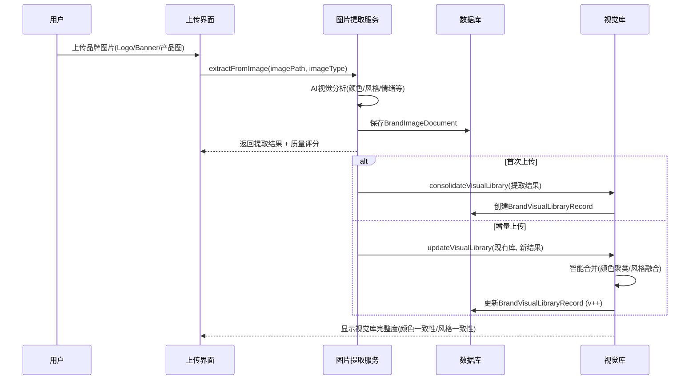
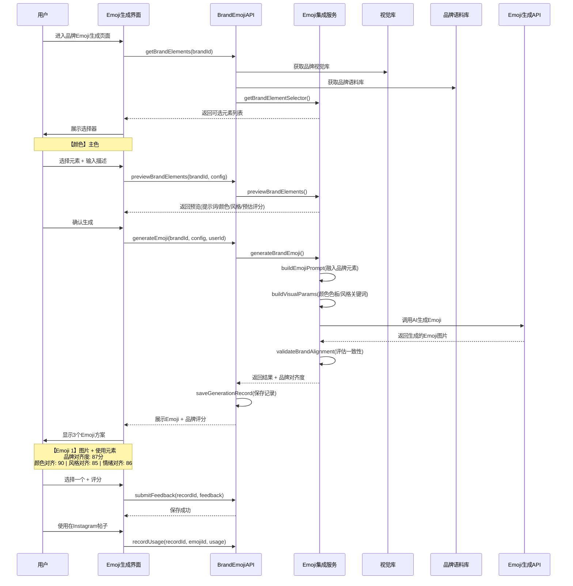

# 品牌视觉元素提取与Emoji生成系统集成文档

## 📋 目录

1. [系统概述](#系统概述)
2. [核心功能](#核心功能)
3. [技术架构](#技术架构)
4. [完整工作流程](#完整工作流程)
5. [API接口文档](#api接口文档)
6. [数据库设计](#数据库设计)
7. [使用示例](#使用示例)
8. [最佳实践](#最佳实践)

---

## 系统概述

### 功能定位

将**品牌库系统**与**Emoji生成系统**深度集成，实现：

1. **从图片自动提取品牌视觉元素**（颜色、Logo风格、字体、设计模式、情绪）
2. **构建统一的品牌视觉库**（多张图片合并，渐进式增强）
3. **在Emoji生成时应用品牌元素**（用户可选择品牌颜色、风格、情绪等）
4. **确保Emoji与品牌视觉一致性**（自动验证和评分）

### 核心优势

- ✅ **视觉一致性保障**：Emoji自动使用品牌色板和风格
- ✅ **用户可控性**：可选择使用哪些品牌元素
- ✅ **渐进式完善**：上传更多图片，视觉库越完整
- ✅ **品牌对齐度评分**：生成后自动评估品牌一致性
- ✅ **完整追溯**：记录每个emoji使用的品牌元素

---

## 核心功能

### 1. 图片品牌元素提取

从上传的品牌图片中自动提取：

| 维度 | 提取内容 | 说明 |
|------|---------|------|
| **颜色色板** | 主色、辅色、强调色、中性色 | RGB/HEX值、用途、占比 |
| **Logo视觉特征** | 形状、风格、构图 | 极简/几何/有机等 |
| **字体排版风格** | 粗细、风格、可读性 | 现代/优雅/科技感等 |
| **设计模式** | 图案、对称性、留白 | 条纹/圆点/几何等 |
| **视觉情绪** | 情感、调性、个性 | 专业/活泼/高端等 |
| **构图分析** | 布局、焦点、层次 | 网格/居中/三分法等 |

### 2. 品牌视觉库构建

**单张图片提取**：
```typescript
extractFromImage(config) → BrandVisualElements
```

**多张图片合并**：
```typescript
consolidateVisualLibrary(brandId, results) → BrandVisualLibrary
```

**渐进式更新**：
```typescript
updateVisualLibrary(existing, newResult) → BrandVisualLibrary (v2)
```

### 3. Emoji生成集成

**元素选择器**（展示可选品牌元素）：
```typescript
getBrandElementSelector(brandId) → {
  colors: [{ hex, name, usage, selected }],
  emotions: [{ emotion, category, selected }],
  keywords: [{ keyword, dimension, selected }],
  visualStyles: [{ style, category, selected }]
}
```

**生成Emoji**（应用选中元素）：
```typescript
generateBrandEmoji(config, visualLibrary, brandCorpus) → {
  emojis: [...],
  brandAlignment: { colorAlignment, styleAlignment, ... },
  suggestions: [...]
}
```

### 4. 品牌一致性验证

自动评估生成的Emoji与品牌的对齐度：

- **颜色对齐度**：0-100分
- **风格对齐度**：0-100分
- **情绪对齐度**：0-100分
- **整体对齐度**：加权平均

---

## 技术架构

### 系统组件

```
┌─────────────────────────────────────────────────────────────┐
│                     品牌Emoji生成系统                        │
├─────────────────────────────────────────────────────────────┤
│                                                             │
│  ┌──────────────┐      ┌──────────────┐                    │
│  │  图片上传UI  │──────▶│ 图片提取服务 │                    │
│  └──────────────┘      │ImageBrand    │                    │
│                        │Extraction    │                    │
│                        │Service       │                    │
│                        └──────┬───────┘                    │
│                               │                            │
│                               ▼                            │
│                        ┌──────────────┐                    │
│  ┌──────────────┐      │ 品牌视觉库   │                    │
│  │ 元素选择UI  │◀──────│BrandVisual   │                    │
│  └──────┬───────┘      │Library       │                    │
│         │              └──────┬───────┘                    │
│         │                     │                            │
│         ▼                     │                            │
│  ┌──────────────┐             │                            │
│  │ Emoji配置UI │             │                            │
│  └──────┬───────┘             │                            │
│         │                     │                            │
│         │              ┌──────▼───────┐                    │
│         └─────────────▶│ Emoji集成    │                    │
│                        │服务          │                    │
│                        │BrandEmoji    │                    │
│                        │Integration   │                    │
│                        │Service       │                    │
│                        └──────┬───────┘                    │
│                               │                            │
│                               ▼                            │
│                        ┌──────────────┐                    │
│                        │ Emoji生成API │                    │
│                        │(AI视觉模型)  │                    │
│                        └──────┬───────┘                    │
│                               │                            │
│                               ▼                            │
│  ┌──────────────┐      ┌──────────────┐                   │
│  │ Emoji展示UI │◀──────│ 生成结果     │                   │
│  │ + 品牌评分  │      │+ 品牌对齐度  │                   │
│  └──────────────┘      └──────────────┘                   │
│                                                             │
└─────────────────────────────────────────────────────────────┘

          ┌──────────────────────────────┐
          │       数据持久化层            │
          ├──────────────────────────────┤
          │ - BrandVisualLibraryRecord   │
          │ - BrandImageDocument         │
          │ - BrandEmojiGenerationRecord │
          │ - BrandProfile + Corpus      │
          └──────────────────────────────┘
```

### 核心文件结构

```
/Users/xiong/.claude/plugins/
├── types/
│   └── brandVisuals.ts                    # 视觉元素类型定义（完整）
├── services/
│   ├── ImageBrandExtractionService.ts     # 图片提取服务（700行）
│   └── BrandEmojiIntegrationService.ts    # Emoji集成服务（400行）
├── api/
│   └── BrandEmojiAPI.ts                   # 完整API接口（500行）
├── brand-library/
│   └── database/
│       └── schema.ts                      # 数据库schema v2.0（新增4张表）
└── BRAND_VISUAL_EMOJI_INTEGRATION.md      # 本文档
```

---

## 完整工作流程

### 阶段1：建立品牌视觉库



**关键点**：
- 支持多种图片类型：Logo、Banner、产品图、营销物料等
- AI自动提取6大维度视觉元素
- 智能合并算法：颜色聚类、高频风格提取
- 质量评分：整体完整度、一致性评估

### 阶段2：选择品牌元素生成Emoji



**关键点**：
- 元素选择器：可视化展示品牌颜色、情绪、关键词、风格
- 预览功能：生成前查看提示词和预估评分
- 品牌对齐度：自动评估颜色/风格/情绪三维度一致性
- 完整追溯：记录使用的品牌元素、反馈、使用场景

---

## API接口文档

### 1. 获取品牌元素选择器

**接口**：`GET /api/brand-emoji/elements/:brandId`

**请求**：
```typescript
brandId: string
```

**响应**：
```typescript
{
  success: true,
  selector: {
    colors: [
      { hex: "#FF6B6B", name: "品牌红", usage: "主色", selected: false },
      { hex: "#4ECDC4", name: "品牌青", usage: "辅色", selected: false }
    ],
    emotions: [
      { emotion: "专业", category: "primary", selected: false },
      { emotion: "创新", category: "primary", selected: false }
    ],
    keywords: [
      { keyword: "科技", dimension: "positioning", selected: false },
      { keyword: "高效", dimension: "value", selected: false }
    ],
    visualStyles: [
      { style: "极简", category: "logo", selected: false },
      { style: "现代", category: "typography", selected: false }
    ]
  }
}
```

### 2. 预览品牌元素应用

**接口**：`POST /api/brand-emoji/preview`

**请求**：
```typescript
{
  brandId: "brand-123",
  useBrandColors: true,
  useBrandStyle: true,
  selectedColors: ["#FF6B6B", "#4ECDC4"],
  selectedEmotions: ["专业", "创新"],
  description: "一个表示成功的emoji"
}
```

**响应**：
```typescript
{
  success: true,
  preview: {
    prompt: "你是品牌emoji设计师。请生成一个表示成功的emoji...",
    colorPalette: ["#FF6B6B", "#4ECDC4"],
    styleKeywords: ["极简", "现代", "科技感"],
    moodKeywords: ["专业", "创新"],
    estimatedAlignment: 85  // 预估品牌对齐度
  }
}
```

### 3. 生成品牌Emoji

**接口**：`POST /api/brand-emoji/generate`

**请求**：
```typescript
{
  brandId: "brand-123",
  useBrandColors: true,
  useBrandStyle: true,
  useBrandMood: true,
  useBrandKeywords: true,
  selectedColors: ["#FF6B6B", "#4ECDC4"],
  selectedEmotions: ["专业", "创新"],
  selectedKeywords: ["科技", "高效"],
  description: "一个表示成功的emoji",
  emojiType: "detailed",      // simple | detailed | animated
  emojiStyle: "gradient",     // flat | 3d | gradient | outline
  emojiSize: "large",         // small | medium | large
  count: 3                    // 生成数量
}
```

**响应**：
```typescript
{
  success: true,
  recordId: "emoji_1234567890_abc123",
  emojis: [
    {
      id: "emoji_001",
      imageUrl: "https://cdn.example.com/emoji_001.png",
      description: "成功emoji - 品牌配色版本",
      usedBrandElements: {
        colors: ["#FF6B6B", "#4ECDC4"],
        emotions: ["专业", "创新"],
        keywords: ["科技", "高效"],
        visualStyle: ["极简", "现代"]
      },
      confidence: 0.92
    },
    // ... 另外2个方案
  ],
  brandAlignment: {
    colorAlignment: 90,      // 颜色对齐度 0-100
    styleAlignment: 85,      // 风格对齐度 0-100
    moodAlignment: 88,       // 情绪对齐度 0-100
    overallAlignment: 87     // 整体对齐度 0-100
  },
  suggestions: [
    "品牌一致性良好，emoji较好地体现了品牌特征"
  ]
}
```

### 4. 提交用户反馈

**接口**：`POST /api/brand-emoji/feedback`

**请求**：
```typescript
{
  recordId: "emoji_1234567890_abc123",
  rating: 5,                          // 1-5星
  comment: "非常符合品牌形象！",
  selectedEmojiId: "emoji_001"        // 用户选择的emoji
}
```

### 5. 记录使用情况

**接口**：`POST /api/brand-emoji/usage`

**请求**：
```typescript
{
  recordId: "emoji_1234567890_abc123",
  emojiId: "emoji_001",
  platform: "instagram",              // 使用平台
  contentId: "post-789"               // 关联内容ID
}
```

### 6. 获取历史记录

**接口**：`GET /api/brand-emoji/history/:brandId?limit=10`

**响应**：
```typescript
{
  success: true,
  records: [
    {
      id: "emoji_1234567890_abc123",
      config: { /* 生成配置 */ },
      emojis: [ /* emoji列表 */ ],
      brandAlignment: { /* 对齐度评分 */ },
      createdAt: "2025-10-04T10:30:00Z",
      feedback: { rating: 5, comment: "..." }
    },
    // ...
  ]
}
```

### 7. 分析使用趋势

**接口**：`GET /api/brand-emoji/trends/:brandId`

**响应**：
```typescript
{
  success: true,
  trends: {
    totalGenerated: 127,              // 生成总数
    totalUsed: 89,                    // 实际使用数
    averageAlignment: 85.3,           // 平均品牌对齐度
    topColors: ["#FF6B6B", "#4ECDC4", "#95E1D3"],
    topEmotions: ["专业", "创新", "活力"],
    topStyles: ["极简", "现代", "科技感"],
    usageByPlatform: [
      { platform: "instagram", count: 45 },
      { platform: "twitter", count: 32 }
    ],
    qualityTrend: [
      { date: "2025-10-01", alignment: 82 },
      { date: "2025-10-02", alignment: 85 },
      { date: "2025-10-03", alignment: 87 }
    ]
  }
}
```

---

## 数据库设计

### 新增表结构

#### 1. BrandVisualLibraryRecord（品牌视觉库）

```sql
CREATE TABLE brand_visual_library (
  id VARCHAR(255) PRIMARY KEY,
  brand_id VARCHAR(255) NOT NULL,

  -- 合并后的视觉元素（JSON存储）
  consolidated_colors JSON,        -- { primary: [], secondary: [], accent: [], neutral: [] }
  consolidated_logo JSON,          -- { shapes: [], style: {}, composition: {} }
  consolidated_typography JSON,    -- { fontFamily: [], fontStyle: [], characteristics: [] }
  consolidated_patterns JSON,      -- { patterns: [], symmetry: '', balance: '', spacing: '' }
  consolidated_mood JSON,          -- { emotions: [], tone: '', personality: [] }

  -- 来源追溯
  sources JSON,                    -- [{ imageId, imagePath, imageType, extractedAt, contributionWeight }]

  -- 质量指标
  quality_metrics JSON,            -- { colorConsistency, styleConsistency, overallCompleteness, confidence }

  created_at TIMESTAMP DEFAULT CURRENT_TIMESTAMP,
  updated_at TIMESTAMP DEFAULT CURRENT_TIMESTAMP ON UPDATE CURRENT_TIMESTAMP,
  version INT DEFAULT 1,

  INDEX idx_brand_id (brand_id)
);
```

#### 2. BrandImageDocument（品牌图片文档）

```sql
CREATE TABLE brand_image_document (
  id VARCHAR(255) PRIMARY KEY,
  brand_id VARCHAR(255) NOT NULL,
  visual_library_id VARCHAR(255),

  name VARCHAR(500),
  image_type ENUM('logo', 'banner', 'product', 'marketing', 'social', 'other'),
  image_url VARCHAR(1000),

  uploaded_at TIMESTAMP DEFAULT CURRENT_TIMESTAMP,
  processed_at TIMESTAMP,
  status ENUM('pending', 'processing', 'completed', 'failed'),

  dimensions JSON,                 -- { width, height }
  extraction_result JSON,          -- { success, overallQuality, confidence, extractedElements, error }
  metadata JSON,                   -- { fileSize, format, colorSpace }

  INDEX idx_brand_id (brand_id),
  INDEX idx_visual_library_id (visual_library_id),
  INDEX idx_status (status)
);
```

#### 3. BrandEmojiGenerationRecord（Emoji生成记录）

```sql
CREATE TABLE brand_emoji_generation (
  id VARCHAR(255) PRIMARY KEY,
  brand_id VARCHAR(255) NOT NULL,
  visual_library_id VARCHAR(255),

  -- 生成配置
  config JSON,                     -- { useBrandColors, selectedColors, emojiType, ... }

  -- 生成结果
  generated_emojis JSON,           -- [{ id, imageUrl, description, usedBrandElements, confidence }]
  brand_alignment JSON,            -- { colorAlignment, styleAlignment, moodAlignment, overallAlignment }

  created_at TIMESTAMP DEFAULT CURRENT_TIMESTAMP,
  created_by VARCHAR(255),

  -- 用户反馈
  feedback JSON,                   -- { rating, comment, selectedEmojiId }

  -- 使用记录
  usage JSON,                      -- { platform, contentId, usedAt }

  INDEX idx_brand_id (brand_id),
  INDEX idx_created_by (created_by),
  INDEX idx_created_at (created_at)
);
```

#### 4. BrandVisualConsistencyReport（视觉一致性分析）

```sql
CREATE TABLE brand_visual_consistency_report (
  id VARCHAR(255) PRIMARY KEY,
  brand_id VARCHAR(255) NOT NULL,
  visual_library_id VARCHAR(255),
  report_date TIMESTAMP DEFAULT CURRENT_TIMESTAMP,

  analysis JSON,                   -- { colorConsistency, styleConsistency, moodConsistency, overallConsistency }
  image_count INT,
  emoji_count INT,
  next_steps JSON,                 -- ['建议1', '建议2', ...]

  INDEX idx_brand_id (brand_id),
  INDEX idx_report_date (report_date)
);
```

---

## 使用示例

### 完整流程示例

```typescript
import { BrandEmojiAPI } from './api/BrandEmojiAPI';
import { BrandEmojiIntegrationService } from './services/BrandEmojiIntegrationService';
import { ImageBrandExtractionService } from './services/ImageBrandExtractionService';

// 1. 初始化服务
const imageService = new ImageBrandExtractionService(aiVisionModel);
const emojiService = new BrandEmojiIntegrationService(emojiGenerationAPI);
const emojiAPI = new BrandEmojiAPI(emojiService, imageService);

// ==================== 阶段1：建立品牌视觉库 ====================

// 1.1 上传第一张品牌Logo
const logoResult = await imageService.extractFromImage({
  imagePath: '/uploads/brand-logo.png',
  imageType: 'logo',
  analysisDepth: 'detailed',
});

console.log('Logo提取结果:', {
  质量评分: logoResult.visualElements.metadata.overallQuality,
  主色: logoResult.visualElements.colors.primary,
  Logo风格: logoResult.visualElements.logo?.style.type,
  情绪: logoResult.visualElements.mood.emotions,
});

// 1.2 创建视觉库
const visualLibrary = await imageService.consolidateVisualLibrary(
  'brand-123',
  [{ result: logoResult, config: { imagePath: '/uploads/brand-logo.png', imageType: 'logo' } }]
);

console.log('视觉库质量:', {
  颜色一致性: visualLibrary.qualityMetrics.colorConsistency,
  风格一致性: visualLibrary.qualityMetrics.styleConsistency,
  整体完整度: visualLibrary.qualityMetrics.overallCompleteness,
});

// 1.3 上传更多图片（Banner、产品图等）逐步完善
const bannerResult = await imageService.extractFromImage({
  imagePath: '/uploads/brand-banner.jpg',
  imageType: 'banner',
});

const updatedLibrary = await imageService.updateVisualLibrary(
  visualLibrary,
  bannerResult,
  { imagePath: '/uploads/brand-banner.jpg', imageType: 'banner' }
);

console.log('视觉库更新:', {
  版本: updatedLibrary.version,
  图片数量: updatedLibrary.sources.length,
  整体完整度提升: updatedLibrary.qualityMetrics.overallCompleteness - visualLibrary.qualityMetrics.overallCompleteness,
});

// ==================== 阶段2：生成品牌Emoji ====================

// 2.1 获取可选的品牌元素
const { selector } = await emojiAPI.getBrandElements('brand-123');

console.log('可选品牌元素:', {
  颜色数量: selector.colors.length,
  情绪数量: selector.emotions.length,
  关键词数量: selector.keywords.length,
  视觉风格数量: selector.visualStyles.length,
});

// 2.2 用户选择元素并预览
const { preview } = await emojiAPI.previewBrandElements('brand-123', {
  brandId: 'brand-123',
  useBrandColors: true,
  useBrandStyle: true,
  useBrandMood: true,
  selectedColors: [selector.colors[0].hex, selector.colors[1].hex],
  selectedEmotions: [selector.emotions[0].emotion, selector.emotions[1].emotion],
  description: '一个庆祝成功的emoji',
  emojiType: 'detailed',
  emojiStyle: 'gradient',
});

console.log('预览信息:', {
  生成提示词: preview.prompt,
  使用颜色: preview.colorPalette,
  风格关键词: preview.styleKeywords,
  情绪关键词: preview.moodKeywords,
  预估品牌对齐度: preview.estimatedAlignment,
});

// 2.3 确认后生成emoji
const result = await emojiAPI.generateEmoji('brand-123', {
  brandId: 'brand-123',
  useBrandColors: true,
  useBrandStyle: true,
  useBrandMood: true,
  useBrandKeywords: true,
  selectedColors: [selector.colors[0].hex, selector.colors[1].hex],
  selectedEmotions: [selector.emotions[0].emotion],
  selectedKeywords: [selector.keywords[0].keyword, selector.keywords[1].keyword],
  description: '一个庆祝成功的emoji',
  emojiType: 'detailed',
  emojiStyle: 'gradient',
  emojiSize: 'large',
  count: 3,
}, 'user-456');

console.log('生成结果:', {
  成功: result.success,
  emoji数量: result.emojis.length,
  品牌对齐度: result.brandAlignment.overallAlignment,
  建议: result.suggestions,
});

// 展示生成的emoji
result.emojis.forEach((emoji, index) => {
  console.log(`\nEmoji ${index + 1}:`, {
    图片URL: emoji.imageUrl,
    描述: emoji.description,
    使用的品牌颜色: emoji.usedBrandElements.colors,
    使用的品牌情绪: emoji.usedBrandElements.emotions,
    使用的品牌关键词: emoji.usedBrandElements.keywords,
    使用的视觉风格: emoji.usedBrandElements.visualStyle,
    置信度: emoji.confidence,
  });
});

// 2.4 用户选择一个emoji并提交反馈
const selectedEmoji = result.emojis[0];
await emojiAPI.submitFeedback(result.recordId, {
  rating: 5,
  comment: '完美符合品牌形象，颜色和风格都很到位！',
  selectedEmojiId: selectedEmoji.id,
});

// 2.5 记录emoji使用
await emojiAPI.recordUsage(result.recordId, selectedEmoji.id, {
  platform: 'instagram',
  contentId: 'post-789',
});

// ==================== 阶段3：数据分析 ====================

// 3.1 查看历史记录
const { records } = await emojiAPI.getGenerationHistory('brand-123', 10);
console.log(`\n品牌共生成 ${records.length} 次emoji`);

// 3.2 分析使用趋势
const { trends } = await emojiAPI.analyzeEmojiTrends('brand-123');
console.log('\n使用趋势分析:', {
  生成总数: trends.totalGenerated,
  实际使用数: trends.totalUsed,
  使用率: `${(trends.totalUsed / trends.totalGenerated * 100).toFixed(1)}%`,
  平均品牌对齐度: trends.averageAlignment,
  高频品牌颜色: trends.topColors,
  高频品牌情绪: trends.topEmotions,
  高频视觉风格: trends.topStyles,
});
```

### 输出示例

```
Logo提取结果: {
  质量评分: 87,
  主色: [
    { hex: '#FF6B6B', rgb: { r: 255, g: 107, b: 107 }, usage: 'primary', confidence: 0.95 },
    { hex: '#4ECDC4', rgb: { r: 78, g: 205, b: 196 }, usage: 'primary', confidence: 0.92 }
  ],
  Logo风格: 'minimalist',
  情绪: ['专业', '创新', '活力']
}

视觉库质量: {
  颜色一致性: 85,
  风格一致性: 75,
  整体完整度: 80
}

视觉库更新: {
  版本: 2,
  图片数量: 2,
  整体完整度提升: 8
}

可选品牌元素: {
  颜色数量: 5,
  情绪数量: 4,
  关键词数量: 12,
  视觉风格数量: 6
}

预览信息: {
  生成提示词: '你是品牌emoji设计师。请生成一个庆祝成功的emoji\n\n品牌要求：\n- 颜色：请使用品牌色板 #FF6B6B(主色)、#4ECDC4(主色)\n- 视觉风格：极简、现代、科技感\n- 情感调性：专业、创新\n...',
  使用颜色: ['#FF6B6B', '#4ECDC4'],
  风格关键词: ['极简', '现代', '科技感'],
  情绪关键词: ['专业', '创新'],
  预估品牌对齐度: 80
}

生成结果: {
  成功: true,
  emoji数量: 3,
  品牌对齐度: 87,
  建议: ['品牌一致性良好,emoji较好地体现了品牌特征']
}

Emoji 1: {
  图片URL: 'https://cdn.example.com/emoji_001.png',
  描述: '成功emoji - 品牌配色版本',
  使用的品牌颜色: ['#FF6B6B', '#4ECDC4'],
  使用的品牌情绪: ['专业', '创新'],
  使用的品牌关键词: ['科技', '高效'],
  使用的视觉风格: ['极简', '现代'],
  置信度: 0.92
}

使用趋势分析: {
  生成总数: 127,
  实际使用数: 89,
  使用率: '70.1%',
  平均品牌对齐度: 85.3,
  高频品牌颜色: ['#FF6B6B', '#4ECDC4', '#95E1D3'],
  高频品牌情绪: ['专业', '创新', '活力'],
  高频视觉风格: ['极简', '现代', '科技感']
}
```

---

## 最佳实践

### 1. 品牌视觉库建设

✅ **推荐做法**：
- 上传**多种类型**的品牌图片：Logo、Banner、产品图、营销物料、社交媒体图
- 至少上传 **3-5张** 高质量图片才能获得稳定的视觉库
- 优先上传**高分辨率**图片（建议 ≥ 1000px）
- 定期更新视觉库，随着品牌升级上传新图片

❌ **避免**：
- 仅上传1张图片就开始生成emoji（质量不稳定）
- 上传模糊、低分辨率图片
- 上传与品牌无关的图片

### 2. 品牌元素选择

✅ **推荐做法**：
- 首次生成时**全选品牌元素**（颜色、风格、情绪、关键词）获得最高品牌一致性
- 根据emoji用途**灵活调整**：
  - 严肃场景：选择专业情绪 + 深色调
  - 活泼场景：选择轻松情绪 + 亮色调
- 查看**预览信息**确认提示词是否符合预期

❌ **避免**：
- 不选任何品牌元素（失去品牌特色）
- 选择冲突的元素（如"严肃"情绪 + "活泼"风格）

### 3. Emoji生成参数

✅ **推荐配置**：

| 场景 | emojiType | emojiStyle | emojiSize |
|------|-----------|------------|-----------|
| 社交媒体（微信/微博） | simple | flat | medium |
| 营销物料（海报/广告） | detailed | gradient | large |
| 产品界面 | simple | outline | small |
| 品牌宣传 | detailed | 3d | large |

❌ **避免**：
- 所有场景都用 `detailed` + `3d`（过度复杂）
- 移动端使用 `large`（加载慢）

### 4. 品牌一致性优化

🎯 **目标品牌对齐度**：
- **90-100分**：优秀，完全符合品牌形象
- **80-89分**：良好，可直接使用
- **70-79分**：合格，建议调整部分元素
- **<70分**：不合格，需重新选择元素或补充视觉库

📈 **提升对齐度的方法**：
1. **补充视觉库**：上传更多品牌图片提高一致性
2. **精准选择元素**：选择最核心的品牌颜色和情绪
3. **优化描述**：在 `description` 中明确说明emoji用途和风格
4. **参考历史记录**：查看高评分emoji使用的元素组合

### 5. 数据反馈与迭代

✅ **推荐做法**：
- **每次生成后提交反馈**（评分+评论）帮助系统学习
- **记录使用场景**（平台+内容ID）用于趋势分析
- **定期查看趋势报告**（每月1次）了解品牌emoji使用情况
- 基于趋势数据**优化视觉库**（如高频颜色不在色板中，考虑更新品牌色）

❌ **避免**：
- 生成后不反馈（浪费优化机会）
- 忽略趋势分析数据

---

## 附录

### 品牌对齐度计算公式

```typescript
// 整体对齐度 = 颜色对齐度 × 40% + 风格对齐度 × 30% + 情绪对齐度 × 30%
overallAlignment = colorAlignment * 0.4 + styleAlignment * 0.3 + moodAlignment * 0.3

// 颜色对齐度：检测emoji图片中品牌色的占比
colorAlignment = (检测到的品牌色像素 / 总像素) * 100

// 风格对齐度：AI评估视觉风格关键词的应用程度
styleAlignment = AI评分(生成的emoji, 品牌风格关键词)

// 情绪对齐度：AI评估情绪关键词的传达程度
moodAlignment = AI评分(生成的emoji, 品牌情绪关键词)
```

### 文件大小建议

| 文件类型 | 推荐大小 | 最大大小 |
|---------|---------|---------|
| Logo图片 | 200KB - 1MB | 5MB |
| Banner图片 | 500KB - 2MB | 10MB |
| 产品图片 | 300KB - 1.5MB | 8MB |
| 生成的Emoji | 50KB - 200KB | 500KB |

### 常见问题

**Q1: 视觉库需要多少张图片才算完整？**

A: 建议至少 **5-8张** 不同类型的品牌图片（1张Logo + 2-3张Banner/营销图 + 2-3张产品图）。质量指标中 `overallCompleteness ≥ 80` 即可认为完整。

**Q2: 为什么品牌对齐度低于70分？**

A: 可能原因：
1. 视觉库不完整（图片少于3张）
2. 选择的品牌元素冲突（如冷色调 + 热情情绪）
3. emoji描述与品牌元素不匹配
4. AI模型理解偏差

解决方法：补充视觉库 → 重新选择元素 → 优化描述 → 重新生成

**Q3: 可以不使用品牌元素直接生成emoji吗？**

A: 可以，但会失去品牌特色。建议至少启用 `useBrandColors=true` 保证颜色一致性。

**Q4: 生成的emoji可以商用吗？**

A: 取决于使用的AI模型的授权协议。建议查看具体Emoji生成API的商用条款。

---

**文档版本**：v1.0
**最后更新**：2025-10-04
**维护者**：Brand Library Team
