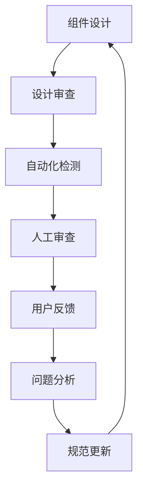

# 🏛️ 组件库架构治理：设计缺陷的系统性解决方案

## 🚨 问题核心：组件库设计缺陷的根本解决

### 🔍 当前Dialog组件的设计缺陷分析

#### 问题症状
```tsx
// ❌ 当前的错误设计
const DialogContent = () => (
  <DialogPrimitive.Content
    className={cn(
      "fixed grid w-full max-w-lg gap-4 border bg-background p-6",
      "inset-0", // 🚨 设计缺陷：内容组件使用全屏定位
      className
    )}
  />
);
```

#### 设计缺陷的本质
1. **职责混淆**：内容组件承担了背景遮罩的定位责任
2. **语义冲突**：同时声明"全屏占满"和"限制宽度"
3. **抽象泄漏**：底层实现细节暴露到上层接口

## 🎯 系统性解决方案

### 1. 建立组件设计原则体系

#### 🔑 核心设计原则

**1.1 单一职责原则 (SRP)**
```tsx
// ✅ 正确设计：每个组件只负责一个职责
const DialogOverlay = () => (
  // 职责：提供全屏背景遮罩
  <Primitive.Overlay className="fixed inset-0 bg-foreground/50" />
);

const DialogContent = () => (
  // 职责：显示居中的内容容器
  <Primitive.Content className="fixed top-1/2 left-1/2 -translate-x-1/2 -translate-y-1/2" />
);
```

**1.2 关注点分离原则**
```tsx
// ✅ 正确的架构分层
interface DialogArchitecture {
  // Layer 1: 布局层 - 负责定位和层级
  positioning: {
    overlay: "fixed inset-0";     // 全屏背景
    content: "fixed centered";    // 居中内容
  };
  
  // Layer 2: 样式层 - 负责视觉呈现
  styling: {
    overlay: "backdrop-blur";     // 背景效果
    content: "border shadow";     // 内容装饰
  };
  
  // Layer 3: 交互层 - 负责用户行为
  interaction: {
    overlay: "click-to-close";    // 点击关闭
    content: "focus-trap";        // 焦点管理
  };
}
```

**1.3 最小惊讶原则**
```tsx
// ✅ 组件行为应该符合开发者直觉
<Dialog>
  {/* 开发者期望：这个遮罩应该全屏 */}
  <DialogOverlay />
  
  {/* 开发者期望：这个内容应该居中 */}
  <DialogContent>
    Content here
  </DialogContent>
</Dialog>
```

### 2. 建立组件库治理框架

#### 🏗️ 组件设计审查流程

**2.1 设计阶段审查清单**
```markdown
## Dialog组件设计审查

### ✅ 架构合规性检查
- [ ] 每个子组件职责单一且明确
- [ ] 没有语义冲突的CSS类组合
- [ ] API设计符合直觉预期
- [ ] 样式不会意外影响其他组件

### ✅ CSS属性兼容性检查
- [ ] 没有冲突的定位属性 (inset vs top/left)
- [ ] 没有矛盾的尺寸声明 (w-full vs max-w-*)
- [ ] z-index层级管理合理
- [ ] 响应式行为一致

### ✅ 可维护性检查
- [ ] 样式可以被安全覆盖
- [ ] 不依赖具体的DOM结构
- [ ] 兼容未来的CSS规范变化
```

**2.2 代码审查自动化**
```javascript
// 设计缺陷检测规则
const componentDesignLints = {
  "conflicting-positioning": {
    message: "检测到冲突的定位属性",
    rule: "不能同时使用 inset-* 和 top-*/left-*",
    examples: ["inset-0 top-1/2", "inset-y-0 bottom-4"]
  },
  
  "semantic-contradiction": {
    message: "检测到语义矛盾的类组合",
    rule: "不能同时声明全屏和限制尺寸",
    examples: ["w-full max-w-lg", "h-screen max-h-96"]
  },
  
  "responsibility-mixing": {
    message: "检测到职责混淆",
    rule: "内容组件不应包含布局容器的样式",
    examples: ["fixed inset-0", "absolute inset-0"]
  }
};
```

### 3. 修复当前Dialog组件的具体方案

#### 🔧 3.1 重构组件架构

```tsx
// ✅ 重构后的Dialog组件架构
const Dialog = DialogPrimitive.Root;

const DialogTrigger = DialogPrimitive.Trigger;

// 🎯 背景遮罩：专注全屏覆盖
const DialogOverlay = React.forwardRef<
  React.ElementRef<typeof DialogPrimitive.Overlay>,
  React.ComponentPropsWithoutRef<typeof DialogPrimitive.Overlay>
>(({ className, ...props }, ref) => (
  <DialogPrimitive.Overlay
    ref={ref}
    className={cn(
      // ✅ 职责明确：全屏背景遮罩
      "fixed inset-0",                    // 全屏定位
      "bg-foreground/50 backdrop-blur-sm", // 视觉效果
      "data-[state=open]:animate-in",      // 进场动画
      "data-[state=closed]:animate-out",   // 退场动画
      "data-[state=closed]:fade-out-0",    // 淡出
      "data-[state=open]:fade-in-0",       // 淡入
      className
    )}
    {...props}
  />
));

// 🎯 内容容器：专注居中显示
const DialogContent = React.forwardRef<
  React.ElementRef<typeof DialogPrimitive.Content>,
  React.ComponentPropsWithoutRef<typeof DialogPrimitive.Content>
>(({ className, children, ...props }, ref) => (
  <DialogPortal>
    <DialogOverlay />
    <DialogPrimitive.Content
      ref={ref}
      className={cn(
        // ✅ 职责明确：居中内容容器
        "fixed left-1/2 top-1/2",          // 居中定位 (不使用inset!)
        "-translate-x-1/2 -translate-y-1/2", // 精确居中
        "grid w-full max-w-lg gap-4",       // 内容布局
        "border bg-background p-6 shadow-lg", // 视觉样式
        "duration-200",                      // 过渡效果
        "data-[state=open]:animate-in",      // 进场动画
        "data-[state=closed]:animate-out",   // 退场动画
        "data-[state=closed]:fade-out-0",    // 淡出
        "data-[state=open]:fade-in-0",       // 淡入
        "data-[state=closed]:zoom-out-95",   // 缩放退场
        "data-[state=open]:zoom-in-95",      // 缩放进场
        "sm:rounded-lg",                     // 响应式圆角
        className
      )}
      {...props}
    >
      {children}
      <DialogPrimitive.Close className="absolute right-4 top-4 rounded-sm opacity-70 ring-offset-background transition-opacity hover:opacity-100 focus:outline-none focus:ring-2 focus:ring-ring focus:ring-offset-2 disabled:pointer-events-none data-[state=open]:bg-accent data-[state=open]:text-muted-foreground">
        <X className="h-4 w-4" />
        <span className="sr-only">Close</span>
      </DialogPrimitive.Close>
    </DialogPrimitive.Content>
  </DialogPortal>
));
```

#### 🔧 3.2 建立防护机制

```tsx
// 设计缺陷防护Hook
export function useDialogIntegrity(elementRef: RefObject<HTMLElement>) {
  useEffect(() => {
    if (!elementRef.current) return;
    
    const element = elementRef.current;
    const computed = window.getComputedStyle(element);
    
    // 🚨 检测设计缺陷
    const hasInsetConflict = 
      computed.inset !== 'auto' && 
      (computed.top !== 'auto' || computed.left !== 'auto');
    
    const hasSemanticConflict = 
      computed.width === '100%' && 
      computed.maxWidth !== 'none';
    
    if (hasInsetConflict) {
      console.warn('🚨 Dialog设计缺陷：检测到inset与top/left冲突', {
        inset: computed.inset,
        top: computed.top,
        left: computed.left
      });
    }
    
    if (hasSemanticConflict) {
      console.warn('🚨 Dialog设计缺陷：检测到尺寸语义冲突', {
        width: computed.width,
        maxWidth: computed.maxWidth
      });
    }
  }, [elementRef]);
}
```

### 4. 预防机制建设

#### 🛡️ 4.1 设计系统规范

```typescript
// 组件设计规范类型定义
interface ComponentDesignRules {
  positioning: {
    // 明确定位策略的适用场景
    fullscreen: "fixed inset-0";     // 仅用于遮罩层
    centered: "fixed top-1/2 left-1/2 -translate-x-1/2 -translate-y-1/2"; // 居中内容
    floating: "absolute top-* left-*"; // 相对定位
  };
  
  responsibilities: {
    // 明确组件职责边界
    layout: string[];    // 布局相关的className
    styling: string[];   // 样式相关的className
    behavior: string[];  // 行为相关的className
  };
}

// 编译时检查
type ValidDialogContentClasses = 
  | "fixed left-1/2 top-1/2 -translate-x-1/2 -translate-y-1/2"  // ✅ 允许
  | "grid w-full max-w-lg"                                      // ✅ 允许
  | "fixed inset-0";                                           // ❌ 禁止：职责冲突
```

#### 🛡️ 4.2 自动化质量保障

```javascript
// ESLint规则：检测组件设计缺陷
module.exports = {
  rules: {
    "component-design/no-positioning-conflicts": {
      create(context) {
        return {
          JSXAttribute(node) {
            if (node.name.name === 'className') {
              const classValue = getClassNameValue(node);
              
              // 检测冲突的定位类
              if (hasConflictingPositioning(classValue)) {
                context.report({
                  node,
                  message: '组件设计缺陷：检测到冲突的定位属性',
                  suggest: getSuggestions(classValue)
                });
              }
            }
          }
        };
      }
    }
  }
};

function hasConflictingPositioning(classes) {
  const hasInset = /inset-\d+/.test(classes);
  const hasTopLeft = /top-\d+|left-\d+/.test(classes);
  return hasInset && hasTopLeft;
}
```

#### 🛡️ 4.3 文档和培训体系

```markdown
## Dialog组件使用最佳实践

### ✅ 正确用法
```tsx
<Dialog>
  {/* 背景遮罩：使用全屏定位 */}
  <DialogOverlay className="fixed inset-0" />
  
  {/* 内容容器：使用居中定位 */}
  <DialogContent className="fixed top-1/2 left-1/2 -translate-x-1/2 -translate-y-1/2">
    Your content here
  </DialogContent>
</Dialog>
```

### ❌ 错误用法及原因
```tsx
{/* ❌ 职责混淆：内容组件不应该全屏 */}
<DialogContent className="fixed inset-0 max-w-lg">

{/* ❌ 语义冲突：不能同时全屏和限制宽度 */}
<DialogContent className="w-full max-w-sm">

{/* ❌ 定位冲突：inset会覆盖top/left */}
<DialogContent className="inset-0 top-1/2">
```

### 🎯 设计原则
1. **单一职责**：每个组件只负责一个明确的功能
2. **语义一致**：CSS类的组合应该在语义上合理
3. **可预测性**：组件行为应该符合开发者直觉
```

### 5. 长期治理机制

#### 🔄 5.1 持续改进流程



#### 🔄 5.2 组件库健康度监控

```typescript
interface ComponentHealthMetrics {
  designQuality: {
    conflictingRules: number;      // 冲突规则数量
    semanticViolations: number;    // 语义违规数量
    responsibilityMixing: number;  // 职责混淆数量
  };
  
  userExperience: {
    bugReports: ComponentBug[];    // 用户问题报告
    usagePatterns: UsagePattern[]; // 使用模式分析
    satisfactionScore: number;     // 满意度评分
  };
  
  maintainability: {
    overrideFrequency: number;     // 被覆盖频率
    customizationDifficulty: number; // 定制难度
    migrationCost: number;         // 升级成本
  };
}
```

## 🎊 总结：从治标到治本

### 🔍 问题本质的演进认识

1. **初始认识**：技术问题（CSS冲突）
2. **深入理解**：实现问题（属性误用）
3. **根本洞察**：设计问题（架构缺陷）
4. **系统视角**：治理问题（质量体系）

### 🎯 解决方案的层次

1. **应急修复**：修复当前Dialog的设计缺陷
2. **规范建设**：建立组件设计原则和审查机制
3. **工具支撑**：自动化检测和质量保障
4. **文化建设**：培训和文档体系
5. **持续改进**：监控反馈和迭代优化

### 🚀 关键成功因素

1. **认知升级**：从技术思维转向设计思维
2. **系统思维**：从单点修复转向系统治理
3. **预防为主**：从事后修复转向事前预防
4. **持续改进**：从一次性解决转向持续优化

**核心洞察：好的架构设计可以避免99%的技术问题，而好的治理机制可以确保架构设计的质量。**