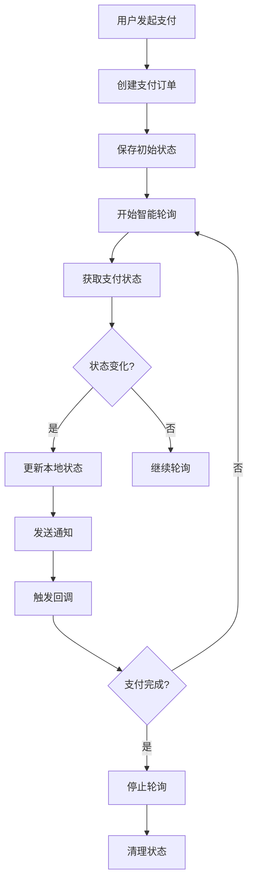

# 💳 支付状态自动检测系统

## 📋 功能概述

为"文派"项目实现了完整的支付状态自动检测系统，提供智能轮询、状态持久化、实时通知等高级功能，确保用户能够及时了解支付状态变化。

## 🎯 核心功能

### 1. 智能轮询策略
- **指数退避算法**: 根据重试次数动态调整轮询间隔
- **状态感知轮询**: 不同支付状态使用不同的轮询频率
- **自动重试机制**: 网络异常时自动重试，最多重试10次
- **智能暂停**: 支付完成后自动停止轮询

### 2. 状态持久化
- **本地存储**: 支付状态自动保存到localStorage
- **页面恢复**: 页面刷新后自动恢复支付状态
- **历史记录**: 保存最近50条支付记录
- **数据清理**: 自动清理过期的支付状态

### 3. 实时通知系统
- **浏览器通知**: 支付状态变化时发送桌面通知
- **提示音效**: 支付成功/失败时播放音效
- **Toast提示**: 集成应用内Toast通知
- **状态变化检测**: 智能检测状态变化并触发通知

### 4. 用户体验优化
- **进度可视化**: 实时显示支付进度条
- **状态图标**: 直观的状态图标和颜色
- **预计时间**: 显示预计完成时间
- **操作按钮**: 一键重新支付、前往个人中心等

## 🏗️ 技术架构

### 核心组件

#### 1. EnhancedPaymentStatusMonitor.tsx
```typescript
// 增强版支付状态监控组件
- 智能轮询策略
- 实时状态更新
- 通知和音效
- 暂停/恢复功能
- 高级信息显示
```

#### 2. PaymentStatusService.ts
```typescript
// 支付状态持久化服务
- 状态保存和恢复
- 历史记录管理
- 数据导入导出
- 统计信息计算
```

#### 3. PaymentStatusRecovery.tsx
```typescript
// 支付状态恢复组件
- 页面加载时检查
- 活跃支付恢复
- 批量状态管理
- 用户确认机制
```

#### 4. usePaymentStatus.ts
```typescript
// 支付状态Hook
- 便捷的状态监控接口
- 完整的生命周期管理
- 自定义回调支持
- 错误处理机制
```

### 数据流程



## 🚀 使用方法

### 1. 基本使用

```typescript
import { EnhancedPaymentStatusMonitor } from '@/components/payment/EnhancedPaymentStatusMonitor';

// 在支付页面中使用
<EnhancedPaymentStatusMonitor
  checkoutId={checkout.id}
  apiKey={import.meta.env.VITE_CREEM_API_KEY}
  onPaymentSuccess={handlePaymentSuccess}
  onPaymentFailed={handlePaymentFailed}
  onPaymentExpired={handlePaymentExpired}
  autoRefresh={true}
  refreshInterval={3000}
  maxRetries={10}
  enableNotifications={true}
  enableSound={true}
  showAdvancedInfo={false}
/>
```

### 2. 使用Hook

```typescript
import { usePaymentStatus } from '@/hooks/usePaymentStatus';

const {
  paymentStatus,
  isRefreshing,
  isPaused,
  startMonitoring,
  stopMonitoring,
  refreshStatus,
} = usePaymentStatus({
  checkoutId: 'checkout_123',
  autoRefresh: true,
  onPaymentSuccess: (data) => console.log('支付成功:', data),
  onPaymentFailed: (error) => console.log('支付失败:', error),
});
```

### 3. 状态恢复

```typescript
import { PaymentStatusRecovery } from '@/components/payment/PaymentStatusRecovery';

// 在页面加载时自动检查
<PaymentStatusRecovery
  onRecoveryComplete={() => navigate('/profile')}
  onNoActivePayments={() => setShowRecovery(false)}
/>
```

## 📊 功能特性

### 智能轮询配置
- **初始间隔**: 3秒
- **最大间隔**: 30秒
- **退避倍数**: 1.5
- **成功间隔**: 5秒
- **最大重试**: 10次

### 状态映射
| Creem状态 | 内部状态 | 进度 | 描述 |
|-----------|----------|------|------|
| pending | pending | 25% | 等待支付 |
| processing | processing | 50% | 支付处理中 |
| paid/completed | paid | 100% | 支付成功 |
| failed/cancelled | failed | 0% | 支付失败 |
| expired | expired | 0% | 支付过期 |

### 通知配置
- **浏览器通知**: 需要用户授权
- **提示音效**: 支持成功/失败音效
- **Toast通知**: 应用内即时通知
- **状态变化**: 智能检测并通知

## 🔧 配置选项

### 组件配置
```typescript
interface EnhancedPaymentStatusMonitorProps {
  checkoutId: string;           // 支付ID
  apiKey: string;              // Creem API密钥
  onPaymentSuccess?: Function; // 支付成功回调
  onPaymentFailed?: Function;  // 支付失败回调
  onPaymentExpired?: Function; // 支付过期回调
  autoRefresh?: boolean;       // 自动刷新
  refreshInterval?: number;    // 刷新间隔(ms)
  maxRetries?: number;         // 最大重试次数
  enableNotifications?: boolean; // 启用通知
  enableSound?: boolean;       // 启用音效
  showAdvancedInfo?: boolean;  // 显示高级信息
}
```

### Hook配置
```typescript
interface UsePaymentStatusOptions {
  checkoutId?: string;         // 支付ID
  autoRefresh?: boolean;       // 自动刷新
  refreshInterval?: number;    // 刷新间隔
  maxRetries?: number;         // 最大重试
  enableNotifications?: boolean; // 启用通知
  enableSound?: boolean;       // 启用音效
  onStatusChange?: Function;   // 状态变化回调
  onPaymentSuccess?: Function; // 支付成功回调
  onPaymentFailed?: Function; // 支付失败回调
  onPaymentExpired?: Function; // 支付过期回调
}
```

## 📱 用户界面

### 状态显示
- **进度条**: 实时显示支付进度
- **状态徽章**: 颜色编码的状态标识
- **图标**: 直观的状态图标
- **时间**: 最后检查时间和预计完成时间

### 操作按钮
- **刷新**: 手动刷新支付状态
- **暂停/恢复**: 控制监控状态
- **重新支付**: 支付失败时重新发起
- **前往个人中心**: 支付成功后跳转

### 高级信息
- **重试次数**: 显示当前重试次数
- **监控状态**: 显示是否正在监控
- **错误信息**: 详细的错误描述
- **支付详情**: 金额、时间等信息

## 🛠️ 开发工具

### 测试页面
- **PaymentStatusTestPage.tsx**: 完整的测试界面
- **功能测试**: 测试所有监控功能
- **配置调整**: 实时调整监控参数
- **状态模拟**: 模拟各种支付状态

### 管理页面
- **PaymentStatusPage.tsx**: 支付状态管理界面
- **批量操作**: 批量管理支付状态
- **数据导出**: 导出支付数据
- **统计分析**: 支付状态统计

## 🔒 安全考虑

### 数据安全
- **本地存储**: 敏感数据仅存储在本地
- **自动清理**: 定期清理过期数据
- **权限控制**: 通知需要用户授权
- **错误处理**: 完善的错误处理机制

### 网络安全
- **重试限制**: 防止无限重试
- **间隔控制**: 避免过于频繁的请求
- **错误恢复**: 网络异常时的恢复机制
- **状态验证**: 验证支付状态的有效性

## 📈 性能优化

### 轮询优化
- **智能间隔**: 根据状态动态调整间隔
- **自动停止**: 完成后自动停止轮询
- **内存管理**: 及时清理定时器
- **状态缓存**: 避免重复请求

### 存储优化
- **数据压缩**: 压缩存储的数据
- **定期清理**: 自动清理过期数据
- **限制大小**: 限制历史记录数量
- **批量操作**: 支持批量数据操作

## 🎨 自定义样式

### 主题支持
- **状态颜色**: 可自定义状态颜色
- **图标样式**: 支持自定义图标
- **布局调整**: 灵活的布局配置
- **响应式设计**: 适配不同屏幕尺寸

### 国际化
- **多语言支持**: 支持中英文切换
- **时间格式**: 本地化时间显示
- **货币格式**: 本地化货币显示
- **消息模板**: 可自定义消息模板

## 🔮 未来扩展

### 功能增强
- **WebSocket支持**: 实时推送支付状态
- **多支付方式**: 支持更多支付平台
- **批量监控**: 同时监控多个支付
- **数据分析**: 支付行为分析

### 集成扩展
- **第三方通知**: 集成钉钉、企业微信等
- **邮件通知**: 支付结果邮件通知
- **短信通知**: 重要状态短信通知
- **API集成**: 提供状态查询API

## 📝 使用示例

### 完整支付流程
```typescript
// 1. 创建支付订单
const checkout = await creem.createCheckout({
  createCheckoutRequest: { priceId, productId, customerEmail },
  xApiKey: apiKey
});

// 2. 开始监控支付状态
<EnhancedPaymentStatusMonitor
  checkoutId={checkout.id}
  apiKey={apiKey}
  onPaymentSuccess={(data) => {
    // 处理支付成功
    upgradeMembership(data);
    navigate('/profile');
  }}
  onPaymentFailed={(error) => {
    // 处理支付失败
    showError(error);
  }}
  autoRefresh={true}
  enableNotifications={true}
  enableSound={true}
/>
```

### 状态恢复示例
```typescript
// 页面加载时自动恢复支付状态
useEffect(() => {
  const activePayments = paymentStatusService.getActivePaymentStatuses();
  if (activePayments.length > 0) {
    setShowRecovery(true);
  }
}, []);

// 显示恢复组件
{showRecovery && (
  <PaymentStatusRecovery
    onRecoveryComplete={() => {
      setShowRecovery(false);
      navigate('/profile');
    }}
    onNoActivePayments={() => setShowRecovery(false)}
  />
)}
```

## 🎉 总结

支付状态自动检测系统为"文派"项目提供了完整的支付状态监控解决方案，具有以下优势：

1. **智能化**: 智能轮询策略，减少服务器压力
2. **可靠性**: 完善的错误处理和重试机制
3. **用户体验**: 实时通知和状态可视化
4. **可扩展性**: 模块化设计，易于扩展
5. **易用性**: 简单的API和Hook接口

该系统确保了用户能够及时了解支付状态变化，提升了支付体验的流畅性和可靠性。 