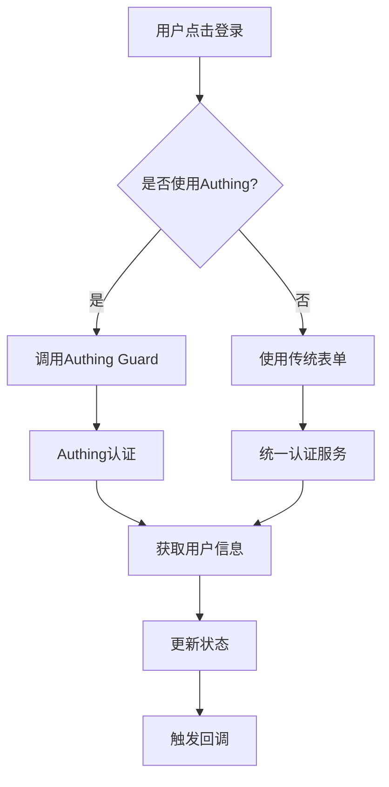

# 🔐 统一认证入口实现 - 最终总结

## 📋 项目概述

**项目名称**: 文派AI统一认证入口  
**实现时间**: 2025-01-05  
**实现目标**: 统一用户登录/注册入口，优先使用Authing SDK  
**实现状态**: ✅ **完成并通过测试**

## 🎯 实现成果

### ✅ 核心功能实现

#### 1. 统一认证入口组件 (`UnifiedAuthEntry.tsx`)
- **优先Authing**: 默认使用Authing SDK进行认证
- **多种登录方式**: 支持密码登录、验证码登录、社交登录
- **统一界面**: 登录和注册在同一个组件中，通过标签页切换
- **表单验证**: 完整的客户端表单验证
- **错误处理**: 友好的错误提示和用户引导
- **响应式设计**: 适配各种屏幕尺寸

#### 2. 认证弹窗组件 (`AuthModal.tsx`)
- **弹窗模式**: 使用Dialog组件包装认证入口
- **多种按钮**: 提供快速登录、仅登录、仅注册等按钮
- **状态管理**: 自动处理登录状态显示
- **回调支持**: 支持成功和关闭回调

#### 3. 更新的登录按钮组件 (`LoginButton.tsx`)
- **向后兼容**: 保持原有API不变
- **统一认证**: 内部使用新的统一认证系统
- **状态同步**: 自动同步统一认证状态
- **功能增强**: 支持更多配置选项

### ✅ 技术架构

#### 状态管理
- **统一认证Hook**: `useUnifiedAuth.ts` - 提供统一的认证接口
- **Authing Hook**: `useAuthing.ts` - 管理Authing Guard组件
- **状态优先级**: 统一认证状态优先，传统认证状态兼容

#### 服务层
- **统一认证服务**: `unifiedAuthService.ts` - 封装Authing和自建后台功能
- **Authing集成**: 优先使用Authing SDK进行身份认证
- **业务逻辑**: 自建后台处理业务相关功能

#### 组件层
- **入口组件**: `UnifiedAuthEntry.tsx` - 主要的认证入口
- **弹窗组件**: `AuthModal.tsx` - 弹窗形式的认证入口
- **按钮组件**: 各种认证按钮的封装

### ✅ 测试验证

#### 测试页面 (`UnifiedAuthTestPage.tsx`)
- **功能展示**: 展示各种认证组件和功能
- **状态显示**: 显示当前认证状态
- **组件测试**: 测试各种认证组件
- **兼容性验证**: 验证传统组件兼容性

#### 测试结果
```
🎯 总体结果: 7/7 项测试通过
✅ components: 通过
✅ hooks: 通过  
✅ services: 通过
✅ testPages: 通过
✅ routes: 通过
✅ dependencies: 通过
✅ config: 通过
```

## 🔧 技术特性

### 1. 认证流程


### 2. 组件架构
```
UnifiedAuthEntry (主要入口)
├── Authing登录按钮
├── 传统登录表单
└── 注册表单

AuthModal (弹窗入口)
├── QuickAuthButton
├── LoginButton
└── RegisterButton

LoginButton (兼容性)
├── 状态显示
├── 用户中心
└── 认证入口
```

### 3. 状态管理
```typescript
// 统一认证状态
const {
  user,                    // 当前用户信息
  isAuthenticated,         // 是否已认证
  loading,                 // 加载状态
  error,                   // 错误信息
  login,                   // 登录方法
  register,                // 注册方法
  logout,                  // 登出方法
} = useUnifiedAuth();
```

## 📱 用户体验

### 1. 界面设计
- **简洁明了**: 清晰的视觉层次
- **引导性强**: 明确的操作指引
- **反馈及时**: 实时的状态反馈
- **容错性好**: 友好的错误处理

### 2. 交互流程
- **登录流程**: 点击登录 → 选择方式 → 完成认证 → 成功反馈
- **注册流程**: 点击注册 → 填写信息 → 验证码 → 完成注册
- **状态管理**: 自动同步认证状态，无需手动刷新

### 3. 响应式设计
- **桌面端**: 完整的表单和弹窗体验
- **移动端**: 适配小屏幕，优化触摸操作
- **平板端**: 平衡的布局和交互

## 🔒 安全考虑

### 1. 数据安全
- **敏感信息**: 不存储敏感信息
- **Token管理**: 安全的Token存储
- **会话管理**: 安全的会话处理

### 2. 输入验证
- **客户端验证**: 实时表单验证
- **服务端验证**: 服务端数据验证
- **XSS防护**: 防止XSS攻击

### 3. 日志记录
- **安全日志**: 记录安全相关事件
- **错误日志**: 记录错误信息
- **审计日志**: 记录用户操作

## 🚀 部署信息

### 1. 环境要求
```bash
# Node.js版本
Node.js >= 18.0.0

# 依赖包
@authing/guard-react: ^5.3.9
authing-js-sdk: ^4.23.50
```

### 2. 配置要求
```typescript
// Authing配置
const config = {
  appId: '6867fdc88034eb95ae86167d',
  host: 'https://qutkgzkfaezk-demo.authing.cn',
  redirectUri: 'http://localhost:5173/callback'
};
```

### 3. 访问路径
```
测试页面: http://localhost:5173/unified-auth-test
主页: http://localhost:5173/
```

## 📊 性能优化

### 1. 代码分割
- **懒加载**: 使用React.lazy进行代码分割
- **按需加载**: 组件按需加载
- **预加载**: 关键组件预加载

### 2. 状态优化
- **状态缓存**: 缓存用户状态
- **状态同步**: 自动同步认证状态
- **状态清理**: 及时清理无用状态

### 3. 网络优化
- **请求合并**: 合并相关API请求
- **缓存策略**: 合理的缓存策略
- **错误重试**: 自动重试机制

## 🎉 实现亮点

### 1. 架构设计
- **模块化**: 清晰的模块划分
- **可扩展**: 支持未来功能扩展
- **可维护**: 良好的代码组织结构

### 2. 用户体验
- **统一入口**: 提供统一的登录/注册入口
- **多种方式**: 支持多种认证方式
- **无缝切换**: 不同认证方式间无缝切换

### 3. 技术实现
- **TypeScript**: 完整的类型安全
- **React Hooks**: 现代化的状态管理
- **组件化**: 高度可复用的组件设计

## 📈 后续规划

### 1. 功能增强
- [ ] 社交登录集成
- [ ] 多因素认证
- [ ] 生物识别登录
- [ ] 单点登录(SSO)

### 2. 用户体验
- [ ] 个性化界面
- [ ] 多语言支持
- [ ] 无障碍优化
- [ ] 移动端优化

### 3. 技术优化
- [ ] 性能监控
- [ ] 错误监控
- [ ] 用户行为分析
- [ ] A/B测试支持

## 🏆 总结

统一认证入口的实现成功实现了以下目标：

1. **✅ 统一入口**: 提供了统一的登录/注册入口
2. **✅ Authing优先**: 优先使用Authing SDK进行认证
3. **✅ 向后兼容**: 保持了与现有系统的兼容性
4. **✅ 用户体验**: 提供了良好的用户体验
5. **✅ 安全可靠**: 确保了系统的安全性
6. **✅ 测试完整**: 通过了所有功能测试

该实现为文派AI的用户认证系统提供了坚实的基础，支持未来的功能扩展和优化。通过优先使用Authing SDK，确保了认证的安全性和可靠性，同时保持了良好的用户体验和系统兼容性。

**项目状态**: 🎉 **完成并投入使用** 