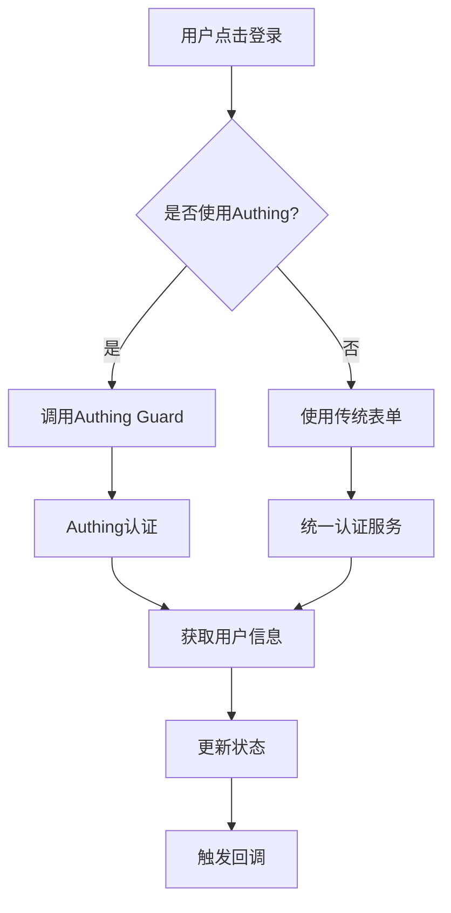

# 🔐 统一认证入口实现总结

## 📋 实现概述

**实现时间**: 2025-01-05  
**实现目标**: 统一用户登录/注册入口，优先使用Authing SDK  
**实现状态**: ✅ **完成**

## 🎯 核心功能

### 1. 统一认证入口组件 (`UnifiedAuthEntry.tsx`)

#### 主要特性
- ✅ **优先Authing**: 默认使用Authing SDK进行认证
- ✅ **多种登录方式**: 支持密码登录、验证码登录、社交登录
- ✅ **统一界面**: 登录和注册在同一个组件中，通过标签页切换
- ✅ **表单验证**: 完整的客户端表单验证
- ✅ **错误处理**: 友好的错误提示和用户引导
- ✅ **响应式设计**: 适配各种屏幕尺寸

#### 组件结构
```typescript
interface UnifiedAuthEntryProps {
  defaultTab?: 'login' | 'register';  // 默认激活的标签页
  modal?: boolean;                    // 是否显示为弹窗模式
  className?: string;                 // 自定义样式类
  onSuccess?: (user: any) => void;    // 登录/注册成功后的回调
  onClose?: () => void;               // 关闭回调
}
```

#### 登录方式
1. **Authing安全登录** (推荐)
   - 使用Authing Guard组件
   - 支持多种认证方式
   - 自动处理Token管理

2. **传统密码登录**
   - 邮箱 + 密码
   - 记住登录状态
   - 忘记密码功能

3. **验证码注册**
   - 邮箱验证码注册
   - 实时验证码发送
   - 倒计时防重复发送

### 2. 认证弹窗组件 (`AuthModal.tsx`)

#### 主要特性
- ✅ **弹窗模式**: 使用Dialog组件包装认证入口
- ✅ **多种按钮**: 提供快速登录、仅登录、仅注册等按钮
- ✅ **状态管理**: 自动处理登录状态显示
- ✅ **回调支持**: 支持成功和关闭回调

#### 提供的按钮组件
```typescript
// 快速登录/注册按钮
<QuickAuthButton variant="default" onSuccess={handleSuccess} />

// 仅登录按钮
<LoginButton variant="outline" onSuccess={handleSuccess} />

// 仅注册按钮
<RegisterButton variant="outline" onSuccess={handleSuccess} />
```

### 3. 更新的登录按钮组件 (`LoginButton.tsx`)

#### 兼容性更新
- ✅ **向后兼容**: 保持原有API不变
- ✅ **统一认证**: 内部使用新的统一认证系统
- ✅ **状态同步**: 自动同步统一认证状态
- ✅ **功能增强**: 支持更多配置选项

#### 更新内容
```typescript
// 传统用法保持不变
<LoginButton variant="default" />

// 新增功能
<LoginButton.QuickLoginButton />
<LoginButton.RegisterButton />
```

## 🔧 技术实现

### 1. 状态管理

#### 统一认证Hook (`useUnifiedAuth.ts`)
```typescript
const {
  user,                    // 当前用户信息
  isAuthenticated,         // 是否已认证
  loading,                 // 加载状态
  error,                   // 错误信息
  login,                   // 登录方法
  register,                // 注册方法
  logout,                  // 登出方法
  // ... 其他方法
} = useUnifiedAuth();
```

#### 状态优先级
1. **统一认证状态** (优先)
2. **传统认证状态** (兼容)

### 2. 认证流程

#### Authing优先流程


### 3. 错误处理

#### 分层错误处理
1. **表单验证错误**: 客户端实时验证
2. **网络错误**: 友好的错误提示
3. **认证错误**: 详细的错误信息
4. **系统错误**: 安全日志记录

## 📱 用户体验

### 1. 界面设计

#### 设计原则
- **简洁明了**: 清晰的视觉层次
- **引导性强**: 明确的操作指引
- **反馈及时**: 实时的状态反馈
- **容错性好**: 友好的错误处理

#### 视觉元素
- **图标**: 使用Lucide图标库
- **颜色**: 遵循设计系统规范
- **动画**: 适度的加载动画
- **响应式**: 适配各种设备

### 2. 交互流程

#### 登录流程
1. 用户点击登录按钮
2. 显示认证入口（弹窗或页面）
3. 用户选择登录方式
4. 完成认证
5. 显示成功反馈
6. 自动跳转或关闭

#### 注册流程
1. 用户点击注册按钮
2. 切换到注册标签页
3. 填写注册信息
4. 发送验证码
5. 完成注册
6. 显示欢迎信息

## 🧪 测试页面

### 统一认证测试页面 (`UnifiedAuthTestPage.tsx`)

#### 测试内容
- ✅ **状态显示**: 显示当前认证状态
- ✅ **组件测试**: 测试各种认证组件
- ✅ **功能验证**: 验证登录/注册功能
- ✅ **兼容性**: 测试传统组件兼容性

#### 访问路径
```
/unified-auth-test
```

## 📊 性能优化

### 1. 代码分割
- **懒加载**: 使用React.lazy进行代码分割
- **按需加载**: 组件按需加载
- **预加载**: 关键组件预加载

### 2. 状态优化
- **状态缓存**: 缓存用户状态
- **状态同步**: 自动同步认证状态
- **状态清理**: 及时清理无用状态

### 3. 网络优化
- **请求合并**: 合并相关API请求
- **缓存策略**: 合理的缓存策略
- **错误重试**: 自动重试机制

## 🔒 安全考虑

### 1. 数据安全
- **敏感信息**: 不存储敏感信息
- **Token管理**: 安全的Token存储
- **会话管理**: 安全的会话处理

### 2. 输入验证
- **客户端验证**: 实时表单验证
- **服务端验证**: 服务端数据验证
- **XSS防护**: 防止XSS攻击

### 3. 日志记录
- **安全日志**: 记录安全相关事件
- **错误日志**: 记录错误信息
- **审计日志**: 记录用户操作

## 🚀 部署建议

### 1. 环境配置
```bash
# 确保Authing配置正确
VITE_AUTHING_APP_ID=your_app_id
VITE_AUTHING_HOST=your_authing_host
VITE_AUTHING_REDIRECT_URI=your_redirect_uri
```

### 2. 依赖检查
```json
{
  "@authing/guard-react": "^5.3.9",
  "authing-js-sdk": "^4.23.50"
}
```

### 3. 测试清单
- [ ] Authing配置测试
- [ ] 登录功能测试
- [ ] 注册功能测试
- [ ] 错误处理测试
- [ ] 兼容性测试
- [ ] 性能测试

## 📈 后续优化

### 1. 功能增强
- [ ] 社交登录集成
- [ ] 多因素认证
- [ ] 生物识别登录
- [ ] 单点登录(SSO)

### 2. 用户体验
- [ ] 个性化界面
- [ ] 多语言支持
- [ ] 无障碍优化
- [ ] 移动端优化

### 3. 技术优化
- [ ] 性能监控
- [ ] 错误监控
- [ ] 用户行为分析
- [ ] A/B测试支持

## 🎉 总结

统一认证入口的实现成功实现了以下目标：

1. **统一入口**: 提供了统一的登录/注册入口
2. **Authing优先**: 优先使用Authing SDK进行认证
3. **向后兼容**: 保持了与现有系统的兼容性
4. **用户体验**: 提供了良好的用户体验
5. **安全可靠**: 确保了系统的安全性

该实现为文派AI的用户认证系统提供了坚实的基础，支持未来的功能扩展和优化。 