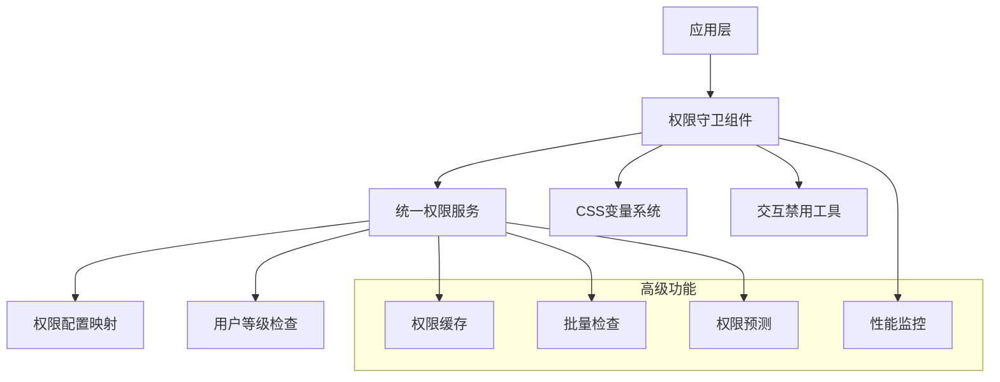

# 🔐 统一权限守卫系统完整指南

## 📋 目录

- [系统概览](#系统概览)
- [核心架构](#核心架构)
- [快速开始](#快速开始)
- [权限类型](#权限类型)
- [显示模式](#显示模式)
- [高级功能](#高级功能)
- [性能优化](#性能优化)
- [最佳实践](#最佳实践)
- [故障排除](#故障排除)
- [API参考](#API参考)

---

## 🎯 系统概览

### 设计目标

统一权限守卫系统是wenpai项目的核心权限管理解决方案，旨在：

- ✅ **统一管理**：集中管理所有权限检查逻辑
- ✅ **多样化显示**：支持8种不同的权限遮罩模式
- ✅ **高性能**：智能缓存和批量检查优化
- ✅ **类型安全**：完整的TypeScript类型支持
- ✅ **用户友好**：优雅的升级提示和预览功能
- ✅ **可维护性**：统一的CSS变量和组件架构

### 核心优势

| 特性 | 传统方案 | 统一权限系统 |
|------|----------|-------------|
| 组件数量 | 8个独立组件 | 1个统一组件 |
| 代码重复 | 大量重复逻辑 | 零重复，统一服务 |
| 权限类型 | 不一致的定义 | 32种标准化类型 |
| 性能优化 | 各自为政 | 智能缓存+批量检查 |
| 维护成本 | 高 | 低 |
| 功能一致性 | 难以保证 | 完全一致 |

---

## 🏗️ 核心架构

### 系统层级



### 核心组件

#### 1. EnhancedUnifiedPermissionGuard
**主力组件** - 提供完整的权限守卫功能

```tsx
import { EnhancedUnifiedPermissionGuard } from '@/components/auth/EnhancedUnifiedPermissionGuard';

<EnhancedUnifiedPermissionGuard
  requiredPermission="feature:creative-studio"
  mode="overlay"
  featureName="创意魔方"
  description="AI驱动的创意内容生成工具"
>
  <YourProtectedComponent />
</EnhancedUnifiedPermissionGuard>
```

#### 2. UnifiedPermissionService
**核心服务** - 权限检查逻辑的中央处理器

```typescript
import { UnifiedPermissionService } from '@/services/unifiedPermissionService';

// 单个权限检查
const result = UnifiedPermissionService.checkPermission(user, 'tier:pro');

// 批量权限检查
const results = UnifiedPermissionService.checkMultiplePermissions(
  user, 
  ['tier:pro', 'feature:creative-studio']
);
```

#### 3. useAdvancedPermissionGuard
**高级Hook** - 提供缓存、批量检查等高级功能

```typescript
import { useAdvancedPermissionGuard } from '@/hooks/useAdvancedPermissionGuard';

const {
  hasPermission,
  batchResult,
  checkBatchPermissions,
  clearCache
} = useAdvancedPermissionGuard(['tier:pro', 'feature:creative-studio'], {
  enablePreload: true,
  cacheExpiry: 5 * 60 * 1000
});
```

---

## 🚀 快速开始

### 1. 基础使用

**最简单的权限守卫：**

```tsx
<EnhancedUnifiedPermissionGuard requiredPermission="tier:pro">
  <div>专业版用户专享内容</div>
</EnhancedUnifiedPermissionGuard>
```

**带自定义信息的权限守卫：**

```tsx
<EnhancedUnifiedPermissionGuard
  requiredPermission="feature:brand-library"
  featureName="品牌库"
  description="企业级品牌资产管理系统"
  mode="card"
>
  <BrandLibraryComponent />
</EnhancedUnifiedPermissionGuard>
```

### 2. 显示模式选择

根据UI需求选择合适的显示模式：

```tsx
// 遮罩模式 - 默认，适合大面积内容保护
<EnhancedUnifiedPermissionGuard
  requiredPermission="tier:pro"
  mode="overlay"
  overlayIntensity="medium"
>
  <LargeContentArea />
</EnhancedUnifiedPermissionGuard>

// 卡片模式 - 适合功能入口展示
<EnhancedUnifiedPermissionGuard
  requiredPermission="tier:premium"
  mode="card"
>
  <FeatureEntrance />
</EnhancedUnifiedPermissionGuard>

// 预览模式 - 适合需要展示但限制交互的场景
<EnhancedUnifiedPermissionGuard
  requiredPermission="tier:pro"
  mode="preview"
  allowPreview={true}
>
  <PreviewableContent />
</EnhancedUnifiedPermissionGuard>
```

### 3. 权限检查集成

在组件内部进行权限检查：

```tsx
function MyComponent() {
  const { hasPermission, permissionResult } = useAdvancedPermissionGuard('tier:pro');

  if (!hasPermission) {
    return <div>需要专业版权限</div>;
  }

  return <div>专业版功能内容</div>;
}
```

---

## 🎭 权限类型

### 权限类型分类

#### 1. 等级权限 (Tier Permissions)
```typescript
'tier:trial'     // 体验版权限
'tier:pro'       // 专业版权限  
'tier:premium'   // 高级版权限
```

#### 2. 功能权限 (Feature Permissions)
```typescript
'feature:creative-studio'      // 创意魔方功能
'feature:creative-cube'        // 九宫格创意魔方
'feature:brand-library'        // 品牌库功能
'feature:marketing-calendar'   // 营销日历
'feature:emoji-generator'      // Emoji生成器
'feature:wechat-templates'     // 微信朋友圈模板
'feature:unlimited-usage'      // 无限使用功能
'feature:advanced-models'      // 高级AI模型访问
```

#### 3. 模型权限 (Model Permissions)
```typescript
'model:trial'     // 体验版AI模型
'model:pro'       // 专业版AI模型
'model:premium'   // 高级版AI模型
```

#### 4. 主题权限 (Theme Permissions)
```typescript
'theme:basic'     // 基础主题
'theme:advanced'  // 高级主题
'theme:premium'   // 专业主题
```

#### 5. 认证权限 (Auth Permissions)
```typescript
'auth:required'   // 需要登录
```

### 权限层级关系

```
premium (高级版)
├── 包含所有 pro 权限
├── 包含所有 trial 权限
├── feature:brand-library
├── feature:unlimited-usage
├── model:premium
└── theme:premium

pro (专业版)
├── 包含所有 trial 权限
├── feature:creative-studio
├── feature:creative-cube
├── feature:marketing-calendar
├── feature:emoji-generator
├── feature:wechat-templates
├── feature:advanced-models
├── model:pro
└── theme:advanced

trial (体验版)
├── 基础功能访问
├── model:trial
└── theme:basic
```

---

## 🎨 显示模式

### 1. overlay (遮罩模式) - 默认
**适用场景**：大面积内容保护，完整的升级体验

```tsx
<EnhancedUnifiedPermissionGuard
  requiredPermission="tier:pro"
  mode="overlay"
  overlayIntensity="medium"
>
  <ComplexInterface />
</EnhancedUnifiedPermissionGuard>
```

**特点**：
- ✅ 显示完整的定价方案对比
- ✅ 支持限时优惠倒计时
- ✅ 磨砂玻璃效果遮罩
- ✅ 智能响应式适配

### 2. card (卡片模式)
**适用场景**：功能入口，页面级保护

```tsx
<EnhancedUnifiedPermissionGuard
  requiredPermission="feature:brand-library"
  mode="card"
>
  <FeatureCard />
</EnhancedUnifiedPermissionGuard>
```

**特点**：
- ✅ 紧凑的升级提示卡片
- ✅ 突出权限要求信息
- ✅ 适合网格布局

### 3. preview (预览模式)
**适用场景**：需要展示功能但限制交互

```tsx
<EnhancedUnifiedPermissionGuard
  requiredPermission="tier:pro"
  mode="preview"
  allowPreview={true}
>
  <InteractiveComponent />
</EnhancedUnifiedPermissionGuard>
```

**特点**：
- ✅ 预览开关控制
- ✅ 灰化但可见的内容
- ✅ 悬浮升级提示
- ✅ 增强用户体验

### 4. button (按钮模式)
**适用场景**：小型组件，按钮级保护

```tsx
<EnhancedUnifiedPermissionGuard
  requiredPermission="tier:pro"
  mode="button"
  upgradeButtonText="解锁高级功能"
>
  <ActionButton />
</EnhancedUnifiedPermissionGuard>
```

### 5. badge (标签模式)
**适用场景**：最小化干扰的权限提示

```tsx
<EnhancedUnifiedPermissionGuard
  requiredPermission="tier:premium"
  mode="badge"
>
  <ContentItem />
</EnhancedUnifiedPermissionGuard>
```

### 6. disabled (禁用模式)
**适用场景**：显示功能存在但当前不可用

```tsx
<EnhancedUnifiedPermissionGuard
  requiredPermission="tier:pro"
  mode="disabled"
  showUpgradeHint={true}
>
  <DisabledFeature />
</EnhancedUnifiedPermissionGuard>
```

### 7. replace (替换模式)
**适用场景**：完全替换内容为升级提示

```tsx
<EnhancedUnifiedPermissionGuard
  requiredPermission="tier:premium"
  mode="replace"
>
  <PremiumContent />
</EnhancedUnifiedPermissionGuard>
```

### 8. dialog (对话框模式)
**适用场景**：需要用户明确确认的权限检查

```tsx
<EnhancedUnifiedPermissionGuard
  requiredPermission="tier:pro"
  mode="dialog"
  interactionBehavior="prompt"
>
  <SensitiveOperation />
</EnhancedUnifiedPermissionGuard>
```

---

## 🚀 高级功能

### 1. 智能缓存系统

**自动缓存权限检查结果，提升性能：**

```typescript
const { hasPermission, clearCache, getCacheStats } = useAdvancedPermissionGuard(
  'tier:pro',
  {
    cacheExpiry: 5 * 60 * 1000, // 5分钟缓存
    enablePreload: true
  }
);

// 获取缓存统计
const stats = getCacheStats();
console.log(`缓存命中率: ${(stats.hitRate * 100).toFixed(1)}%`);

// 手动清除缓存
clearCache();
```

### 2. 批量权限检查

**一次检查多个权限，减少API调用：**

```typescript
const { batchResult, checkBatchPermissions } = useAdvancedPermissionGuard([
  'tier:pro',
  'feature:creative-studio',
  'model:pro'
]);

// 检查结果
console.log('所有权限:', batchResult?.hasAllPermissions);
console.log('任意权限:', batchResult?.hasAnyPermission);
console.log('缺失权限:', batchResult?.missingPermissions);
console.log('建议升级:', batchResult?.suggestedUpgrade);
```

### 3. 权限预测

**预测用户升级后的权限变化：**

```typescript
const { predictPermissionChange } = useAdvancedPermissionGuard('feature:brand-library', {
  enablePrediction: true
});

const prediction = predictPermissionChange?.('feature:brand-library', 'premium');
console.log('升级后有权限:', prediction?.willHavePermission);
console.log('所需操作:', prediction?.requiredActions);
```

### 4. 性能监控

**监控权限检查性能：**

```typescript
const { recordMetric, getPerformanceReport } = usePermissionMonitor();

const { hasPermission } = useAdvancedPermissionGuard('tier:pro', {
  onPerformanceMetric: recordMetric
});

const report = getPerformanceReport();
console.log('平均响应时间:', report.averageResponseTime);
console.log('总检查次数:', report.totalChecks);
```

### 5. 权限系统管理

**高级用户可访问的管理面板：**

```tsx
import { PermissionSystemDashboard } from '@/components/auth/PermissionSystemDashboard';

// 仅高级版用户可访问
<PermissionSystemDashboard />
```

管理面板功能：
- 📊 实时性能监控
- 🔍 权限配置查看
- 🧪 权限测试工具
- 💾 缓存管理
- ⚙️ 系统设置

---

## ⚡ 性能优化

### 1. 缓存策略

**智能缓存配置：**

```typescript
// 长期缓存（适用于稳定权限）
const longTermCache = useAdvancedPermissionGuard('tier:trial', {
  cacheExpiry: 30 * 60 * 1000 // 30分钟
});

// 短期缓存（适用于动态权限）
const shortTermCache = useAdvancedPermissionGuard('feature:advanced-models', {
  cacheExpiry: 60 * 1000 // 1分钟
});
```

### 2. 预加载优化

**预加载相关权限：**

```typescript
import { usePermissionPreloader } from '@/hooks/useAdvancedPermissionGuard';

function App() {
  const { preloadCommonPermissions } = usePermissionPreloader();
  
  useEffect(() => {
    // 应用启动时预加载常用权限
    preloadCommonPermissions();
  }, []);
  
  return <YourApp />;
}
```

### 3. 懒加载组件

**使用懒加载减少初始包大小：**

```tsx
import { UnifiedPermissionGuard } from '@/components/auth/LazyAuthComponents';

// 自动懒加载的权限守卫组件
<UnifiedPermissionGuard requiredPermission="tier:pro">
  <HeavyComponent />
</UnifiedPermissionGuard>
```

### 4. 批量优化

**批量检查减少网络请求：**

```typescript
// ❌ 低效：多次单独检查
const hasProTier = checkPermission('tier:pro');
const hasCreativeStudio = checkPermission('feature:creative-studio');
const hasBrandLibrary = checkPermission('feature:brand-library');

// ✅ 高效：批量检查
const { batchResult } = useAdvancedPermissionGuard([
  'tier:pro',
  'feature:creative-studio', 
  'feature:brand-library'
]);
```

---

## 📖 最佳实践

### 1. 权限类型选择

**根据功能级别选择正确的权限类型：**

```typescript
// ✅ 正确：功能级权限
<EnhancedUnifiedPermissionGuard requiredPermission="feature:creative-studio">
  <CreativeStudio />
</EnhancedUnifiedPermissionGuard>

// ❌ 错误：过于宽泛的等级权限
<EnhancedUnifiedPermissionGuard requiredPermission="tier:pro">
  <CreativeStudio />
</EnhancedUnifiedPermissionGuard>
```

### 2. 显示模式选择

**根据UI场景选择合适的模式：**

```typescript
// ✅ 大面积内容 → overlay模式
<EnhancedUnifiedPermissionGuard mode="overlay" requiredPermission="tier:pro">
  <ComplexDashboard />
</EnhancedUnifiedPermissionGuard>

// ✅ 功能入口 → card模式  
<EnhancedUnifiedPermissionGuard mode="card" requiredPermission="feature:brand-library">
  <BrandLibraryEntry />
</EnhancedUnifiedPermissionGuard>

// ✅ 需要预览 → preview模式
<EnhancedUnifiedPermissionGuard mode="preview" requiredPermission="tier:pro">
  <AdvancedSettings />
</EnhancedUnifiedPermissionGuard>
```

### 3. 性能优化

**合理使用缓存和批量检查：**

```typescript
// ✅ 页面级：启用长期缓存和预加载
const pagePermissions = useAdvancedPermissionGuard(['tier:pro', 'feature:creative-studio'], {
  cacheExpiry: 10 * 60 * 1000,
  enablePreload: true
});

// ✅ 组件级：使用批量检查
const componentPermissions = useAdvancedPermissionGuard([
  'model:pro',
  'theme:advanced'
]);
```

### 4. 错误处理

**优雅处理权限检查失败：**

```typescript
function MyComponent() {
  try {
    const { hasPermission, permissionResult } = useAdvancedPermissionGuard('tier:pro');
    
    if (permissionResult?.suggestedAction === 'login') {
      return <LoginPrompt />;
    }
    
    if (permissionResult?.suggestedAction === 'upgrade') {
      return <UpgradePrompt targetTier={permissionResult.upgradeTarget} />;
    }
    
    return hasPermission ? <ProtectedContent /> : <AccessDenied />;
  } catch (error) {
    console.error('权限检查失败:', error);
    return <ErrorFallback />;
  }
}
```

### 5. 用户体验优化

**提供清晰的权限信息和升级路径：**

```tsx
<EnhancedUnifiedPermissionGuard
  requiredPermission="feature:brand-library"
  featureName="品牌库"
  description="企业级品牌资产管理系统，支持多维度品牌分析"
  mode="overlay"
  showUpgradeButton={true}
  upgradeButtonText="立即解锁品牌库"
>
  <BrandLibrary />
</EnhancedUnifiedPermissionGuard>
```

### 6. 测试策略

**完整的权限测试覆盖：**

```typescript
// 单元测试
describe('权限守卫', () => {
  it('应该允许高级版用户访问', () => {
    const { result } = renderHook(() => 
      useAdvancedPermissionGuard('tier:premium')
    );
    expect(result.current.hasPermission).toBe(true);
  });
});

// 集成测试
it('应该显示正确的升级提示', () => {
  render(
    <EnhancedUnifiedPermissionGuard requiredPermission="tier:pro">
      <TestComponent />
    </EnhancedUnifiedPermissionGuard>
  );
  expect(screen.getByText(/升级到专业版/)).toBeInTheDocument();
});
```

---

## 🔧 故障排除

### 常见问题

#### 1. 权限检查失效

**问题**：权限检查总是返回false

**排查步骤**：
```typescript
// 1. 检查用户对象
console.log('当前用户:', user);

// 2. 检查权限配置
const config = UnifiedPermissionService.getPermissionConfig('tier:pro');
console.log('权限配置:', config);

// 3. 手动测试权限检查
const result = UnifiedPermissionService.checkPermission(user, 'tier:pro');
console.log('权限检查结果:', result);
```

**解决方案**：
- 确认用户已正确登录
- 检查用户等级数据是否正确
- 验证权限类型是否拼写正确

#### 2. 缓存问题

**问题**：权限状态更新不及时

**解决方案**：
```typescript
// 清除特定用户的缓存
const { clearCache } = useAdvancedPermissionGuard('tier:pro');
clearCache();

// 或在用户等级变化时自动清除
useEffect(() => {
  if (userTierChanged) {
    clearCache();
  }
}, [userTier]);
```

#### 3. 性能问题

**问题**：权限检查响应慢

**排查**：
```typescript
const { getPerformanceReport } = usePermissionMonitor();
const report = getPerformanceReport();
console.log('性能报告:', report);
```

**优化方案**：
- 启用缓存
- 使用批量检查
- 减少不必要的权限检查

#### 4. UI显示异常

**问题**：权限遮罩样式错误

**检查**：
```css
/* 确认CSS变量已正确加载 */
:root {
  --permission-overlay-opacity: 0.6;
  --permission-overlay-z-index: 1000;
}
```

**解决**：
- 检查CSS文件导入顺序
- 确认CSS变量定义
- 验证组件样式类名

### 调试工具

#### 1. 开启调试模式

```typescript
const permissions = useAdvancedPermissionGuard('tier:pro', {
  enableDebug: true,
  onPerformanceMetric: (metric) => {
    console.log('性能指标:', metric);
  }
});
```

#### 2. 使用管理面板

```tsx
// 仅在开发环境显示
{process.env.NODE_ENV === 'development' && (
  <PermissionSystemDashboard />
)}
```

#### 3. 权限测试工具

```typescript
// 测试特定权限
const testResult = UnifiedPermissionService.checkPermission(testUser, 'tier:pro');
console.log('测试结果:', testResult);

// 批量测试
const testPermissions = ['tier:trial', 'tier:pro', 'tier:premium'];
const testResults = UnifiedPermissionService.checkMultiplePermissions(testUser, testPermissions);
console.log('批量测试结果:', testResults);
```

---

## 📚 API参考

### EnhancedUnifiedPermissionGuard Props

| 属性 | 类型 | 默认值 | 描述 |
|------|------|--------|------|
| `requiredPermission` | `ExtendedPermissionType` | - | **必需** 所需权限类型 |
| `children` | `React.ReactNode` | - | **必需** 被保护的子组件 |
| `featureName` | `string` | - | 功能名称，显示在权限提示中 |
| `description` | `string` | - | 功能描述 |
| `mode` | `DisplayMode` | `'overlay'` | 显示模式 |
| `overlayIntensity` | `'light' \| 'medium' \| 'heavy'` | `'medium'` | 遮罩强度 |
| `overlayOpacity` | `number` | - | 自定义透明度(0-1) |
| `allowPreview` | `boolean` | `false` | 是否允许预览模式 |
| `showUpgradeButton` | `boolean` | `true` | 是否显示升级按钮 |
| `upgradeButtonText` | `string` | - | 自定义升级按钮文本 |
| `interactionBehavior` | `'block' \| 'prompt' \| 'redirect' \| 'custom'` | `'prompt'` | 交互行为 |
| `disableInteraction` | `boolean` | `true` | 是否禁用交互 |
| `className` | `string` | `''` | 自定义CSS类名 |
| `fallback` | `React.ReactNode` | - | 无权限时的回退组件 |
| `upgradeUrl` | `string` | - | 自定义升级URL |
| `onUpgradeClick` | `(result: PermissionCheckResult) => void` | - | 升级点击回调 |
| `showUpgradeHint` | `boolean` | `true` | 是否显示升级提示 |
| `enableLogging` | `boolean` | `false` | 是否启用调试日志 |

### UnifiedPermissionService 方法

| 方法 | 描述 | 参数 | 返回值 |
|------|------|------|-------|
| `checkPermission` | 检查单个权限 | `(user, permission)` | `PermissionCheckResult` |
| `checkMultiplePermissions` | 检查多个权限 | `(user, permissions)` | `PermissionCheckResult[]` |
| `checkAllPermissions` | 检查是否满足所有权限 | `(user, permissions)` | `boolean` |
| `checkAnyPermission` | 检查是否满足任意权限 | `(user, permissions)` | `boolean` |
| `getMissingPermissions` | 获取缺失的权限列表 | `(user, permissions)` | `PermissionCheckResult[]` |
| `getPermissionConfig` | 获取权限配置 | `(permission)` | `PermissionConfig` |
| `getAllPermissionConfigs` | 获取所有权限配置 | `()` | `Record<string, PermissionConfig>` |
| `getPermissionsByCategory` | 按分类获取权限 | `(category)` | `Record<string, PermissionConfig>` |
| `getPermissionsByPriority` | 按优先级获取权限 | `(priority)` | `Record<string, PermissionConfig>` |

### useAdvancedPermissionGuard 返回值

| 属性 | 类型 | 描述 |
|------|------|------|
| `hasPermission` | `boolean` | 是否有权限（单个权限时） |
| `permissionResult` | `PermissionCheckResult \| null` | 权限检查结果（单个权限时） |
| `batchResult` | `BatchPermissionResult \| null` | 批量权限检查结果 |
| `isLoading` | `boolean` | 是否正在检查权限 |
| `checkBatchPermissions` | `Function` | 批量检查权限方法 |
| `checkSinglePermission` | `Function` | 单个权限检查方法 |
| `predictPermissionChange` | `Function \| undefined` | 权限变化预测方法 |
| `preloadPermissions` | `Function` | 预加载权限方法 |
| `clearCache` | `Function` | 清除缓存方法 |
| `getCacheStats` | `Function` | 获取缓存统计方法 |
| `hasAllPermissions` | `boolean` | 是否拥有所有权限 |
| `hasAnyPermission` | `boolean` | 是否拥有任意权限 |
| `missingPermissions` | `ExtendedPermissionType[]` | 缺失的权限列表 |
| `suggestedUpgrade` | `'pro' \| 'premium' \| undefined` | 建议的升级目标 |
| `canAccessTier` | `Function` | 等级权限快捷检查 |
| `canAccessFeature` | `Function` | 功能权限快捷检查 |
| `canAccessModel` | `Function` | 模型权限快捷检查 |

---

## 🎉 总结

统一权限守卫系统为wenpai项目提供了：

- 🎯 **统一架构**：一套系统管理所有权限
- 🎨 **灵活显示**：8种模式适应不同场景  
- ⚡ **高性能**：智能缓存和批量优化
- 🔒 **安全可靠**：多层防护和交互禁用
- 📊 **可监控**：完整的性能和使用分析
- 🛠️ **易维护**：标准化的配置和组件

通过本指南，你应该能够：
- ✅ 理解权限系统的核心架构
- ✅ 正确选择和使用权限类型
- ✅ 根据场景选择合适的显示模式  
- ✅ 应用性能优化最佳实践
- ✅ 处理常见问题和故障排除

如有任何问题或建议，请查阅相关源码或提交Issue。

---

**文档版本**: v1.0.0
**最后更新**: 2025-01-16
**维护团队**: 权限系统团队