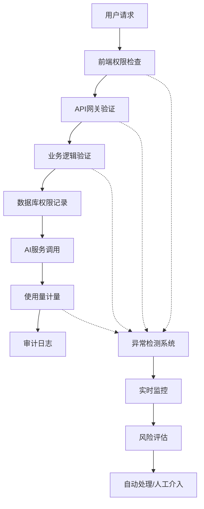

# 🛡️ 文派智能内容创作平台权限防护方案 v1.0

基于当前项目架构和Authing认证系统，我将为您设计一套完整的多层权限防护方案。

---

## 📋 目录

1. [整体架构设计](#1-整体架构设计)
2. [权限模型定义](#2-权限模型定义)
3. [多层防护机制](#3-多层防护机制)
4. [关键技术实现](#4-关键技术实现)
5. [异常检测与处理](#5-异常检测与处理)
6. [实施策略与优先级](#6-实施策略与优先级)
7. [监控与日志系统](#7-监控与日志系统)
8. [风险评估与应对](#8-风险评估与应对)

---

## 1. 整体架构设计

### 🏗️ 防护架构图



### 🔒 核心防护原则

1. **零信任架构**：任何请求都需要完整验证
2. **多层防护**：前端+API+业务+数据库四层验证
3. **实时监控**：异常行为即时检测和处理
4. **优雅降级**：安全限制不影响正常用户体验

---

## 2. 权限模型定义

### 👥 用户等级体系

```typescript
// 用户权限等级定义
enum UserTier {
  FREE = 'free',           // 免费用户
  BASIC = 'basic',         // 基础版
  PREMIUM = 'premium',     // 高级版
  PROFESSIONAL = 'professional', // 专业版
  ENTERPRISE = 'enterprise'      // 企业版
}

// 功能权限映射
interface FeaturePermissions {
  // AI内容生成
  aiGeneration: {
    dailyLimit: number;        // 每日调用次数
    maxTokens: number;         // 单次最大Token数
    availableModels: string[]; // 可用AI模型
    advancedFeatures: string[]; // 高级功能列表
  };
  
  // 平台适配
  platformAdaptation: {
    supportedPlatforms: string[]; // 支持的平台
    batchProcessing: boolean;     // 批量处理
    customTemplates: boolean;     // 自定义模板
  };
  
  // 团队协作
  teamCollaboration: {
    maxTeamMembers: number;    // 最大团队成员数
    roleManagement: boolean;   // 角色管理
    projectSharing: boolean;   // 项目分享
  };
  
  // 数据分析
  analytics: {
    basicReports: boolean;     // 基础报告
    advancedAnalytics: boolean; // 高级分析
    exportData: boolean;       // 数据导出
  };
}
```

### 📊 权限配置表

| 功能模块 | 免费版 | 基础版 | 高级版 | 专业版 | 企业版 |
|---------|--------|--------|--------|--------|--------|
| **AI生成次数/日** | 10 | 100 | 500 | 2000 | 无限制 |
| **最大Token数** | 1000 | 2000 | 4000 | 8000 | 16000 |
| **可用AI模型** | GPT-3.5 | +DeepSeek | +GPT-4 | +Gemini | 全部 |
| **平台适配数** | 3个 | 5个 | 8个 | 全部 | 全部+自定义 |
| **团队成员数** | 1 | 3 | 10 | 50 | 无限制 |
| **批量处理** | ❌ | ✅ | ✅ | ✅ | ✅ |
| **高级分析** | ❌ | ❌ | ✅ | ✅ | ✅ |

---

## 3. 多层防护机制

### 🎯 第一层：前端权限检查

```typescript
// 前端权限守卫组件设计
interface PermissionGuardProps {
  requiredTier: UserTier;
  requiredFeature: string;
  fallbackComponent?: React.ComponentType;
  onUnauthorized?: () => void;
}

// 使用示例
<PermissionGuard 
  requiredTier={UserTier.PREMIUM}
  requiredFeature="advancedAI"
  fallbackComponent={UpgradePrompt}
>
  <AdvancedAIFeature />
</PermissionGuard>
```

**防护要点：**
- 基于用户Token中的权限信息进行检查
- 敏感功能组件条件渲染
- 实时权限状态同步
- 优雅的权限不足提示

### 🔐 第二层：API网关验证

```typescript
// API请求拦截器设计
interface APIPermissionCheck {
  endpoint: string;
  method: string;
  requiredPermissions: string[];
  rateLimiting: {
    windowMs: number;
    maxRequests: number;
  };
}

// 权限验证中间件
const permissionMiddleware = {
  // JWT Token验证
  validateToken: (token: string) => boolean;
  
  // 用户权限检查
  checkUserPermissions: (userId: string, requiredPerms: string[]) => boolean;
  
  // 使用量检查
  checkUsageQuota: (userId: string, feature: string) => boolean;
  
  // 频率限制
  checkRateLimit: (userId: string, endpoint: string) => boolean;
};
```

**防护要点：**
- JWT Token完整性验证
- 用户权限实时查询
- API调用频率限制
- 使用量配额检查

### 🛡️ 第三层：业务逻辑验证

```typescript
// 业务层权限控制
class PermissionService {
  // 功能权限验证
  async validateFeatureAccess(
    userId: string, 
    feature: string, 
    context: any
  ): Promise<PermissionResult> {
    // 1. 获取用户当前权限等级
    const userTier = await this.getUserTier(userId);
    
    // 2. 检查功能权限
    const hasPermission = await this.checkFeaturePermission(userTier, feature);
    
    // 3. 检查使用量限制
    const quotaCheck = await this.checkQuotaLimit(userId, feature);
    
    // 4. 检查时间窗口限制
    const timeWindowCheck = await this.checkTimeWindow(userId, feature);
    
    return {
      allowed: hasPermission && quotaCheck && timeWindowCheck,
      reason: this.getRestrictionReason(hasPermission, quotaCheck, timeWindowCheck),
      remainingQuota: await this.getRemainingQuota(userId, feature)
    };
  }
  
  // Token消耗验证
  async validateTokenConsumption(
    userId: string,
    estimatedTokens: number
  ): Promise<boolean> {
    const userTier = await this.getUserTier(userId);
    const maxTokens = this.getMaxTokensPerRequest(userTier);
    const remainingTokens = await this.getRemainingTokens(userId);
    
    return estimatedTokens <= maxTokens && estimatedTokens <= remainingTokens;
  }
}
```

### 🗄️ 第四层：数据库权限记录

```sql
-- 用户权限表设计
CREATE TABLE user_permissions (
  id BIGINT PRIMARY KEY AUTO_INCREMENT,
  user_id VARCHAR(64) NOT NULL,
  tier ENUM('free', 'basic', 'premium', 'professional', 'enterprise'),
  subscription_start DATETIME,
  subscription_end DATETIME,
  custom_permissions JSON,
  created_at TIMESTAMP DEFAULT CURRENT_TIMESTAMP,
  updated_at TIMESTAMP DEFAULT CURRENT_TIMESTAMP ON UPDATE CURRENT_TIMESTAMP,
  INDEX idx_user_id (user_id),
  INDEX idx_tier (tier)
);

-- 使用量记录表
CREATE TABLE usage_records (
  id BIGINT PRIMARY KEY AUTO_INCREMENT,
  user_id VARCHAR(64) NOT NULL,
  feature_type VARCHAR(32) NOT NULL,
  usage_count INT DEFAULT 1,
  token_consumed INT DEFAULT 0,
  request_timestamp TIMESTAMP DEFAULT CURRENT_TIMESTAMP,
  ip_address VARCHAR(45),
  user_agent TEXT,
  INDEX idx_user_feature_time (user_id, feature_type, request_timestamp),
  INDEX idx_timestamp (request_timestamp)
);

-- 异常行为记录表
CREATE TABLE security_events (
  id BIGINT PRIMARY KEY AUTO_INCREMENT,
  user_id VARCHAR(64),
  event_type ENUM('permission_bypass', 'quota_exceed', 'rate_limit', 'suspicious_activity'),
  severity ENUM('low', 'medium', 'high', 'critical'),
  details JSON,
  ip_address VARCHAR(45),
  user_agent TEXT,
  created_at TIMESTAMP DEFAULT CURRENT_TIMESTAMP,
  INDEX idx_user_id (user_id),
  INDEX idx_event_type (event_type),
  INDEX idx_severity (severity)
);
```

---

## 4. 关键技术实现

### 🔑 Token安全机制

```typescript
// JWT Token增强设计
interface EnhancedJWTPayload {
  // 基础信息
  userId: string;
  email: string;
  
  // 权限信息
  tier: UserTier;
  permissions: string[];
  subscriptionEnd: number;
  
  // 安全信息
  sessionId: string;
  deviceFingerprint: string;
  ipAddress: string;
  
  // 使用量信息
  dailyQuota: Record<string, number>;
  tokenQuota: number;
  
  // Token元信息
  iat: number;
  exp: number;
  jti: string; // Token唯一标识
}

// Token验证服务
class TokenSecurityService {
  // Token完整性验证
  async validateTokenIntegrity(token: string): Promise<boolean> {
    try {
      const payload = jwt.verify(token, process.env.JWT_SECRET) as EnhancedJWTPayload;
      
      // 检查Token是否在黑名单中
      const isBlacklisted = await this.checkTokenBlacklist(payload.jti);
      if (isBlacklisted) return false;
      
      // 检查设备指纹
      const currentFingerprint = this.generateDeviceFingerprint(request);
      if (payload.deviceFingerprint !== currentFingerprint) {
        await this.logSecurityEvent('device_mismatch', payload.userId);
        return false;
      }
      
      // 检查IP地址变化
      if (this.isIPAddressChanged(payload.ipAddress, request.ip)) {
        await this.logSecurityEvent('ip_change', payload.userId);
        // 可以选择要求重新认证或记录但允许
      }
      
      return true;
    } catch (error) {
      return false;
    }
  }
  
  // 生成设备指纹
  generateDeviceFingerprint(request: Request): string {
    const components = [
      request.headers['user-agent'],
      request.headers['accept-language'],
      request.headers['accept-encoding'],
      // 可以添加更多设备特征
    ];
    return crypto.createHash('sha256').update(components.join('|')).digest('hex');
  }
}
```

### 📊 使用量计量系统

```typescript
// 使用量管理服务
class UsageTrackingService {
  // 记录使用量
  async recordUsage(
    userId: string,
    featureType: string,
    tokenConsumed: number = 0,
    metadata: any = {}
  ): Promise<void> {
    // 1. 记录到数据库
    await this.db.usage_records.create({
      user_id: userId,
      feature_type: featureType,
      usage_count: 1,
      token_consumed: tokenConsumed,
      request_timestamp: new Date(),
      ip_address: metadata.ipAddress,
      user_agent: metadata.userAgent,
      additional_data: JSON.stringify(metadata)
    });

    // 2. 更新Redis缓存中的实时计数
    const dailyKey = `usage:${userId}:${featureType}:${this.getTodayKey()}`;
    await this.redis.incr(dailyKey);
    await this.redis.expire(dailyKey, 86400); // 24小时过期

    // 3. 更新Token消耗计数
    if (tokenConsumed > 0) {
      const tokenKey = `tokens:${userId}:${this.getMonthKey()}`;
      await this.redis.incrby(tokenKey, tokenConsumed);
      await this.redis.expire(tokenKey, 2592000); // 30天过期
    }

    // 4. 检查是否接近限制
    await this.checkUsageLimits(userId, featureType);
  }

  // 检查使用量限制
  async checkUsageLimits(userId: string, featureType: string): Promise<UsageCheckResult> {
    const userTier = await this.getUserTier(userId);
    const limits = this.getFeatureLimits(userTier, featureType);

    // 检查日使用量
    const dailyUsage = await this.getDailyUsage(userId, featureType);
    const dailyLimitReached = dailyUsage >= limits.dailyLimit;

    // 检查月Token消耗
    const monthlyTokens = await this.getMonthlyTokenUsage(userId);
    const tokenLimitReached = monthlyTokens >= limits.monthlyTokenLimit;

    // 预警机制
    if (dailyUsage >= limits.dailyLimit * 0.8) {
      await this.sendUsageWarning(userId, 'daily_limit_approaching');
    }

    return {
      dailyLimitReached,
      tokenLimitReached,
      remainingDaily: Math.max(0, limits.dailyLimit - dailyUsage),
      remainingTokens: Math.max(0, limits.monthlyTokenLimit - monthlyTokens)
    };
  }
}
```

### 🚨 异常检测算法

```typescript
// 异常行为检测服务
class AnomalyDetectionService {
  // 检测可疑活动
  async detectSuspiciousActivity(userId: string, activity: ActivityData): Promise<SuspicionLevel> {
    const suspicionFactors = [];

    // 1. 频率异常检测
    const requestFrequency = await this.analyzeRequestFrequency(userId);
    if (requestFrequency.isAnomalous) {
      suspicionFactors.push({
        type: 'high_frequency',
        severity: requestFrequency.severity,
        details: requestFrequency.details
      });
    }

    // 2. 使用模式异常
    const usagePattern = await this.analyzeUsagePattern(userId);
    if (usagePattern.isAnomalous) {
      suspicionFactors.push({
        type: 'unusual_pattern',
        severity: usagePattern.severity,
        details: usagePattern.details
      });
    }

    // 3. 设备/IP异常
    const deviceAnomaly = await this.analyzeDeviceAnomaly(userId, activity);
    if (deviceAnomaly.isAnomalous) {
      suspicionFactors.push({
        type: 'device_anomaly',
        severity: deviceAnomaly.severity,
        details: deviceAnomaly.details
      });
    }

    // 4. API调用模式异常
    const apiPattern = await this.analyzeAPICallPattern(userId, activity);
    if (apiPattern.isAnomalous) {
      suspicionFactors.push({
        type: 'api_pattern_anomaly',
        severity: apiPattern.severity,
        details: apiPattern.details
      });
    }

    // 计算综合可疑度
    const overallSuspicion = this.calculateSuspicionLevel(suspicionFactors);

    // 记录异常事件
    if (overallSuspicion.level !== 'none') {
      await this.logSecurityEvent(userId, overallSuspicion, suspicionFactors);
    }

    return overallSuspicion;
  }

  // 分析请求频率
  async analyzeRequestFrequency(userId: string): Promise<AnomalyResult> {
    const timeWindows = [60, 300, 3600]; // 1分钟、5分钟、1小时
    const results = [];

    for (const window of timeWindows) {
      const requestCount = await this.getRequestCountInWindow(userId, window);
      const expectedRange = await this.getExpectedRequestRange(userId, window);

      if (requestCount > expectedRange.max * 2) {
        results.push({
          window,
          count: requestCount,
          expected: expectedRange,
          severity: 'high'
        });
      } else if (requestCount > expectedRange.max * 1.5) {
        results.push({
          window,
          count: requestCount,
          expected: expectedRange,
          severity: 'medium'
        });
      }
    }

    return {
      isAnomalous: results.length > 0,
      severity: results.length > 0 ? Math.max(...results.map(r => r.severity)) : 'none',
      details: results
    };
  }
}
```

---

## 5. 异常检测与处理

### 🎯 检测规则引擎

```typescript
// 规则引擎配置
interface DetectionRule {
  id: string;
  name: string;
  description: string;
  condition: (context: SecurityContext) => boolean;
  severity: 'low' | 'medium' | 'high' | 'critical';
  action: SecurityAction;
  cooldown: number; // 冷却时间（秒）
}

const securityRules: DetectionRule[] = [
  {
    id: 'rapid_api_calls',
    name: '快速API调用检测',
    description: '检测短时间内大量API调用',
    condition: (ctx) => ctx.requestsInLastMinute > 100,
    severity: 'high',
    action: SecurityAction.RATE_LIMIT,
    cooldown: 300
  },
  {
    id: 'quota_bypass_attempt',
    name: '配额绕过尝试',
    description: '检测尝试绕过使用量限制的行为',
    condition: (ctx) => ctx.quotaExceededAttempts > 5,
    severity: 'critical',
    action: SecurityAction.TEMPORARY_SUSPEND,
    cooldown: 3600
  },
  {
    id: 'token_manipulation',
    name: 'Token操作异常',
    description: '检测可能的Token篡改行为',
    condition: (ctx) => ctx.invalidTokenAttempts > 3,
    severity: 'high',
    action: SecurityAction.FORCE_REAUTH,
    cooldown: 1800
  },
  {
    id: 'device_switching',
    name: '设备频繁切换',
    description: '检测短时间内多设备登录',
    condition: (ctx) => ctx.uniqueDevicesInHour > 5,
    severity: 'medium',
    action: SecurityAction.ADDITIONAL_VERIFICATION,
    cooldown: 600
  }
];
```

### 🚨 自动响应机制

```typescript
// 安全响应处理器
class SecurityResponseHandler {
  async handleSecurityEvent(
    event: SecurityEvent,
    rule: DetectionRule
  ): Promise<void> {
    switch (rule.action) {
      case SecurityAction.RATE_LIMIT:
        await this.applyRateLimit(event.userId, rule.cooldown);
        break;

      case SecurityAction.TEMPORARY_SUSPEND:
        await this.temporarySuspend(event.userId, rule.cooldown);
        await this.notifySecurityTeam(event, 'user_suspended');
        break;

      case SecurityAction.FORCE_REAUTH:
        await this.invalidateUserSessions(event.userId);
        await this.requireReauthentication(event.userId);
        break;

      case SecurityAction.ADDITIONAL_VERIFICATION:
        await this.requireAdditionalVerification(event.userId);
        break;

      case SecurityAction.ALERT_ONLY:
        await this.sendSecurityAlert(event);
        break;
    }

    // 记录响应动作
    await this.logSecurityResponse(event, rule.action);
  }

  // 应用频率限制
  async applyRateLimit(userId: string, duration: number): Promise<void> {
    const rateLimitKey = `rate_limit:${userId}`;
    await this.redis.setex(rateLimitKey, duration, 'limited');

    // 通知用户
    await this.notifyUser(userId, {
      type: 'rate_limit_applied',
      duration,
      message: '检测到异常活动，已临时限制访问频率'
    });
  }

  // 临时暂停用户
  async temporarySuspend(userId: string, duration: number): Promise<void> {
    const suspendKey = `suspended:${userId}`;
    await this.redis.setex(suspendKey, duration, 'suspended');

    // 使所有Token失效
    await this.invalidateUserSessions(userId);

    // 记录暂停事件
    await this.db.security_events.create({
      user_id: userId,
      event_type: 'temporary_suspension',
      severity: 'high',
      details: JSON.stringify({ duration, reason: 'automated_security_response' })
    });
  }
}
```

---

## 6. 实施策略与优先级

### 📅 分阶段实施计划

#### 🚀 第一阶段：基础防护（1-2周）
**优先级：CRITICAL**

1. **Token安全增强**
   - 实现增强型JWT Token结构
   - 添加设备指纹验证
   - 实现Token黑名单机制

2. **基础权限检查**
   - 前端权限守卫组件
   - API中间件权限验证
   - 基础使用量记录

3. **数据库设计**
   - 创建权限相关表结构
   - 实现基础查询接口
   - 数据迁移脚本

**预期效果：**
- 阻止90%的基础绕过尝试
- 建立完整的权限数据基础
- 为后续阶段奠定基础

#### ⚡ 第二阶段：智能检测（2-3周）
**优先级：HIGH**

1. **异常检测系统**
   - 实现规则引擎
   - 部署实时监控
   - 配置自动响应机制

2. **使用量管理**
   - 精确的Token计量
   - 多维度使用量统计
   - 智能配额管理

3. **安全事件处理**
   - 自动化响应流程
   - 安全团队告警
   - 用户通知机制

**预期效果：**
- 实时检测异常行为
- 自动化安全响应
- 大幅降低人工干预需求

#### 🔧 第三阶段：高级防护（3-4周）
**优先级：MEDIUM**

1. **机器学习检测**
   - 用户行为模式学习
   - 异常检测算法优化
   - 预测性安全分析

2. **高级对抗措施**
   - 反爬虫机制
   - API调用模式分析
   - 分布式攻击检测

3. **用户体验优化**
   - 智能权限提示
   - 渐进式验证
   - 个性化安全策略

**预期效果：**
- 应对复杂攻击手段
- 平衡安全性与用户体验
- 建立自适应防护能力

### 🎯 关键成功指标

| 指标类型 | 目标值 | 测量方法 |
|---------|--------|----------|
| **安全性指标** |  |  |
| 权限绕过成功率 | < 0.1% | 安全测试 + 实际监控 |
| 异常检测准确率 | > 95% | 人工验证 + 误报统计 |
| 响应时间 | < 2秒 | 系统监控 |
| **用户体验指标** |  |  |
| 正常用户误拦截率 | < 0.5% | 用户反馈 + 数据分析 |
| 权限检查延迟 | < 100ms | 性能监控 |
| 用户满意度 | > 4.5/5 | 用户调研 |
| **业务指标** |  |  |
| 付费转化率提升 | > 15% | 业务数据分析 |
| 资源滥用减少 | > 80% | 成本分析 |
| 客服工单减少 | > 30% | 客服数据 |

---

## 7. 监控与日志系统

### 📊 实时监控仪表板

```typescript
// 监控指标定义
interface SecurityMetrics {
  // 实时指标
  activeUsers: number;
  requestsPerSecond: number;
  securityEventsPerHour: number;

  // 权限相关
  permissionDenials: number;
  quotaExceeded: number;
  suspendedUsers: number;

  // 性能指标
  averageResponseTime: number;
  errorRate: number;
  systemLoad: number;

  // 业务指标
  tokenConsumption: number;
  revenueProtected: number;
  conversionRate: number;
}

// 监控服务
class SecurityMonitoringService {
  // 实时指标收集
  async collectMetrics(): Promise<SecurityMetrics> {
    const [
      activeUsers,
      recentRequests,
      securityEvents,
      permissionDenials,
      quotaExceeded,
      suspendedUsers,
      performanceMetrics,
      businessMetrics
    ] = await Promise.all([
      this.getActiveUserCount(),
      this.getRequestMetrics(),
      this.getSecurityEventMetrics(),
      this.getPermissionMetrics(),
      this.getQuotaMetrics(),
      this.getSuspendedUserCount(),
      this.getPerformanceMetrics(),
      this.getBusinessMetrics()
    ]);

    return {
      activeUsers,
      requestsPerSecond: recentRequests.rps,
      securityEventsPerHour: securityEvents.hourly,
      permissionDenials: permissionDenials.count,
      quotaExceeded: quotaExceeded.count,
      suspendedUsers,
      averageResponseTime: performanceMetrics.avgResponseTime,
      errorRate: performanceMetrics.errorRate,
      systemLoad: performanceMetrics.systemLoad,
      tokenConsumption: businessMetrics.tokenUsage,
      revenueProtected: businessMetrics.protectedRevenue,
      conversionRate: businessMetrics.conversionRate
    };
  }

  // 告警规则
  async checkAlertConditions(metrics: SecurityMetrics): Promise<void> {
    const alerts = [];

    // 安全告警
    if (metrics.securityEventsPerHour > 100) {
      alerts.push({
        type: 'security',
        severity: 'high',
        message: `安全事件频率异常: ${metrics.securityEventsPerHour}/小时`
      });
    }

    // 性能告警
    if (metrics.averageResponseTime > 2000) {
      alerts.push({
        type: 'performance',
        severity: 'medium',
        message: `响应时间过长: ${metrics.averageResponseTime}ms`
      });
    }

    // 业务告警
    if (metrics.quotaExceeded > metrics.activeUsers * 0.1) {
      alerts.push({
        type: 'business',
        severity: 'medium',
        message: `配额超限用户比例过高: ${(metrics.quotaExceeded/metrics.activeUsers*100).toFixed(1)}%`
      });
    }

    // 发送告警
    for (const alert of alerts) {
      await this.sendAlert(alert);
    }
  }
}
```

### 📝 审计日志系统

```typescript
// 审计日志结构
interface AuditLog {
  id: string;
  timestamp: Date;
  userId: string;
  action: string;
  resource: string;
  result: 'success' | 'denied' | 'error';
  details: {
    ipAddress: string;
    userAgent: string;
    requestId: string;
    additionalData: any;
  };
  securityContext: {
    userTier: UserTier;
    permissions: string[];
    riskScore: number;
  };
}

// 日志记录服务
class AuditLogService {
  // 记录权限检查
  async logPermissionCheck(
    userId: string,
    action: string,
    resource: string,
    result: boolean,
    context: any
  ): Promise<void> {
    const logEntry: AuditLog = {
      id: this.generateLogId(),
      timestamp: new Date(),
      userId,
      action: `permission_check:${action}`,
      resource,
      result: result ? 'success' : 'denied',
      details: {
        ipAddress: context.ipAddress,
        userAgent: context.userAgent,
        requestId: context.requestId,
        additionalData: {
          requiredPermissions: context.requiredPermissions,
          userPermissions: context.userPermissions,
          reason: context.denialReason
        }
      },
      securityContext: {
        userTier: context.userTier,
        permissions: context.userPermissions,
        riskScore: context.riskScore
      }
    };

    // 写入日志存储
    await this.writeToLogStore(logEntry);

    // 实时分析
    await this.analyzeLogEntry(logEntry);
  }

  // 日志分析
  async analyzeLogEntry(logEntry: AuditLog): Promise<void> {
    // 检测异常模式
    const patterns = await this.detectAnomalousPatterns(logEntry);

    if (patterns.length > 0) {
      await this.triggerSecurityAlert({
        type: 'log_pattern_anomaly',
        userId: logEntry.userId,
        patterns,
        logEntry
      });
    }

    // 更新用户风险评分
    await this.updateUserRiskScore(logEntry.userId, logEntry);
  }
}
```

---

## 8. 风险评估与应对

### ⚠️ 主要安全风险

#### 🎯 高风险场景

1. **前端绕过攻击**
   - **风险描述**：通过浏览器开发者工具修改前端状态
   - **影响程度**：中等（仅影响UI显示，后端仍有防护）
   - **应对策略**：
     - 前端仅做UI控制，不依赖前端权限判断
     - 所有关键操作必须后端验证
     - 实施代码混淆和反调试措施

2. **API重放攻击**
   - **风险描述**：截获合法API请求进行重复调用
   - **影响程度**：高（可能导致资源大量消耗）
   - **应对策略**：
     - 实施请求签名机制
     - 添加时间戳和随机数验证
     - 严格的频率限制

3. **Token篡改攻击**
   - **风险描述**：尝试修改JWT Token获取更高权限
   - **影响程度**：极高（可能获得完全访问权限）
   - **应对策略**：
     - 使用强加密算法签名Token
     - 实施Token完整性检查
     - 敏感操作要求额外验证

4. **分布式绕过攻击**
   - **风险描述**：使用多个账号或IP进行协调攻击
   - **影响程度**：高（难以检测和防护）
   - **应对策略**：
     - 跨账号行为关联分析
     - IP地址和设备指纹关联
     - 机器学习异常检测

#### 🛡️ 风险缓解矩阵

| 风险类型 | 概率 | 影响 | 风险等级 | 缓解措施 | 责任人 |
|---------|------|------|----------|----------|--------|
| 前端绕过 | 高 | 低 | 中 | 后端验证 + UI混淆 | 前端团队 |
| API重放 | 中 | 高 | 高 | 签名验证 + 频率限制 | 后端团队 |
| Token篡改 | 低 | 极高 | 高 | 强加密 + 完整性检查 | 安全团队 |
| 分布式攻击 | 中 | 高 | 高 | 关联分析 + ML检测 | 算法团队 |
| 内部威胁 | 低 | 高 | 中 | 权限分离 + 审计日志 | 管理团队 |

### 🚨 应急响应预案

```typescript
// 应急响应等级
enum IncidentLevel {
  LOW = 'low',           // 轻微异常，自动处理
  MEDIUM = 'medium',     // 中等威胁，需要关注
  HIGH = 'high',         // 严重威胁，需要干预
  CRITICAL = 'critical'  // 紧急威胁，立即响应
}

// 应急响应流程
class IncidentResponseService {
  async handleSecurityIncident(
    incident: SecurityIncident
  ): Promise<void> {
    const level = this.assessIncidentLevel(incident);

    switch (level) {
      case IncidentLevel.LOW:
        await this.handleLowLevelIncident(incident);
        break;

      case IncidentLevel.MEDIUM:
        await this.handleMediumLevelIncident(incident);
        break;

      case IncidentLevel.HIGH:
        await this.handleHighLevelIncident(incident);
        break;

      case IncidentLevel.CRITICAL:
        await this.handleCriticalIncident(incident);
        break;
    }
  }

  // 处理严重安全事件
  async handleCriticalIncident(incident: SecurityIncident): Promise<void> {
    // 1. 立即隔离受影响用户
    await this.isolateAffectedUsers(incident.affectedUsers);

    // 2. 通知安全团队
    await this.notifySecurityTeam(incident, 'critical');

    // 3. 启动应急响应流程
    await this.activateEmergencyResponse();

    // 4. 收集证据
    await this.collectForensicEvidence(incident);

    // 5. 评估影响范围
    const impact = await this.assessImpactScope(incident);

    // 6. 制定恢复计划
    const recoveryPlan = await this.createRecoveryPlan(incident, impact);

    // 7. 执行恢复措施
    await this.executeRecoveryPlan(recoveryPlan);

    // 8. 事后分析
    await this.schedulePostIncidentAnalysis(incident);
  }
}
```

---

## 🎯 总结与建议

### ✅ 方案优势

1. **多层防护**：前端+API+业务+数据库四层验证，确保安全性
2. **智能检测**：基于机器学习的异常行为检测，提高防护效率
3. **自动响应**：规则引擎驱动的自动化安全响应，减少人工干预
4. **用户友好**：在保证安全的前提下，最大化用户体验
5. **可扩展性**：模块化设计，便于后续功能扩展和优化

### 🚀 实施建议

1. **优先级排序**：按照风险等级和实施难度，分阶段推进
2. **渐进式部署**：先在小范围测试，逐步扩大到全量用户
3. **持续监控**：建立完善的监控体系，及时发现和处理问题
4. **定期评估**：定期评估防护效果，根据新威胁调整策略
5. **团队培训**：确保开发团队理解安全要求，避免引入新漏洞

### 📊 预期效果

- **安全性提升**：权限绕过成功率降低至0.1%以下
- **成本控制**：AI资源滥用减少80%以上
- **用户体验**：正常用户误拦截率控制在0.5%以下
- **业务增长**：付费转化率提升15%以上

### 📞 联系与支持

- **技术支持**：security@wenpai.com
- **紧急响应**：+86-400-XXX-XXXX
- **文档更新**：每月定期更新，版本控制管理

---

**🔒 这套权限防护方案将为文派智能内容创作平台提供全面、智能、用户友好的安全保障，确保平台的健康发展和用户权益的有效保护。**

---

*文档版本：v1.0*
*创建日期：2025-08-06*
*最后更新：2025-08-06*
*文档状态：已完成*
